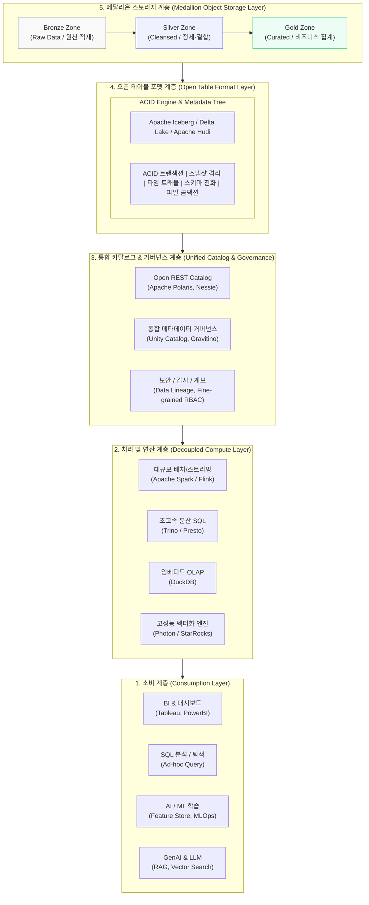

# 데이터 레이크하우스(Data Lakehouse)

---

## I. 레이크의 유연성과 웨어하우스의 신뢰성을 결합한 데이터 레이크하우스의 개요

### 가. 데이터 레이크하우스(Data Lakehouse)의 정의

* 저비용·고확장성의 데이터 레이크(오브젝트 스토리지) 상에 오픈 테이블 포맷 기반의 메타데이터 계층을 구현하여, 데이터 웨어하우스(DW) 수준의 ACID [[트랜잭션]], [[데이터 거버넌스]], 고속 [[SQL(Structured Query Language)|SQL]] 질의 및 AI/ML 워크로드를 단일 저장소에서 통합 지원하는 차세대 데이터 플랫폼 아키텍처
* 단일 원천 데이터(Single Source of Truth) 환경에서 정형·반정형·비정형 데이터를 직접 조회·학습할 수 있도록 스토리지와 컴퓨팅 엔진을 완전히 분리한 개방형 데이터 구조

### 나. 데이터 레이크하우스의 등장배경 및 핵심 특징

* **기존 2계층(Two-Tier) 아키텍처의 한계 극복**: 데이터 레이크 적재 후 DW로 ETL 복제하는 이중 파이프라인으로 인한 데이터 지연(Staleness), 중복 저장 비용, 데이터 사일로 및 거버넌스 불일치(Data Swamp) 해소
* **다중 워크로드 수렴**: BI/[[OLAP]] 리포팅(SQL)과 데이터 사이언스(AI/ML 파이프라인, 비정형 분석) 간의 분리된 인프라를 단일 플랫폼으로 통합
* **핵심 특징**:
* **컴퓨팅-스토리지 완전 분리**: 워크로드 규모에 따른 독립적 탄력 스케일링
* **오픈 스탠다드 지향**: 특정 벤더 종속을 탈피하는 오픈 테이블 포맷 및 개방형 파일 규격 채택
* **엔터프라이즈 거버넌스**: [[스키마]] 강제, 세밀한 접근 제어([[RBAC]]/ABAC), 데이터 계보 추적 지원

---

## II. 데이터 레이크하우스의 아키텍처 및 핵심 기술 요소

### 가. 데이터 레이크하우스의 개념도 및 동작 원리

* 오브젝트 스토리지 상의 Parquet 데이터에 오픈 테이블 포맷(Iceberg, Delta 등)을 래핑하고, 통합 REST 카탈로그를 통해 다중 연산 엔진(Spark, Trino 등)이 ACID 보장 하에 직접 읽기/쓰기를 수행하는 구조

### 나. 데이터 레이크하우스의 핵심 기술 및 구성 요소

| 구분 | 요소기술(키워드) | 세부 설명 |
| --- | --- | --- |
| **저장 인프라** | 클라우드 오브젝트 스토리지 | AWS S3, Azure ADLS Gen2, GCS 기반 무제한 확장성 및 저비용 스토리지 확보 |
| **개방형 포맷** | 컬럼형 스토리지 (Parquet/ORC) | 고효율 압축(Snappy, ZSTD) 및 컬럼 단위 I/O Pruning을 지원하는 표준 파일 포맷 |
| **테이블 포맷** | Apache Iceberg | 계층적 스냅샷 트리(Manifest) 기반 다중 엔진 호환 표준, 오브젝트 리스팅 부하 제거 |
| **테이블 포맷** | Delta Lake (4.x) | 트랜잭션 로그(`_delta_log`) 기반 직렬화, UniForm을 통한 다중 포맷 호환 지원 |
| **트랜잭션** | ACID & Snapshot Isolation | 원자적 커밋(Atomic Commit)으로 동시 읽기·쓰기 충돌 방지 및 일관된 뷰 제공 |
| **스키마 관리** | Schema Enforcement & Evolution | 데이터 유입 시 스키마 자동 검증(강제) 및 기존 데이터 영향 없는 컬럼 추가/변경 |
| **데이터 버전** | Time Travel & Rollback | 메타데이터 포인터 기반 과거 특정 시점 스냅샷 재현, 롤백 및 감사(Audit) 수행 |
| **행 레벨 변경** | MoR (Merge-on-Read) & Deletion Vectors | 데이터 파일 재작성 없이 삭제 비트맵을 기록하여 실시간 CDC 및 GDPR 삭제 요청 고속 처리 |
| **통합 카탈로그** | Iceberg REST Catalog (Polaris/Unity) | 엔진-스토리지 간 메타데이터 포인터 교환 및 중앙집중식 권한 부여(Credential Vending) 표준화 |
| **파이프라인 전략** | 메달리온 아키텍처 (Medallion) | Bronze(원천 원형) -> Silver(품질 정제) -> Gold(마트 집계) 단계별 품질 보증 체계 |

---

## III. 데이터 플랫폼 유형별 비교 및 향후 전망

### 가. 데이터 웨어하우스 vs 데이터 레이크 vs 데이터 레이크하우스 비교

| 비교 항목 | 데이터 웨어하우스 (DW) | 데이터 레이크 (Data Lake) | 데이터 레이크하우스 (Lakehouse) |
| --- | --- | --- | --- |
| **데이터 형태** | 정형 데이터 (Structured) | 정형, 반정형, 비정형 전체 | 정형, 반정형, 비정형 전체 (멀티모달 포함) |
| **스토리지 비용** | 높음 (전용 고성능 블록 스토리지) | 매우 낮음 (오브젝트 스토리지) | 매우 낮음 (오브젝트 스토리지 활용) |
| **스키마 구조** | Schema-on-Write (사전 모델링) | Schema-on-Read (질의 시점 해석) | Schema-on-Write + Schema Evolution 결합 |
| **트랜잭션 보장** | 강력한 ACID 보장 | 트랜잭션 부재 (파일 손상 위험) | 완벽한 ACID 보장 (스냅샷 기반) |
| **연산 엔진** | 독점 내장형 SQL 엔진 (Vendor Lock-in) | 다양한 오픈소스 엔진 (Spark 등) | 다중 오픈 연산 엔진 호환 (Spark/Trino/DuckDB) |
| **주요 지원 업무** | BI, 정형 리포팅, OLAP 큐브 | 빅데이터 탐색, 대규모 ML 모델 학습 | 고성능 BI, 실시간 스트리밍, AI/[[초거대 언어 모델|LLM]] 학습 통합 |

### 나. 향후 발전 방향 및 고려사항

* **오픈 카탈로그 전쟁(Catalog Wars)과 거버넌스 단일화**: 테이블 포맷 표준화(Apache Iceberg 수렴) 이후, Apache Polaris 및 Unity Catalog 중심의 REST Catalog 프로토콜을 적용하여 다중 클라우드 간 벤더 락인 해제 필수
* **AI/LLM-Ready 인프라로의 확장**: 텍스트·임베딩 벡터를 포함하는 멀티모달 포맷(Lance 등) 지원 및 레이크하우스 내 직접 Vector [[RDBMS 인덱스(index)|Index]] 구축을 통한 RAG(검색 증강 생성) 파이프라인 일원화
* **FinOps 관점의 파일 최적화 거버넌스**: 무분별한 파일 생성에 따른 성능 저하를 방지하기 위해 주기적인 소형 파일 병합(Compaction), Z-Order 클러스터링, [[파티셔닝|파티션]] 진화(Partition Evolution)의 자동화 운영 체계 수립 필요

---

### 🔗 연관 토픽

- **소속 도메인**: [[00_데이터베이스_MOC|🗄️ 데이터베이스]]
- **세부 분류**: `2. 트랜잭션 & 동시성 제어 (Concurrency)`
- **핵심 연관 토픽**:
  - [[트랜잭션]]
  - [[RDBMS 인덱스(index)]]
  - [[파티셔닝|파티션]]
  - [[OLAP]]
  - [[EDW]]
