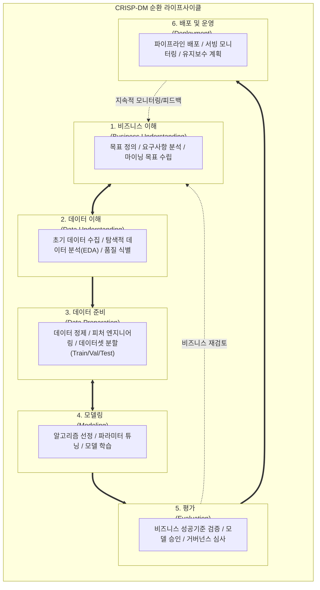

# 데이터 마이닝 방법론

---

## I. 대용량 데이터 기반 지식 탐색 및 가치 창출, 데이터 마이닝 방법론의 개요

### 가. 데이터 마이닝 방법론의 정의

* 대용량 데이터셋에서 통계, 머신러닝, 패턴 인식 알고리즘을 체계적으로 적용하여 잠재적이고 유용한 지식(규칙, 패턴, 관계)을 발굴하기 위한 표준화된 분석 절차 및 [[프로세스]] 모델
* 비즈니스 목표 정의부터 데이터 수집·가공, 모델링, 성능 검증, 운영 배포에 이르는 전 과정을 구조화한 엔지니어링 [[프레임워크]]

### 나. 데이터 마이닝 방법론의 등장배경 및 핵심 특징

* **등장배경**: 데이터 폭증에 따른 직관적 분석 한계, 분석 시행착오 및 프로젝트 실패율 감소 필요, 분석 결과의 비즈니스 가치(ROI) 연계 요구
* **핵심특징**:
* **반복·순환성(Iterative)**: 단계별 결과 검증 후 이전 단계로 피드백 피봇팅 수행
* **비즈니스 정렬(Business Alignment)**: 기술적 지표(Accuracy)와 조직 KPI의 연계
* **표준화 및 재사용성**: 도메인 종속성을 최소화하여 분석 산출물 및 파이프라인 자산화

---

## II. 데이터 마이닝 방법론의 프로세스 및 핵심 기술 요소

### 가. 데이터 마이닝 방법론의 표준 프로세스 (CRISP-DM 중심)

* 비즈니스 이해와 데이터 이해 간 상호 탐색, 데이터 준비와 모델링 간의 양방향 반복 튜닝을 거쳐 최종 비즈니스 성공 기준 평가 후 배포·운영 단계로 이행하는 반복 순환 구조

### 나. 데이터 마이닝 방법론의 핵심 기술 및 구성 요소

| 구분 | 요소기술(키워드) | 세부 설명 |
| --- | --- | --- |
| **기획/정의** | 비즈니스 KPI 정렬 | 비즈니스 문제의 수식화 및 마이닝 성공 기준(ROC-AUC, 이탈률 감소율 등) 정의 |
| **탐색/이해** | 탐색적 데이터 분석 ([[EDA]]) | 데이터 분포, 왜도/첨도, 상관계수 매트릭스 분석 및 시각화를 통한 데이터 특성 식별 |
| **전처리** | 결측·[[이상치]] 정제 | MICE(다중대체), Isolation Forest, IQR 기반 [[결측치]] 대체 및 노이즈 레코드 필터링 |
| **엔지니어링** | 특성 공학 (Feature Engineering) | 원-핫/타깃 인코딩, [[차원 축소]]([[PCA(Principal Component Analysis)|PCA]], t-SNE), 정규화(StandardScaler, MinMax) |
| **학습/모델링** | [[지도학습]] (Supervised) | 분류(XGBoost, LightGBM, Random Forest), 회귀(GLM, Ridge/Lasso) [[알고리즘]] 적용 |
| **학습/모델링** | 비지도학습 (Unsupervised) | 군집화(K-Means, [[DBSCAN(밀도 기반 클러스터링)|DBSCAN]]), 연관규칙 분석(Apriori, FP-Growth)을 통한 패턴 도출 |
| **검증/평가** | 교차 검증 및 지표 평가 | Stratified K-Fold, 혼동 행렬(Confusion Matrix), F1-Score, SHAP([[XAI]] 기여도 분석) |
| **배포/운영** | [[MLOps]] 파이프라인 연계 | 모델 레지스트리 등록, API 컨테이너화 서빙, 데이터/개념 드리프트(Drift) 감지 |

---

## III. 데이터 마이닝 방법론 비교 및 발전 동향

### 가. 대표 데이터 마이닝 방법론 비교 (CRISP-DM vs SEMMA vs KDD)

| 비교 항목 | [[CRISP-DM]] (Cross-Industry Standard) | SEMMA (SAS Institute) | KDD (Knowledge Discovery in Databases) |
| --- | --- | --- | --- |
| **주도 기관** | 유럽 컨소시엄 (SPSS, Teradata, NCR) | SAS Institute (소프트웨어 벤더) | 학계 (Fayyad et al., 1996) |
| **핵심 철학** | 비즈니스 중심의 종합 문제 해결 | 툴(Tool) 중심의 실무적 알고리즘 탐색 | 학술적·컴퓨팅적 데이터 패턴 추출 |
| **단계 구성** | 6단계 (비즈니스이해-데이터이해-준비-모델링-평가-배포) | [[PMBOK 프로세스 그룹 (5단계)|5단계]] (Sample-Explore-Modify-Model-Assess) | 5단계 (선택-전처리-변환-마이닝-해석/평가) |
| **비즈니스 반영** | 최초 단계부터 비즈니스 요구 적극 반영 | 모델 구축 기법 중심 (비즈니스 기획 미포함) | 데이터 중심 기술적 접근에 편중 |
| **배포(Deployment)** | 프로세스 내 공식 단계로 포함 | 별도 배포 단계 없음 (평가에서 종료) | 해석/평가 이후 활용 프로세스 부재 |
| **산업 적용성** | 산업계 사실상 표준(De-facto Standard) | SAS 환경 및 통계 데이터 분석 프로젝트 | 연구 목적, 대규모 학술 데이터 분석 |

### 나. 최신 발전 동향 및 전망

* **CRISP-ML(Q)로의 진화**: 머신러닝 시스템의 불확실성 관리를 위해 품질 보증(Quality Assurance) 및 리스크 모니터링을 결합한 차세대 방법론 표준으로 확장
* **DataOps 및 Data-Centric AI 통합**: 알고리즘 튜닝 중심에서 탈피, Feature Store 기반 데이터 버전 관리와 데이터 계약(Data Contract)을 결합하여 고품질 학습 데이터 자동 공급
* **[[AutoML (Automated Machine Learning)|AutoML]] 및 생성형 AI 융합**: 전처리, 피처 엔지니어링, 하이퍼파라미터 탐색의 자동화(AutoML) 및 비정형 텍스트·임베딩 벡터 기반의 심층 지식 추출 방법론으로 고도화

---

### 🔗 연관 토픽

- **소속 도메인**: [[00_데이터베이스_MOC|🗄️ 데이터베이스]]
- **세부 분류**: `1. 데이터 모델링 & 관계형 DB 설계`
- **핵심 연관 토픽**:
  - [[이상치]]
  - [[지도학습]]
  - [[결측치]]
  - [[DBSCAN(밀도 기반 클러스터링)]]
  - [[AutoML (Automated Machine Learning)]]
