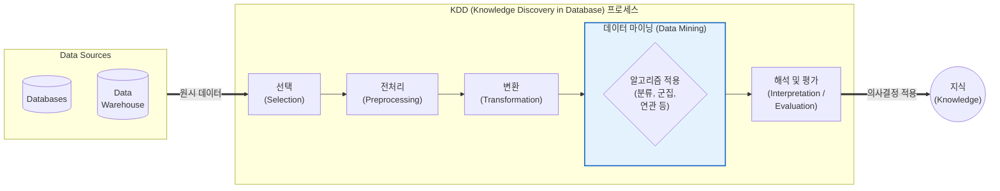

# 데이터 마이닝 (Data Mining)

---

## I. 대규모 데이터 속 은닉된 지식 발견, 데이터 마이닝의 개요

* **가. 데이터 마이닝(Data Mining)의 정의**: 대용량의 [[데이터베이스]](DW, Data Lake 등) 내에 숨겨진 유효하고 실행 가능한 패턴, 규칙, 상관관계를 알고리즘을 통해 자동 혹은 반자동으로 추출하여 비즈니스 의사결정에 활용하는 지식 발견 기술
* **나. 데이터 마이닝의 필요성 및 특징**:
* **필요성**: 빅데이터 시대 도래에 따른 데이터의 가치 창출, 직관 기반 의사결정의 한계 극복, 고객 맞춤형 마케팅 및 리스크 사전 예측
* **특징**:
* **KDD 프로세스의 핵심**: 데이터베이스에서의 지식 발견(KDD: Knowledge Discovery in Database) 과정 중 패턴을 추출하는 핵심 단계
* **목적 지향성**: 데이터를 활용한 분류(Classification), 군집화(Clustering), 연관성(Association) 도출 중심
* **다학제적 융합**: 통계학, 기계학습(Machine Learning), [[인공지능]](AI), 패턴인식 기술의 복합적 활용

---

## II. 데이터 마이닝의 개념도 및 핵심 기술 요소

### 가. KDD 프로세스 기반 데이터 마이닝 개념도

* 데이터 마이닝은 정제되고 변환된 데이터(Target Data)를 바탕으로 마이닝 알고리즘을 적용하여 숨겨진 패턴(Pattern)을 추출하는 핵심 단계임

### 나. 데이터 마이닝의 핵심 기술 및 구성 요소

| 구분 | 요소기술([[알고리즘]]) | 세부 설명 |
| --- | --- | --- |
| **지도 학습 (예측/분류)** | 분류 (Classification) | 과거의 데이터(Target)를 학습하여, 새로운 데이터가 속할 범주(Class)를 사전에 정의된 그룹으로 예측 (예: [[의사결정나무]], [[서포트 벡터 머신|SVM]], KNN) |
| **지도 학습 (예측/분류)** | 회귀 분석 (Regression) | 독립 변수와 종속 변수 간의 관계를 수치로 모델링하여, 연속적인 미래 수치 값을 예측 (예: 선형 회귀, 로지스틱 회귀) |
| **[[비지도 학습]] (패턴/규칙)** | 군집화 (Clustering) | 사전 정의된 기준 없이 데이터 객체들의 유사성(거리 등)을 측정하여 비슷한 특성을 가진 그룹으로 분할 (예: K-Means, [[DBSCAN(밀도 기반 클러스터링)|DBSCAN]]) |
| **비지도 학습 (패턴/규칙)** | 연관 규칙 (Association) | 동시에 발생하는 사건들 간의 관계를 도출하는 기법, 장바구니 분석(if A then B)에 주로 사용 (예: Apriori, FP-Growth) |
| **비지도 학습 (패턴/규칙)** | 순차 패턴 (Sequential) | 시간의 흐름(Time-series)에 따른 사건의 배열 간 연관성을 찾아내어 미래 행위 예측 (예: GSP, SPADE) |
| **이상 탐지** | [[이상치]] 탐지 ([[Anomaly(이상현상)|Anomaly]]) | 데이터의 정상적인 패턴에서 벗어나는 극단치, 오류, 사기(Fraud) 행위를 식별 (예: Isolation Forest) |
| **[[차원 축소]]** | [[PCA(Principal Component Analysis)|PCA]] (주성분 분석) | 분석의 효율성을 높이기 위해 데이터의 분산을 최대한 보존하면서 변수의 수(차원)를 줄이는 [[데이터 전처리]]/마이닝 기법 |
| **성능 평가** | 혼동 행렬 (Confusion Matrix) | 분류 모델의 정확도, 정밀도, 재현율, F1-Score 등을 측정하여 마이닝 결과의 유효성을 검증하는 지표 |

---

## III. 데이터 마이닝과 통계 분석 비교 및 향후 동향

### 가. 데이터 마이닝과 전통적 통계 분석 비교

| 비교 항목 | 통계 분석 (Statistical Analysis) | 데이터 마이닝 (Data Mining) |
| --- | --- | --- |
| **분석 접근법** | **하향식 (Top-Down)**: 가설 설정 후 데이터로 검증 | **상향식 (Bottom-Up)**: 데이터 자체에서 숨겨진 패턴 탐색 |
| **데이터 규모** | 정형화된 **표본(Sample)** 데이터 중심 | 대용량의 **전체(Population)** 원시 데이터 |
| **핵심 목적** | 변수 간의 **인과관계** 규명 및 모수 추정 | 비즈니스 **예측 모델링** 및 의사결정 자동화 도출 |
| **활용 알고리즘** | 분산 분석([[ANOVA(Analysis of variance)|ANOVA]]), [[t-검정 (t-test)|t-검정]], 선형 회귀 | 의사결정나무, [[딥러닝]], 연관 규칙, 앙상블 기법 |

### 나. 향후 전망 및 기술 동향

* **기계학습 및 딥러닝과의 통합 가속**: 최근 데이터 마이닝은 단순한 규칙 추출을 넘어, 거대 인공지능(AI)과 딥러닝(Deep Learning) 모델의 특징 추출(Feature Extraction) 영역으로 흡수되며 비정형 데이터(텍스트, 이미지, 음성) 마이닝의 성능이 비약적으로 향상됨
* **[[AutoML (Automated Machine Learning)|AutoML]] 기반의 대중화 (Democratization)**: 하이퍼파라미터 튜닝 및 알고리즘 선택을 자동화하는 AutoML 기술이 결합되어, 전문 데이터 사이언티스트뿐만 아니라 비즈니스 실무자도 쉽게 예측 모델을 생성할 수 있는 시민 데이터 과학(Citizen Data Science) 트렌드로 확산 중임

---

### 🔗 연관 토픽

- **소속 도메인**: [[00_경영전략_MOC|📈 경영전략]]
- **세부 분류**: `3. 비즈니스 프로세스 혁신 & 디지털 전환 (DX)`
- **핵심 연관 토픽**:
  - [[인공지능]]
  - [[이상치]]
  - [[PCA(Principal Component Analysis)]]
  - [[차원 축소|차원 축소(Dimensionality Reduction)]]
  - [[데이터 전처리]]
