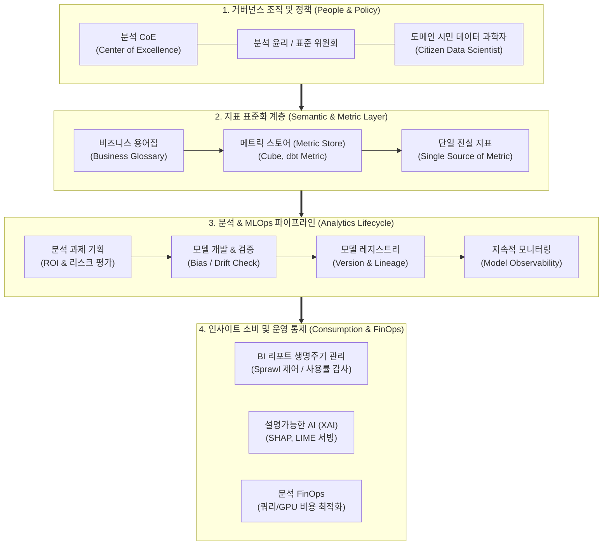

# 데이터 분석 거버넌스 (Data Analytics Governance)

---

## I. 신뢰 기반 의사결정 및 AI·분석 자산 통제, 데이터 분석 거버넌스의 개요

### 가. 데이터 분석 거버넌스(Data Analytics Governance)의 정의

* 조직의 데이터 기반 의사결정 신뢰성과 비즈니스 가치(ROI)를 극대화하기 위해 분석 기획부터 모델 개발, 지표(Metric) 정의, BI 리포트 배포 및 [[알고리즘]] 수명주기 전반을 표준화하고 통제하는 관리 [[프레임워크]]
* 원천 데이터 관리(Data Governance)를 넘어 시맨틱 계층(Semantic Layer), [[MLOps]], 분석 윤리, 클라우드 비용(FinOps)까지 포괄하여 '인사이트 도출 및 소비 과정'을 규율하는 종합 운영 체계

### 나. 데이터 분석 거버넌스의 필요성 및 핵심 특징

* **지표 왜곡 및 BI 난립(BI Sprawl) 방지**: 부서별 상이한 KPI 산출 로직을 단일화하여 단일 진실 지표(Single Source of Metric) 보장
* **섀도우 AI(Shadow AI) 및 규제 대응**: 검증되지 않은 머신러닝·[[초거대 언어 모델|LLM]] 모델 도입에 따른 알고리즘 편향성 및 컴플라이언스(EU AI Act, [[AI 윤리]] 기준) 리스크 차단
* **특징 (Outcome-Driven & Lifecycle-Centric)**: 데이터 적재 중심의 통제에서 벗어나 분석 모델의 성능 저하(Drift) 감지, 모델 설명가능성([[XAI]]) 및 분석 컴퓨팅 비용 최적화에 집중

---

## II. 데이터 분석 거버넌스의 프레임워크 및 핵심 기술 요소

### 가. 데이터 분석 거버넌스의 아키텍처 및 동작 프로세스

* CoE의 정책 하에 Metric Store를 통해 비즈니스 지표를 통일하고, 모델 등록부터 드리프트 감시까지 MLOps 전주기를 통제하며, BI 자산 라이프사이클 및 FinOps를 결합하여 안정적 인사이트를 제공하는 구조

### 나. 데이터 분석 거버넌스의 핵심 기술 및 구성 요소

| 구분 | 요소기술(키워드) | 세부 설명 |
| --- | --- | --- |
| **조직/역할** | 분석 CoE (Center of Excellence) | 전사 분석 과제 우선순위 지정, 모델 배포 승인 및 시민 데이터 과학자 지원 총괄 |
| **지표 표준화** | 시맨틱 레이어 (Semantic Layer) | BI 도구와 데이터 웨어하우스 간 공통 비즈니스 로직 및 측정 지표를 코드로 중앙 정의 |
| **지표 표준화** | 메트릭 스토어 (Metric Store) | KPI 정의를 중앙 저장소에서 단일화(Headless BI)하여 대시보드 간 계산 불일치 원천 차단 |
| **모델 관리** | 모델 레지스트리 (Model Registry) | ML/AI 모델 버전, 파라미터, 학습 데이터셋 스냅샷 및 종단간 계보(Lineage) 추적 |
| **품질/운영** | 모델 관측성 (Model Observability) | 배포 모델의 데이터 드리프트(Data Drift), 개념 드리프트(Concept Drift), 추론 지연 모니터링 |
| **윤리/신뢰** | XAI (설명가능한 AI) | SHAP, [[LIME]] 기반 특성 중요도(Feature Attribution) 산출 및 의사결정 알고리즘 블랙박스 해소 |
| **자산 관리** | BI 자산 라이프사이클 관리 | 미사용 대시보드 식별·폐기, 접근 권한 통제 및 리포트 중복 방지(BI Sprawl Control) |
| **비용 최적화** | 분석 FinOps (Cloud Cost FinOps) | 복잡한 분석 쿼리 I/O 제한, 비효율 모델의 [[GPU]] 자원 낭비 감시 및 부서별 비용 할당(Showback) |

---

## III. 데이터 거버넌스 vs 데이터 분석 거버넌스 비교 및 향후 전망

### 가. 데이터 거버넌스 vs 데이터 분석 거버넌스 비교

| 비교 항목 | [[데이터 거버넌스|데이터 거버넌스 (Data Governance)]] | 데이터 분석 거버넌스 (Data Analytics Governance) |
| --- | --- | --- |
| **관리 대상** | 원천 데이터, [[스키마]], 파이프라인, 마스터 데이터 | 분석 모델(ML/LLM), KPI 지표, BI 대시보드, 알고리즘 |
| **핵심 초점** | 데이터 자산의 [[무결성]], 보안, [[HA(High Availability)|가용성]] (Data at Rest/Motion) | 인사이트 도출의 정확성, 비즈니스 영향도 (Insight in Action) |
| **표준화 영역** | 데이터 명명 규칙, 코드 정의, 메타데이터 카탈로그 | 계산 로직(Metric Store), 시맨틱 계층, 피처 스토어(Feature Store) |
| **위험 관리** | 데이터 유출, 개인정보 침해, 결측/오류 데이터 | 잘못된 의사결정 유발, 모델 환각(Hallucination), 알고리즘 [[편향]] |
| **핵심 도구** | Data Catalog, Data Lineage, MDM 솔루션 | Model Registry, MLOps, Semantic Layer, BI Audit Tools |
| **주요 담당자** | CDO, Data Owner, Data Steward, 데이터 엔지니어 | CAO(최고분석책임자), 분석 CoE, 데이터 사이언티스트, BI 관리자 |

### 나. 성공적 정착을 위한 향후 과제 및 전망

* **생성형 AI 및 에이전트 거버넌스(Agentic Governance) 융합**: LLM 에이전트의 자율적 분석 쿼리 실행 증가에 대응하여 에이전트 권한 제어, 프롬프트 가드레일 및 환각 검증 체계 확립 필수
* **연합형 자율 분석(Federated Analytics) 체계 정립**: 중앙 집중식 승인의 병목을 방지하기 위해 도메인 조직에 분석 권한을 위임하되, CI/CD 파이프라인 내 정책 코드(Policy-as-Code) 기반 자동 검증 구현 필요

---

### 🔗 연관 토픽

- **소속 도메인**: [[00_데이터베이스_MOC|🗄️ 데이터베이스]]
- **세부 분류**: `6. SQL 표준 문법 & 쿼리 성능 튜닝`
- **핵심 연관 토픽**:
  - [[무결성]]
  - [[편향]]
  - [[XAI]]
  - [[MLOps]]
  - [[데이터 거버넌스|데이터 거버넌스 (Data Governance)]]
