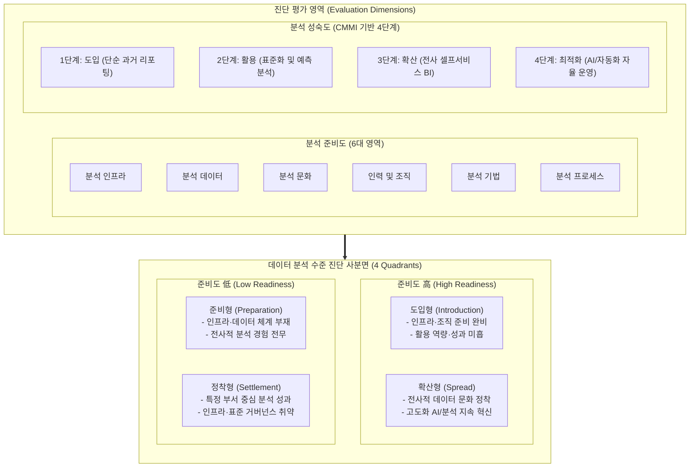

# 데이터 분석 준비도와 성숙도

---

## I. 데이터 기반 경영 전환을 위한 진단 프레임워크, 데이터 분석 준비도와 성숙도의 개요

### 가. 데이터 분석 준비도와 성숙도의 정의

* 기업 및 기관의 데이터 기반 의사결정 역량을 객관적으로 진단하기 위해 데이터 인프라, 조직, [[프로세스]] 등 사전 환경 역량(준비도)과 분석 기술 및 가치 창출의 발전 수준(성숙도)을 입체적으로 측정하는 수준 진단 [[프레임워크]]
* 한국데이터산업진흥원(K-DATA) 및 [[CMMI]] 기반으로 조직의 현재 분석 위치를 파악하고 맞춤형 데이터 로드맵을 도출하는 2차원 평가 체계

### 나. 데이터 분석 준비도와 성숙도의 필요성 및 특징

* **투자 효율성(ROI) 극대화**: 툴 도입 중심의 과잉 투자를 방지하고 조직 역량에 부합하는 단계적 도입 로드맵 수립
* **데이터 사일로 및 불균형 식별**: IT 인프라, [[데이터 거버넌스]], 분석 문화 간의 병목 요인을 진단하여 균형 잡힌 데이터 자산화 지원
* **핵심 특징**:
* **2차원 사분면 매핑**: 준비도와 성숙도 축을 결합한 4대 유형(준비형, 정착형, 도입형, 확산형) 포지셔닝
* **정량·정성 복합 진단**: 시스템 규격(하드웨어/소프트웨어)과 조직 문화(리터러시/리더십)의 통합 평가

---

## II. 데이터 분석 준비도와 성숙도의 진단 체계 및 핵심 구성요소

### 가. 분석 수준 진단 사분면 및 평가 프레임워크

* 6대 준비도 영역과 4단계 성숙도 레벨을 교차 평가하여 조직의 포지션을 도출하고, 병목 요인을 해결하기 위한 타깃 개선 전략을 정의

### 나. 데이터 분석 준비도와 성숙도의 핵심 기술 및 구성 요소

| 구분 | 요소기술(키워드) | 세부 설명 |
| --- | --- | --- |
| **준비도(환경)** | 분석 인프라 (Modern Data [[Stack]]) | 클라우드 DW/레이크하우스, 확장형 분산 처리 엔진, DataOps/[[MLOps]] 자동화 환경 |
| **준비도(자산)** | 분석 데이터 및 품질 (Data & DQC) | 데이터 카탈로그, 메타데이터 연계, 신선도/완전성 관리, 비정형 멀티모달 자산화 |
| **준비도(조직)** | 인력 및 조직 (Analytics CoE) | 데이터 엔지니어/사이언티스트 확보, 현업 시민 데이터 과학자(Citizen DS) 육성 체계 |
| **준비도(문화)** | 데이터 문화 및 리터러시 | 최고경영진의 스폰서십, 직관 대신 데이터 기반 의사결정 원칙, 데이터 공유 문화 |
| **준비도(운영)** | 분석 기법 및 프로세스 | 과제 발굴-PoC-배포 표준 수명주기, 특성 공학(Feature Store), 통계/ML 모델 라이브러리 |
| **성숙도(1단계)** | 도입 단계 (Descriptive) | 일부 부서의 일회성 분석, 엑셀/정적 보고서 중심의 과거 사실 조회 수준 |
| **성숙도(2단계)** | 활용 단계 (Diagnostic & Predictive) | 분석 전문 부서 신설, 전사 표준 지표 정의, 원인 규명 및 미래 예측 머신러닝 적용 |
| **성숙도(3단계)** | 확산 단계 (Prescriptive) | 전사 셀프서비스 BI, 실시간 스트리밍 분석, 비즈니스 프로세스 내 처방 분석 내재화 |
| **성숙도(4단계)** | 최적화 단계 (Autonomous) | 생성형 AI/에이전트 연계, 비즈니스 모델 자동 피봇팅, FinOps 기반 비용-성능 최적화 |

---

## III. 사분면 유형별 추진 전략 및 최신 발전 동향

### 가. 분석 수준 진단 사분면별 현안 및 맞춤형 추진 전략

| 사분면 유형 | 상태 특징 | 주요 현안 및 위험 | 추진 전략 및 과제 |
| --- | --- | --- | --- |
| **준비형**(준비도 低 / 성숙도 低) | 분석 환경 및 역량 전무 | 투자 실패 위험, 조직 저항 | 경영진 인식 제고, 단기 Quick-Win 과제 중심 PoC 추진 |
| **정착형**(준비도 低 / 성숙도 高) | 소수 전문가/부서 주도 분석 | 시스템 확장 불가, 지식 사일로 | 전사 공통 플랫폼 도입, 데이터 거버넌스 및 표준화 체계 수립 |
| **도입형**(준비도 高 / 성숙도 低) | 플랫폼 구축 완료, 활용 저조 | 인프라 비용 낭비, 낮은 ROI | 데이터 리터러시 교육 강화, 현업 주도 유즈케이스 발굴 캠페인 |
| **확산형**(준비도 高 / 성숙도 高) | 전사적 분석 문화 내재화 | 클라우드 비용 급증, 컴플라이언스 | 자율형 [[에이전틱 AI]] 도입, FinOps 체계 가동, 데이터 보안 거버넌스 |

### 나. 최신 기술 동향 및 향후 전망

* **AI-Readiness([[인공지능]] 준비도) 프레임워크로의 확장**: 정형 통계 분석 수준을 넘어 [[파운데이션 모델]], RAG 파이프라인, 비정형 데이터 라벨링 역량을 측정하는 'AI 준비도 지수'로 진화
* **거버넌스 및 자율형 분석(Agentic Analytics)과의 통합**: 시맨틱 레이어(Metric Store)를 통한 지표 표준화 수준과 [[초거대 언어 모델|LLM]] 기반 자율 에이전트의 데이터 탐색 성숙도를 평가 모델에 반영하는 체계 고도화 필수

---

### 🔗 연관 토픽

- **소속 도메인**: [[00_경영전략_MOC|📈 경영전략]]
- **세부 분류**: `3. 비즈니스 프로세스 혁신 & 디지털 전환 (DX)`
- **핵심 연관 토픽**:
  - [[데이터 거버넌스|데이터 거버넌스 (Data Governance)]]
  - [[인공지능]]
  - [[에이전틱 AI|에이전틱 AI(Agentic AI)]]
  - [[파운데이션 모델|파운데이션 모델(Foundation Model)]]
  - [[프로세스]]
