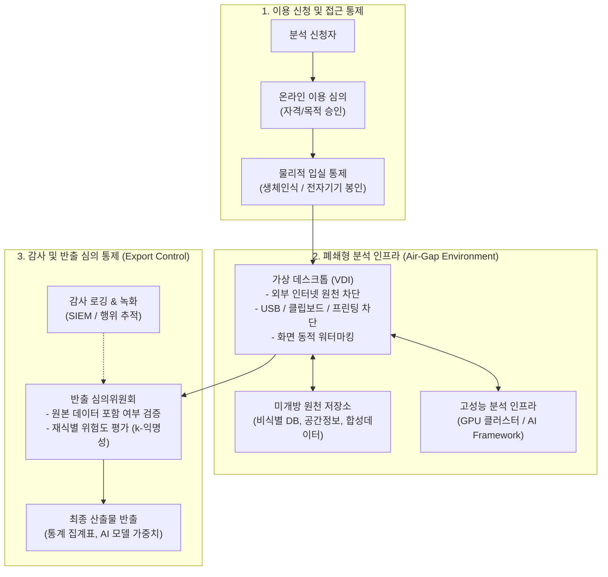

# 데이터 안심구역 (Data Safety Zone)

---

## I. 미개방·민감 데이터의 안전한 활용 거점, 데이터 안심구역의 개요

### 가. 데이터 안심구역의 정의

* 국가 핵심 전략 데이터 및 민감 미개방 데이터를 외부 유출 없이 분석할 수 있도록 물리적·기술적·관리적 보안 대책을 완비한 보안 분석 환경 및 시설
* 「데이터 산업진흥 및 이용촉진에 관한 기본법」(데이터산업법) 제11조에 근거하여 과학기술정보통신부 장관 및 관계 중앙행정기관의 장이 지정·운영하는 공인 데이터 활용 구역

### 나. 데이터 안심구역의 등장배경 및 핵심 특징

* **등장배경**: [[데이터 3법]] 개정 이후에도 재식별·기술 유출 우려로 인한 공공·금융·의료 미개방 원천데이터 활용 한계 해소, 고부가가치 AI 학습용 미개방 데이터 수요 급증
* **핵심특징**:
* **원천데이터 반출 불가(Zero Outbound)**: 데이터 반출을 원천 차단하고 오직 사전 심의를 통과한 분석 결과물(가중치, 통계치)만 반출
* **3대 보안 체계 완비**: 물리적 폐쇄망, 기술적 [[가상화]](VDI), 관리적 반출 심의 거버넌스 융합
* **규제샌드박스 연계**: 모빌리티·의료·공간정보 등 규제 제한 원본 데이터의 실증 분석 허용

---

## II. 데이터 안심구역의 아키텍처 및 핵심 기술 요소

### 가. 데이터 안심구역의 구성 아키텍처 및 처리 절차

* 분석가는 물리·관리적 승인을 거쳐 폐쇄형 VDI 환경에 접속하여 미개방 원천데이터를 분석하며, 모든 행위는 감사 로그로 기록되고 가공 산출물은 반출심의위원회의 적합성 검증 후 반출됨

### 나. 데이터 안심구역의 핵심 기술 및 구성 요소

| 구분 | 요소기술(키워드) | 세부 설명 |
| --- | --- | --- |
| **물리적 보안** | 에어갭 폐쇄망 (Air-Gap) | 외부 공용 인터넷망과 완전히 물리적으로 격리된 전용 분석 네트워크 구축 |
| **물리적 보안** | 다중 출입통제 (MFA / 생체인식) | 지문/안면인식 기반 2차 인증, 금속탐지기, 모바일 기기 및 저장매체 밀봉 반입 통제 |
| **가상화 인프라** | 망분리 VDI (DaaS) | [[세션]] 기반 가상 데스크톱 환경을 제공하여 로컬 단말기로의 데이터 다운로드 원천 방지 |
| **유출 방지 ([[DLP]])** | 엔드포인트 I/O 블로킹 | 클립보드 복사, 파일 드래그앤드롭, USB/외장 디스크 마운트, 화면 캡처 및 출력 차단 |
| **추적성 확보** | 동적 워터마킹 & 감사추적 | 사용자 IP, 계정, 접속 시간을 실시간 화면에 표출하고, 전 과정 조작 화면/명령어 비디오 녹화 |
| **프라이버시 강화** | PET (개인정보 강화기술) | [[차분 프라이버시]](Differential Privacy), 재식별 모델링, [[합성 데이터|합성 데이터(Synthetic Data)]] 생성 기술 |
| **반출 통제** | 반출 데이터 정량 진단 | 산출물 내 개인정보 노출 여부, $k$-익명성, $l$-다양성 충족 여부 및 역공학 위험도 자동 스캔 |
| **거버넌스** | 데이터 반출 심의위원회 | 통계학·보안·법률 전문가가 최종 산출물의 비식별 적정성을 평가·승인하는 공적 심의 체계 |

---

## III. 데이터 안심구역 vs 개인정보 안심구역 비교 및 향후 전망

### 가. 데이터 안심구역(과기정통부) vs 개인정보 안심구역(개보위) 비교

| 비교 항목 | 데이터 안심구역 (Data Safety Zone) | [[개인정보 안심구역]] (Privacy Safety Zone) |
| --- | --- | --- |
| **근거 법령** | 「데이터산업법」 제11조 | 「개인정보 보호법」 및 개보위 안심구역 지정 지침 |
| **주관 부처** | 과학기술정보통신부 및 관계 중앙행정기관 | 개인정보보호위원회 |
| **대상 데이터** | 미개방 산업·공공 원천데이터, 공간정보, 통신, 교통 등 | 가명정보(이종 결합 데이터), 결합키 연계 통계 데이터 |
| **주요 목적** | AI R&D, [[알고리즘]] 검증, 비식별 원본 데이터 산업적 활용 촉진 | 가명처리 수준 완화, 동형암호 등 PET 실증, 가명정보 [[재사용]] |
| **분석 공간** | 과기정통부 지정 거점 센터 (K-DATA 등 전국 오프라인/원격) | 통계데이터센터, KISA 등 공공/선도 가명정보 분석 센터 |

### 나. 향후 과제 및 발전 전망

* **클라우드 기반 원격 안심구역(Virtual Safety Zone) 전환**: 오프라인 방문 중심 한계를 극복하기 위해 기밀 컴퓨팅([[기밀컴퓨팅|Confidential Computing]], Enclave) 및 동형암호 기반 원격 클라우드 안심구역으로의 인프라 전환 가속화
* **AI [[파운데이션 모델]] 학습 특화 인프라 확장**: 대규모 [[초거대 언어 모델|LLM]]/VLM 파인튜닝을 위한 고성능 [[GPU]] 팜(Cluster)을 내장하고, 모델 가중치(Weight) 반출 시 모델 전도 공격(Model Inversion Attack)을 탐지하는 보안 가드레일 정립 필수

---

### 🔗 연관 토픽

- **소속 도메인**: [[00_보안_MOC|🛡️ 보안]]
- **세부 분류**: `6. 개인정보보호 & 프라이버시 강화 기술`
- **핵심 연관 토픽**:
  - [[개인정보 안심구역]]
  - [[차분 프라이버시]]
  - [[합성 데이터|합성 데이터(Synthetic Data)]]
  - [[데이터 3법|데이터 3법 (Data 3 Acts)]]
  - [[GPU]]
