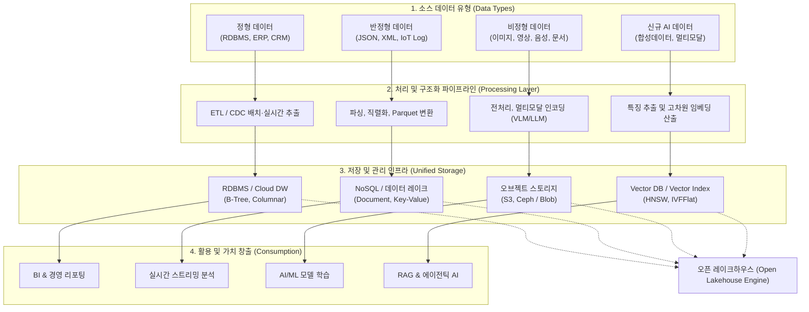

# 데이터 유형 (Data Types)

---

## I. 데이터 자산화 및 AI 워크로드의 핵심 기초, 데이터 유형의 개요

### 가. 데이터 유형의 정의

* 컴퓨터 시스템에서 처리, 저장, 분석되는 데이터의 형태, 구조적 규격 및 의미론적 특성에 따라 분류한 체계
* 전통적 관계형 [[스키마]] 기반 정형 데이터부터 웹·로그 중심 반정형, 멀티미디어 비정형, 그리고 생성형 AI 학습 및 추론을 위한 벡터·합성 데이터까지 포괄하는 데이터 분류 [[프레임워크]]

### 나. 데이터 유형의 분류 기준 및 핵심 특징

* **구조화 수준(Structure)**: 고정 스키마(Schema-on-Write) $\rightarrow$ 유연한 스키마(Schema-on-Read) $\rightarrow$ 비구조화(No-Schema) $\rightarrow$ 다차원 수치 임베딩(Vector)으로 진화
* **AI 패러다임 전환**: 과거 [[트랜잭션]] 처리([[OLTP]]) 중심 정형 데이터에서 비정형 멀티모달 및 고차원 임베딩 벡터 데이터 중심 전이
* **저장·처리 아키텍처 다변화**: RDBMS/DW $\rightarrow$ [[NoSQL (CAP 이론 BASE 속성)|NoSQL]]/데이터 레이크 $\rightarrow$ 레이크하우스(Iceberg) 및 [[벡터 데이터베이스]](Vector DB)로 처리 인프라 수렴

---

## II. 데이터 유형별 처리 체계 및 핵심 기술 요소

### 가. 데이터 유형별 파이프라인 아키텍처 및 처리 흐름

* 다양한 원천 데이터 유형은 고유한 변환·임베딩 파이프라인을 거쳐 최적화된 스토리지로 적재되며, 최신 아키텍처에서는 오픈 테이블 포맷(Lakehouse) 및 Vector [[RDBMS 인덱스(index)|Index]]를 통해 단일 뷰로 수렴 처리됨

### 나. 데이터 유형의 핵심 기술 및 구성 요소

| 구분 | 요소기술(키워드) | 세부 설명 |
| --- | --- | --- |
| **정형 (Structured)** | Schema-on-Write | 데이터 적재 전 테이블 구조(ERD, 필드 타입, 제약조건)를 사전 정의 및 엄격 통제 |
| **정형 (Structured)** | 관계형 연산 (ACID/[[SQL(Structured Query Language)|SQL]]) | 원자성·일관성을 보장하며 B-Tree, 비트맵 인덱스 및 SQL 기반의 고속 집계·조회 지원 |
| **반정형 (Semi-structured)** | Self-Describing 메타데이터 | 데이터 값과 함께 구조 정보(태그, 키-값 쌍)를 파일 내 자체 포함([[JSON]], [[XML]], YAML) |
| **반정형 (Semi-structured)** | 오픈 컬럼형 포맷 | Apache Parquet, ORC 등 압축률과 I/O 효율을 극대화한 빅데이터 표준 분석 파일 규격 |
| **비정형 (Unstructured)** | 오브젝트 스토리지 (Blob) | 메타데이터와 고유 ID 기반으로 대용량 파일(영상, 이미지, 텍스트)을 무제한 수평 확장 저장 |
| **비정형 (Unstructured)** | 멀티모달 특징 추출 | VLM(비전-언어 모델), Whisper(STT), OCR 등을 통해 비정형 소스에서 정량 특징 정보 추출 |
| **신규 AI 데이터** | 벡터 임베딩 (Vector Embedding) | 텍스트·이미지의 의미론적 맥락을 $\mathbb{R}^d$ 차원의 연속 실수 벡터로 변환, HNSW/IVF 색인 적용 |
| **신규 AI 데이터** | 합성 데이터 (Synthetic Data) | Diffusion, [[GAN (Generative Adversarial Network)|GAN]], [[초거대 언어 모델|LLM]]을 활용하여 프라이버시 침해 없이 데이터 불균형 및 편향을 해소하는 가상 데이터 |

---

## III. 데이터 유형별 다차원 비교 및 향후 전망

### 가. 구조화 수준에 따른 데이터 유형 다차원 비교

| 비교 항목 | 정형 데이터 (Structured) | 반정형 데이터 (Semi-structured) | 비정형 데이터 (Unstructured) | 벡터 데이터 (Vector Data) |
| --- | --- | --- | --- | --- |
| **스키마 적용 시점** | Schema-on-Write (사전 정의) | Schema-on-Read (해석 시점) | 스키마 없음 (No-Schema) | 벡터 차원 정의 ($d$-Dimensions) |
| **데이터 형태** | 테이블, 행(Row)/열(Column) | Key-Value, JSON, XML, 로그 | 이미지, 오디오, 비디오, 텍스트 | 고차원 실수 배열(Embedding) |
| **저장 인프라** | RDBMS, DW | NoSQL, Data Lake | Object Storage, [[HDFS]] | Vector DB, 임베딩 인덱스 |
| **검색/질의 방식** | SQL, 엄격한 일치 검색 | XPath, JSONPath, NoSQL Query | 키워드 검색, 메타데이터 매칭 | [[유사도]] 검색 (Cosine, L2 Distance) |
| **엔터프라이즈 비중** | 약 10~20% | 약 20~30% | 약 70~80% (비정형 급증 추세) | AI 파이프라인 핵심 자산화 급증 |

### 나. 데이터 유형의 최신 기술 동향 및 향후 전망

* **비정형 데이터의 벡터화 및 시맨틱 수렴**: 텍스트, 이미지, 음성 등 파편화된 비정형 데이터가 임베딩 모델을 통해 고차원 벡터로 단일화되어 RAG(검색 증강 생성) 및 지능형 에이전트의 원천 자산으로 활용 가속
* **멀티모달 레이크하우스(Multimodal Lakehouse)의 표준화**: Apache Iceberg 등 오픈 테이블 포맷 상에서 정형 테이블, 반정형 JSON, 비정형 미디어 포인터, 벡터 인덱스를 단일 거버넌스 프레임워크로 통합 관리하는 체계 필수 정립
* **[[합성 데이터|합성 데이터(Synthetic Data)]] 거버넌스 도입**: 실데이터 수집 한계([[개인정보보호법]], 저작권)를 극복하기 위해 합성 데이터 생성 파이프라인의 환각(Hallucination) 검증 및 데이터 충실도(Fidelity) 평가 기준 마련 전망

---

### 🔗 연관 토픽

- **소속 도메인**: [[00_인공지능_MOC|🤖 인공지능]]
- **세부 분류**: `1. 수학 · 통계학 & 데이터 전처리`
- **핵심 연관 토픽**:
  - [[벡터 데이터베이스|벡터 데이터베이스(Vector Database)]]
  - [[합성 데이터|합성 데이터(Synthetic Data)]]
  - [[유사도|유사도(Similarity)]]
  - [[GAN (Generative Adversarial Network)]]
  - [[SQL(Structured Query Language)]]
