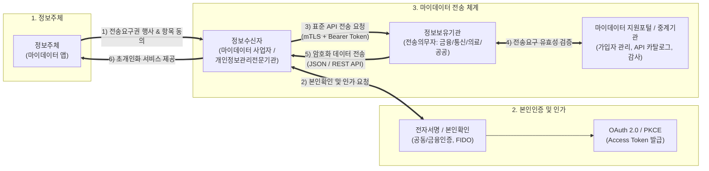

# 데이터 전송요구권 (Right to Request Data Transmission)

---

## I. 정보주체 주권 강화 및 전 산업 마이데이터의 핵심, 데이터 전송요구권의 개요

### 가. 데이터 전송요구권의 정의

* 정보주체가 개인정보처리자에게 본인에 관한 개인정보를 본인 또는 본인이 지정한 제3자(다른 개인정보처리자, 개인정보관리전문기관 등)에게 기계 판독이 가능한 형태로 안전하게 전송하도록 요구할 수 있는 법적 권리
* 「개인정보 보호법」 제35조의2 및 「신용정보의 이용 및 보호에 관한 법률」 제33조의2에 근거하여 금융·공공을 넘어 의료·통신·유통 등 전 산업 [[마이데이터]](MyData) 확산의 핵심 법적 동력

### 나. 데이터 전송요구권의 필요성 및 핵심 특징

* **필요성**:
* **정보주체의 자기결정권 실질화**: 특정 플랫폼에 종속(Lock-in)된 데이터 소유권을 개인이 회수하여 능동적 활용 지원
* **데이터 독점 해소 및 경쟁 촉진**: 플랫폼 빅테크의 데이터 폐쇄성을 완화하고 신규 스타트업·[[01_IT Tech/핀테크]] 진입 장벽 제거
* **스크래핑(Scraping) 보안 부작용 차단**: 계정정보 탈취 및 트래픽 과부하를 유발하는 웹 스크래핑 관행을 표준 API 체계로 전면 대체

* **핵심 특징**:
* **본인 및 제3자 전송 지원**: 본인 다운로드(Download)뿐 아니라 인가된 타 사업자로의 직접 전송(Direct Transfer) 보장
* **기계 판독성(Machine-readable)**: 스프레드시트나 비정형 포맷이 아닌 [[JSON]] 형태의 표준화된 오픈 API 전송 강제
* **선택적 동의권**: 정보주체가 전송 항목, 주기, 수신자를 개별 선택·철회할 수 있는 세분화된 통제권 제공

---

## II. 데이터 전송요구권의 아키텍처 및 핵심 기술 요소

### 가. 데이터 전송요구권의 개념도 및 동작 프로세스

* 정보주체의 명시적 동의와 본인확인을 거쳐 정보수신자가 인가 토큰(OAuth 2.0)을 확보하고, 상호 인증된 안전한 전송 구간(mTLS)을 통해 기계 판독형 표준 API(JSON)로 데이터를 실시간 전송받는 구조

### 나. 데이터 전송요구권의 핵심 기술 및 구성 요소

| 구분 | 요소기술(키워드) | 세부 설명 |
| --- | --- | --- |
| **인증/인가** | OAuth 2.0 & OIDC | 패스워드 노출 없이 특정 리소스 접근 권한만 세분화하여 부여하는 Scoped Access Token 기반 인가 |
| **전송 보안** | mTLS (Mutual TLS 1.3) | 클라이언트와 서버 간 양방향 상호 인증 및 전송 구간 [[무결성]]·[[기밀성]] 보장 [[암호화]] 통신 |
| **연계 인터페이스** | 표준 RESTful API | HTTP 표준 메서드 및 JSON 규격을 채택하여 데이터 파싱 및 이종 시스템 간 상호운용성(Interoperability) 확보 |
| **무결성/부인방지** | 전자서명 및 [[FIDO]] | 전송요구 동의 및 철회 시 공인전자서명과 생체인증을 결합하여 법적 부인방지 효력 담보 |
| **식별/매핑** | CI (연계정보) & 해시 매핑 | 주민등록번호 대체 일방향 암호화 연계정보(CI)를 활용하여 이종 기관 간 동일 정보주체 식별 및 안전 결합 |
| **거버넌스/중계** | 마이데이터 지원포털 | 전송요구 내역 일괄 조회·철회 지원, 전송이력 관리, API 카탈로그 및 전송의무자 메타데이터 중계 |
| **모니터링** | 전용 FDS (이상거래탐지) | 대량 데이터 비정상 호출, 위조 토큰 접근, 비인가 스크래핑 시도 등 트래픽 패턴 실시간 감시 및 차단 |
| **데이터 최소화** | Data Minimization 제어 | 정보주체가 요구한 목적에 부합하는 최소한의 필드만 전송되도록 API [[스키마]] 레벨에서 필터링 통제 |

---

## III. 데이터 전송요구권 vs 정보공개청구 비교 및 향후 전망

### 가. 데이터 전송요구권 vs 공공기관 정보공개청구 비교

| 비교 항목 | 데이터 전송요구권 (Data Transmission) | 공공기관 정보공개청구 |
| --- | --- | --- |
| **근거 법령** | 「개인정보 보호법」 제35조의2, 「신용정보법」 제33조의2 | 「공공기관의 정보공개에 관한 법률」 |
| **권리 주체 및 대상** | 정보주체 본인에 관한 '개인정보' | 모든 국민, 공공기관이 생산·보유한 '행정정보/공문서' |
| **전송 대상** | 정보주체 본인 또는 지정된 제3자(마이데이터 사업자) | 청구인 본인 (제3자 자동 전송 경로 없음) |
| **제공 방식** | 실시간 기계 판독형 표준 API (JSON 규격화) | 전자문서(PDF, HWP), 열람, 수기 사본 교부 |
| **권리의 핵심 목적** | 개인의 데이터 주권 확립 및 혁신 서비스 창출 | 알 권리 충족 및 행정 운영의 투명성 확보 |
| **처리 속도** | API 호출 기반 즉시/실시간 처리 원칙 | 청구일로부터 10일 이내(연장 가능) 처리 |

### 나. 향후 발전 방향 및 고려사항

* **합리적 과금 체계 수립**: 정보보유기관(전송의무자)의 과중한 API 서버 트래픽 비용 및 인프라 [[유지보수]] 부담을 완화하기 위한 표준 전송 수수료 체계 정착 필요
* **다크패턴 방지 및 동의 체계 내실화**: 서비스 이용을 빌미로 한 포괄적 정보 요구를 근절하고, 개별 정보 항목별 전송 여부를 명확히 인지할 수 있는 UI/UX 표준 가이드라인 의무화
* **[[에이전틱 AI]](Agentic AI)와의 융합**: 표준 API로 수집된 금융, 통신, 헬스케어 결합 데이터를 바탕으로 자율형 AI 에이전트가 개인 최적화된 자산 관리 및 건강 코칭을 수행하는 데이터 경제 고도화 전망

---

### 🔗 연관 토픽

- **소속 도메인**: [[00_보안_MOC|🛡️ 보안]]
- **세부 분류**: `6. 개인정보보호 & 프라이버시 강화 기술`
- **핵심 연관 토픽**:
  - [[암호화|암호화 (Encryption)]]
  - [[기밀성]]
  - [[무결성]]
  - [[스키마]]
  - [[마이데이터]]
