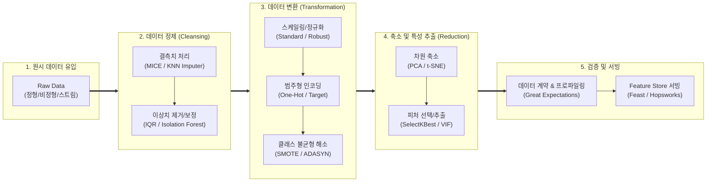

# 데이터 전처리 (Data Preprocessing)

---

## I. 모델 성능 결정 및 Data-Centric AI의 핵심, 데이터 전처리의 개요

### 가. 데이터 전처리(Data Preprocessing)의 정의

* 수집된 원시 데이터(Raw Data)의 결측, 노이즈, [[이상치]], 불일치를 제거하고 정규화·변환·축소하여 머신러닝/[[딥러닝]] 모델이 학습 가능한 고품질 피처셋으로 가공하는 엔지니어링 [[프로세스]]
* GIGO(Garbage In, Garbage Out) 방지 및 알고리즘의 수렴 속도와 예측 정확도(Accuracy/F1-Score)를 극대화하기 위한 정제·변환·통합의 기반 작업

### 나. 데이터 전처리의 필요성 및 특징

* **필요성**: 실세계 데이터의 불완전성(Incompleteness)·잡음(Noise)·모호성 해소, 데이터 [[편향]](Bias) 완화, 모델 과적합(Overfitting) 방지
* **핵심 특징**:
* **Data-Centric AI 전환**: [[모델 구조]] 튜닝보다 학습 데이터 품질과 일관성이 모델 성능을 결정하는 패러다임 반영
* **반복 및 파이프라인화**: 일회성 스크립트 처리를 탈피하고 Feature Store 및 CI/CD 기반 파이프라인 자동화 구축
* **멀티모달 확장**: 정형 테이블 위주에서 텍스트(토큰화), 이미지/영상(증강·패치화), 고차원 벡터 임베딩으로 처리 범위 확장

---

## II. 데이터 전처리의 파이프라인 및 핵심 기술 요소

### 가. 데이터 전처리의 프로세스 및 동작 원리

* 원시 데이터 유입 후 결측·이상치 정제, 단위 스케일링 및 불균형 해소, 차원 축소를 거쳐 유효성 검증 후 Feature Store를 통해 실시간/배치 모델로 서빙하는 엔드투엔드 파이프라인

### 나. 데이터 전처리의 핵심 기술 및 구성 요소

| 구분 | 요소기술(키워드) | 세부 설명 |
| --- | --- | --- |
| **[[결측치]] 정제** | 다중대체법 (MICE) | 변수 간 회귀 관계를 반복 추정하여 결측값을 다변량 확률 분포 기반으로 정밀 대체 |
| **이상치 탐지** | Isolation Forest / LOF | 트리 분할 격리 횟수 및 주변 밀도(Local Outlier Factor) 기반 비모수적 다차원 이상치 검출 |
| **값 정규화** | 스케일링 (Robust / Standard) | 중앙값·IQR 기반 이상치 저항 스케일링(Robust) 및 평균 0, 분산 1 표준화(Z-Score) 적용 |
| **범주형 변환** | 타깃 인코딩 (Target Encoding) | 종속변수 평균값 매핑을 통해 고유 카디널리티(High Cardinality) 범주 폭증(차원의 저주) 방지 |
| **데이터 불균형** | SMOTE & ADASYN | 소수 [[클래스]] 경계면(k-NN) 주변 가상 보간 샘플을 생성하여 오버샘플링 및 편향 완화 |
| **[[차원 축소]]** | [[PCA(Principal Component Analysis)|PCA]] & [[다중공선성]] 제거 | 공분산 행렬의 고유벡터 기반 직교 변환 주성분 추출 및 VIF(분산팽창지수) 기반 특성 축소 |
| **비정형 전처리** | 토큰화 및 데이터 증강 | BPE(Byte-Pair Encoding), WordPiece 분절 및 RandAugment, 음성 노이즈 믹스 기반 표현 증강 |
| **품질/자동화** | Data Validation & Feature Store | Great Expectations 기반 [[스키마]]/분포 검증 및 Feast/Hopsworks 기반 온/오프라인 피처 동기화 |

---

## III. 전통적 데이터 전처리 vs 현대적 MLOps 기반 전처리 비교 및 향후 전망

### 가. 전통적 데이터 전처리 vs 현대적 MLOps 기반 전처리 비교

| 비교 항목 | 전통적 데이터 전처리 | 현대적 [[MLOps]] 기반 데이터 전처리 |
| --- | --- | --- |
| **패러다임** | 모델 중심(Model-Centric), 개별 엔지니어 주도 | 데이터 중심(Data-Centric), 전사 파이프라인 주도 |
| **실행 방식** | 로컬 주피터 노트북 내 사후 수동 스크립트 처리 | CI/CD 파이프라인 통합 및 선언적(Declarative) 실행 |
| **피처 공유/서빙** | 부서별 코드 중복 작성, 훈련-서빙 불일치(Skew) 발생 | Feature Store 도입으로 오프라인 훈련/온라인 서빙 단일화 |
| **품질 검증** | 단순 통계 확인 및 육안 검증 | Data Contract, Great Expectations 기반 자동 차단(Shift-Left) |
| **데이터 형태** | 관계형 DB 기반 단일 정형 테이블 중심 | 멀티모달(텍스트, 이미지, 오디오), 임베딩 벡터 결합 |
| **드리프트 대응** | 모델 배포 후 주기적 재수작업 전처리 | 실시간 관측성(Observability) 기반 자동 트리거 재학습 |

### 나. 향후 발전 방향 및 고려사항

* **훈련-서빙 왜곡(Train-Serving Skew) 방지**: 배치 학습 시의 전처리 로직과 실시간 API 추론 시의 전처리 로직을 단일화하기 위해 Feature Store 및 변환 파이프라인 [[캡슐화]] 필수
* **[[합성 데이터]] 기반 전처리 고도화**: 개인정보 이슈 및 데이터 희소성([[EDGE|Edge]] Case) 극복을 위해 Diffusion/[[초거대 언어 모델|LLM]] 기반 합성(Synthetic) 데이터를 활용한 사전 보정 기술 정착 전망

---

### 🔗 연관 토픽

- **소속 도메인**: [[00_데이터베이스_MOC|🗄️ 데이터베이스]]
- **세부 분류**: `1. 데이터 모델링 & 관계형 DB 설계`
- **핵심 연관 토픽**:
  - [[편향]]
  - [[PCA(Principal Component Analysis)]]
  - [[차원 축소|차원 축소(Dimensionality Reduction)]]
  - [[다중공선성|다중공선성 (Multicolinearity)]]
  - [[이상치]]
