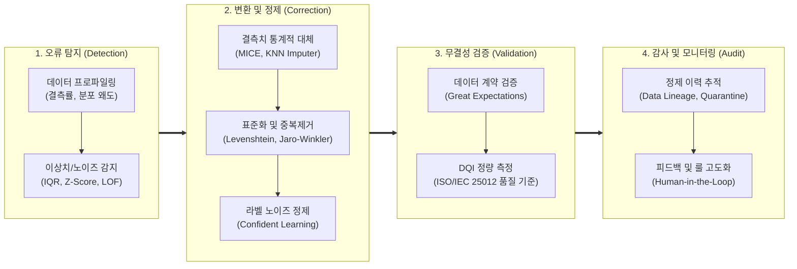

# 데이터 클렌징 (Data Cleansing)

---

## I. 데이터 품질 보증 및 Data-Centric AI의 출발점, 데이터 클렌징의 개요

### 가. 데이터 클렌징(Data Cleansing)의 정의

* 원시 데이터셋(Raw Dataset) 내 존재하는 [[결측치]], [[이상치]], 중복값, 오기입 등 오류 및 노이즈 데이터를 체계적으로 탐지, 수정, 삭제, 대체하여 데이터 무결성과 신뢰성을 확보하는 정제 활동
* GIGO(Garbage In, Garbage Out) 방지 및 다운스트림 분석·AI 모델의 성능 저하를 방지하기 위해 [[데이터 거버넌스]] 및 데이터 파이프라인 전반에서 수행하는 핵심 데이터 품질 엔지니어링

### 나. 데이터 클렌징의 필요성 및 특징

* **필요성**:
* **분석/의사결정 왜곡 차단**: 오기입 및 중복 레코드로 인한 비즈니스 KPI 및 집계 지표 왜곡 원천 제거
* **AI 모델 성능 및 드리프트 방지**: 학습 데이터 내 노이즈 라벨 및 이상치 주입에 따른 과적합 및 [[일반화]] 성능 저하 예방
* **컴플라이언스 준수**: 오기입된 개인정보 정비 및 도메인 표준 규격 충족을 통한 데이터 거버넌스 확립

* **핵심 특징**:
* **Data-Centric AI 전환**: 모델 튜닝 중심에서 탈피하여 학습 데이터의 정합성과 일관성을 우선시하는 패러다임 반영
* **연속적 파이프라인(Shift-Left)**: 사후 수동 정제를 벗어나 데이터 수집·적재 단계(CI/CD)에서 자동으로 결함을 차단하는 자동화 지향
* **통계 및 머신러닝 융합**: 정적 비즈니스 룰과 통계적 대체, 비지도 이상치 탐지 알고리즘의 유기적 결합

---

## II. 데이터 클렌징의 아키텍처 및 핵심 기술 요소

### 가. 데이터 클렌징의 프로세스 및 아키텍처

* 원천 데이터 유입 시 프로파일링 및 ML 기반으로 오류를 탐지하고, 다변량 결측 대체 및 라벨 정제를 거친 후, 데이터 계약 기반 자동 검증을 통과한 고품질 데이터만 서빙하며 결함 데이터는 격리(Quarantine)하는 구조

### 나. 데이터 클렌징의 핵심 기술 및 구성 요소

| 구분 | 요소기술(키워드) | 세부 설명 |
| --- | --- | --- |
| **탐지/식별** | [[데이터 프로파일링|데이터 프로파일링 (Data Profiling)]] | 컬럼별 결측치 비율, 카디널리티, 고유값 패턴, 포맷 유효성을 진단하여 오류 데이터 사전 식별 |
| **이상치 처리** | 비지도 이상치 탐지 (Isolation Forest / LOF) | 다차원 피처 공간에서 고립 경로 길이 및 국소 밀도(Local Outlier Factor)를 기반으로 비정상 데이터 검출 |
| **결측치 대체** | 다변량 연쇄 대체 (MICE) | 변수 간 다중 회귀 모델을 반복 적합하여 결측값을 단순 평균이 아닌 통계적 확률 분포로 정밀 추정·보충 |
| **중복 정비** | 레코드 링키지 (Record Linkage) | Levenshtein, Jaro-Winkler 등 문자열 [[유사도]] 알고리즘을 활용한 동명이인/유사 [[엔티티]] 식별 및 중복 제거 |
| **포맷 표준화** | 비즈니스 룰 엔진 & Regex | 정규표현식 및 도메인 업무 규칙을 기반으로 전화번호, 주소, 날짜 등 비표준 데이터 포맷의 강제 표준화 |
| **라벨 정제** | 확신 학습 (Confident Learning) | Cleanlab 기법을 활용하여 예측 확률과 실제 라벨 간 불일치를 수학적으로 추정, 레이블 노이즈 자동 수정 |
| **품질 계약** | 선언적 데이터 검증 (Great Expectations) | [[스키마]], 결측률, 값 범위를 코드로 정의한 데이터 계약(Data Contract) 기반 배포 파이프라인 자동 테스트 |
| **이력/격리** | 데이터 계보 및 격리소 (Lineage & Quarantine) | 정제 실패 레코드를 별도 격리소(Dead Letter [[Queue]])로 분기 처리하고 원본-정제 간 변환 이력 감사 추적 |

---

## III. 전통적 클렌징 vs 현대적 AI 기반 클렌징 비교 및 향후 전망

### 가. 전통적 규칙 기반 클렌징 vs 현대적 AI 기반 자동화 클렌징 비교

| 비교 항목 | 전통적 규칙 기반 클렌징 | 현대적 AI 기반 자동화 클렌징 |
| --- | --- | --- |
| **접근 방식** | 수동 작성된 정적 규칙 (Static Rule) | 머신러닝 및 통계 기반 동적 적응 (Adaptive ML) |
| **검증 시점** | DB/DW 적재 후 주기적 사후 검증 | 데이터 수집 및 CI/CD 파이프라인 단계 사전 차단 (Shift-Left) |
| **데이터 범위** | 정형 관계형 테이블(RDBMS) 중심 | 정형, 비정형 텍스트/이미지, 멀티모달 및 학습 라벨 노이즈 |
| **결측/이상 처리** | 단순 평균값 대체 또는 일괄 삭제(Listwise Deletion) | MICE 다변량 회귀 대체, 다차원 밀도 기반 이상치 정밀 보정 |
| **라벨 노이즈 대응** | 대응 불가 (작업자 전수 육안 검수 의존) | Confident Learning 기반 불확실 라벨 자동 필터링 |
| **파이프라인 연계** | 개별 엔지니어의 일회성 [[SQL(Structured Query Language)|SQL]]/스크립트 처리 | DataOps, [[MLOps]] 연계 Feature Store 자동 동기화 |

### 나. 최신 기술 동향 및 향후 과제

* **소형 언어 모델(SLM) 기반 문맥적 정제(Semantic Cleansing)**: 단순 정규식으로 해결할 수 없는 비정형 텍스트 내 사실 왜곡, 모순 문맥, 도메인 전문 오탈자를 정밀 튜닝된 SLM을 활용해 자동 교정하는 기술 확산
* **정제 [[편향]](Cleansing Bias) 방지 거버넌스 수립**: 과도한 이상치 삭제 및 통계적 대체 과정에서 소수 집단([[EDGE|Edge]] Case)의 고유 데이터가 임의 소멸되어 발생하는 AI 편향성을 방지하기 위해 데이터 보전성 평가 기준 확립 필수

---

### 🔗 연관 토픽

- **소속 도메인**: [[00_데이터베이스_MOC|🗄️ 데이터베이스]]
- **세부 분류**: `1. 데이터 모델링 & 관계형 DB 설계`
- **핵심 연관 토픽**:
  - [[데이터 프로파일링|데이터 프로파일링 (Data Profiling)]]
  - [[스키마]]
  - [[엔티티|엔티티(Entity)]]
  - [[결측치]]
  - [[빅데이터 관련 정보화 사업에 대한 감리 수행]]
