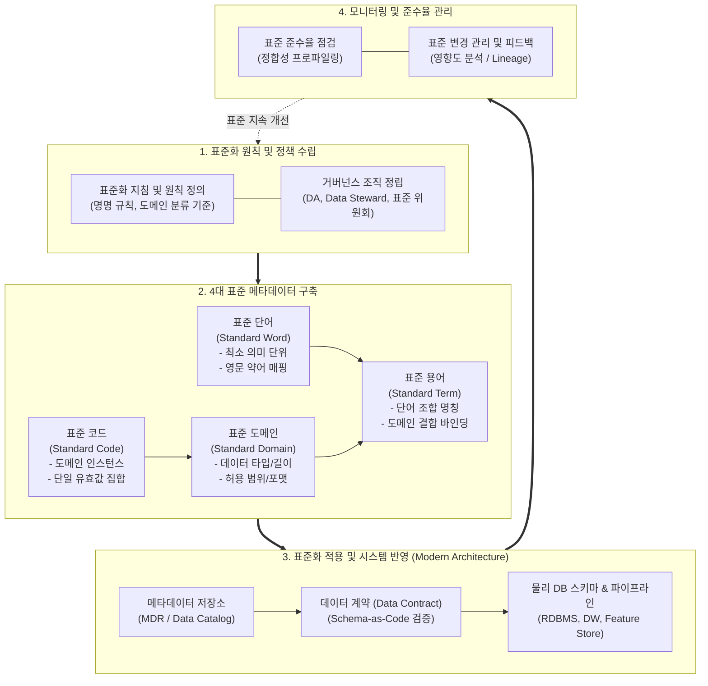

# 데이터 표준화 (Data Standardization)

---

## I. 전사 데이터 상호운용성 및 무결성 확보의 근간, 데이터 표준화의 개요

### 가. 데이터 표준화의 정의

* 전사 차원에서 데이터의 명칭, 정의, 형식, 규칙을 일관되게 규정하고, 합의된 표준 원칙에 따라 [[데이터베이스]] 객체와 속성을 통일하여 관리하는 [[데이터 거버넌스]] 기반 엔지니어링 활동
* ISO/IEC 11179(MDR) 메타데이터 레지스트리 규격을 기반으로 동일 의미 이명(Synonym), 이의 동일명(Homonym)을 정비하여 데이터 일관성 및 상호운용성을 보장하는 체계

### 나. 데이터 표준화의 필요성 및 특징

* **데이터 사일로(Silo) 및 중복 해소**: 부서·시스템별 상이한 컬럼명 및 코드 체계로 인한 데이터 정합성 불일치 원천 제거
* **차세대 AI/[[초거대 언어 모델|LLM]] [[신뢰성]] 담보**: 일관된 시맨틱(Semantic) 정의를 통해 피처 왜곡을 방지하고 Garbage In, Garbage Out(GIGO) 차단
* **핵심 특징**:
* **계층적 조합 구조**: 단어(Word) $\rightarrow$ 용어(Term) $\rightarrow$ 도메인(Domain) $\rightarrow$ 코드(Code)의 유기적 매핑
* **사전 예방(Shift-Left)**: 사후 수기 정제에서 벗어나 모델링 및 CI/CD 배포 시점에 표준을 강제하는 체계 지향

---

## II. 데이터 표준화의 체계 및 핵심 기술 요소

### 가. 데이터 표준화 체계도 및 수명주기 프로세스

* 4대 표준 요소(단어·도메인·코드·용어)를 기반으로 구축된 표준 사전을 MDR 및 Data Contract(CI/CD) 파이프라인과 연동하여 물리 데이터베이스 및 AI 피처에 자동 전파·검증하는 순환 구조

### 나. 데이터 표준화의 핵심 기술 및 구성 요소

| 구분 | 요소기술(키워드) | 세부 설명 |
| --- | --- | --- |
| **표준 요소** | 표준 단어 (Standard Word) | 데이터 명칭을 구성하는 최소 의미 단위로 동음이의어/이음동의어 분리, 금칙어 정의 및 영문 약어명 부여 |
| **표준 요소** | 표준 도메인 (Standard Domain) | 속성의 물리적·논리적 데이터 타입, 자릿수, 포맷(예: 날짜 YYYYMMDD), 허용 범위(Check 조건)를 그룹화하여 정의 |
| **표준 요소** | 표준 코드 (Standard Code) | 특정 도메인 내에서 선택 가능한 [[인스턴스]] 값 집합으로 단일 코드 체계 수립 및 코드값 매핑 명세화 |
| **표준 요소** | 표준 용어 (Standard Term) | 하나 이상의 표준 단어 조합과 표준 도메인을 결합하여 실제 비즈니스 속성명 및 논리/물리 컬럼명 확정 |
| **참조 표준** | ISO/IEC 11179 (MDR) | 메타데이터 상호운용성을 보장하는 국제 표준 레지스트리 프레임워크로 개념 객체(Data Element) 규격화 지원 |
| **통제 체계** | 3-Tier 거버넌스 조직 | Data Steward(도메인 표준 감수), Data Architect(전사 모델 설계), 표준 심의위원회(분쟁 조정 및 최종 승인) |
| **최신 검증** | 데이터 계약 (Data Contract) | [[스키마]] 및 표준 용어 준수 여부를 YAML/코드 형태로 정의하여 Git PR 및 CI/CD 배포 시점에 자동 검증 |
| **지능화 기술** | AI 기반 자동 표준 매핑 | LLM 및 시맨틱 임베딩 모델을 활용하여 레거시 비표준 컬럼과 의미론적 표준 용어 간의 [[유사도]] 자동 추천 |

---

## III. 전통적 데이터 표준화 vs 현대적 데이터 표준화 비교 및 향후 전망

### 가. 전통적 데이터 표준화 vs 현대적 데이터 표준화 비교

| 비교 항목 | 전통적 데이터 표준화 | 현대적 데이터 표준화 (Modern Data [[Stack]]) |
| --- | --- | --- |
| **통제 방식** | 중앙 집중형 수동 심의 (Gatekeeper 방식) | 연합형 자동화 거버넌스 (Policy-as-Code 기반) |
| **적용 시점** | DB 모델링 단계 정적 사전 적용 | CI/CD 파이프라인 내 Data Contract 자동 차단(Shift-Left) |
| **데이터 범위** | 관계형 데이터베이스(RDBMS) 정형 테이블 위주 | 정형, 반정형([[JSON]]), 비정형 메타데이터, 벡터 스토어 통합 |
| **메타데이터 연계** | 정적 메타데이터 관리 시스템(MDR) 수기 등록 | 액티브 메타데이터(Active Metadata) 기반 실시간 자동 동기화 |
| **지표 표준화** | DB 컬럼 단위의 물리적 네이밍 통제에 국한 | 시맨틱 레이어(Metric Store)와 결합한 전사 비즈니스 KPI 로직 단일화 |
| **도구 생태계** | 전용 상용 거버넌스 솔루션 (수작업 입력) | dbt Semantic Layer, Great Expectations, OpenMetadata, Git |

### 나. 향후 발전 방향 및 고려사항

* **시맨틱 웹 및 지식 그래프(Knowledge Graph) 통합**: 단순 텍스트 기반 단어/용어 사전을 넘어 온톨로지(Ontology) 기반 지식 그래프로 표준 체계를 고도화하여 엔터프라이즈 LLM의 검색 증강 생성(RAG) 정확도 극대화 필요
* **Data Mesh 기반 연합형 표준화(Federated Governance) 정착**: 중앙 조직의 승인 병목을 해소하기 위해 도메인 팀에 표준화 자율성을 부여하되, 공통 플랫폼(Global Policy)을 통해 상호 호환성을 자동 보장하는 분산 표준 체계 수립 시급

---

### 🔗 연관 토픽

- **소속 도메인**: [[00_데이터베이스_MOC|🗄️ 데이터베이스]]
- **세부 분류**: `3. 장애 회복 기법 & 데이터 무결성`
- **핵심 연관 토픽**:
  - [[데이터 거버넌스|데이터 거버넌스 (Data Governance)]]
  - [[데이터베이스]]
  - [[스키마]]
  - [[데이터 거버넌스 데이터 품질]]
  - [[데이터 품질인증 가이드라인 - DQ인증 (2025.02.26)]]
