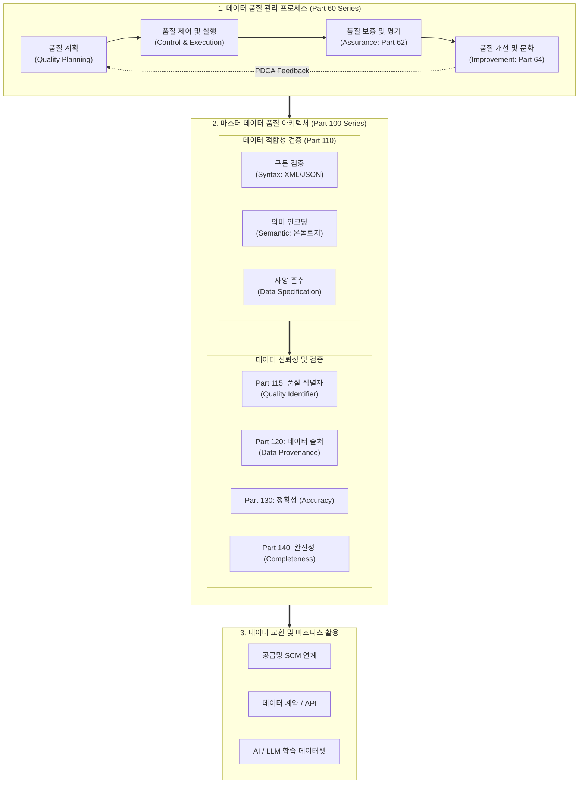

# 데이터 품질관리 (ISO 8000)

---

## I. 엔터프라이즈 데이터 품질 보증 국제 표준, ISO 8000의 개요

### 가. ISO 8000의 정의

* 산업 및 기업 간 교환되는 데이터의 무결성을 확보하기 위해 데이터 자체의 구문(Syntax)·의미(Semantic) 적합성과 데이터 관리 [[프로세스]] 및 조직 역량을 체계화한 ISO/TC 184 주관의 데이터 품질 국제 표준 규격
* 마스터 데이터의 명세 적합성 검증부터 라이프사이클 전반의 프로세스 참조 모델(PRM)을 제시하는 엔터프라이즈 데이터 품질 보증(QA) 체계

### 나. ISO 8000의 등장배경 및 핵심 특징

* **등장배경**: 글로벌 공급망([[SCM (Supply Chain Management)|SCM]]) 및 기업 간 이종 시스템 연계 시 데이터 불일치(Data Mismatch) 심화, AI/빅데이터 환경에서 고품질 마스터 데이터 확보 필요성 증대
* **핵심특징**:
* **3대 품질 요건 규정**: 구문(Syntax), 시맨틱 인코딩(Semantic Encoding), 사양 적합성(Conformance to Data Specification) 검증
* **데이터 출처(Provenance) 보증**: 데이터 생성·수정·전송 경로를 추적하여 [[신뢰성]] 담보
* **프로세스 중심 접근**: 데이터 값 자체의 정적 검증을 넘어 지속적 품질 관리를 위한 프로세스 참조 모델(Part 61) 제시

---

## II. ISO 8000의 프레임워크 및 핵심 기술 요소

### 가. ISO 8000의 프레임워크 및 품질 관리 프로세스

* Part 61 프로세스 참조 모델(PRM) 기반 [[PDCA(Plan-Do-Check-Act, Deming Cycle)|PDCA]] 사이클을 통해 품질 정책을 수립하고, Part 100 시리즈를 통해 마스터 데이터의 구문·의미·사양 적합성 및 계보(Provenance)를 다차원 검증하여 비즈니스 및 AI 인프라에 공급하는 구조

### 나. ISO 8000의 핵심 기술 및 구성 요소

| 구분 | 요소기술(키워드) | 세부 설명 |
| --- | --- | --- |
| **총괄/개념** | Part 1 / Part 2 | ISO 8000 표준의 기본 원칙, 데이터 품질 개요 및 전사 표준 용어집(Vocabulary) 정의 |
| **마스터 데이터** | Part 110 (적합성) | 구문(Syntax), 시맨틱 인코딩(Semantic Encoding), 데이터 사양에 대한 적합성(Conformance) 검증 |
| **식별 체계** | Part 115 (품질 식별자) | 개체 식별자(Identifier)의 유일성 및 품질 인증 라벨을 결합한 데이터 식별 표준 규격 |
| **데이터 계보** | Part 120 (출처/이력) | 원천 생성자, 변환 단계, 전송 경로 등 데이터 이력 추적성(Data Provenance) 명세 |
| **정량 검증** | Part 130 (정확성) | 측정 가능한 기준 및 진실값(Ground Truth)과 비교 검증을 통한 데이터 정확도(Accuracy) 보증 |
| **정량 검증** | Part 140 (완전성) | 필수 속성의 결측 여부 및 레코드 누락 방지를 위한 마스터 데이터 완전성(Completeness) 규정 |
| **프로세스** | Part 61 (PRM) | 데이터 수명주기 전반의 품질 계획, 제어, 보증, 개선을 정의한 프로세스 참조 모델 |
| **조직/문화** | Part 64 / Part 81 | 조직의 데이터 품질 성숙도 진단, [[데이터 거버넌스]] 리더십 및 데이터 품질 문화 평가 기준 |

---

## III. ISO 8000 vs ISO/IEC 25012 비교 및 향후 전망

### 가. ISO 8000 vs ISO/IEC 25012 비교

| 비교 항목 | ISO 8000 | ISO/IEC 25012 |
| --- | --- | --- |
| **표준화 기구** | ISO/TC 184/SC 4 (산업 데이터) | ISO/IEC JTC 1/SC 7 (소프트웨어 및 시스템 공학) |
| **핵심 목적** | 비즈니스 [[트랜잭션]] 및 마스터 데이터 상호운용성 보증 | 소프트웨어 제품 내 데이터 품질 모델(SQuaRE) 표준화 |
| **주요 대상** | 마스터 데이터, 엔터프라이즈 데이터 교환, 데이터 관리 프로세스 | 시스템 내 저장된 데이터의 고유/시스템 의존적 정적 품질 |
| **접근 관점** | 프로세스(PRM) + 데이터 사양(Syntax/Semantic/Provenance) | 15대 데이터 품질 특성(정확성, 완전성, 일관성 등 모델 중심) |
| **적용 영역** | 글로벌 B2B 공급망(SCM), 전사 마스터 데이터 거버넌스(MDM) | SW 품질 시험 인증(GS인증), 소프트웨어 내부 [[데이터베이스]] 평가 |

### 나. 최신 동향 및 향후 전망

* **AI 데이터 품질 표준(ISO/IEC 5259)과의 융합**: [[초거대 언어 모델|LLM]]/[[파운데이션 모델]] 확산에 맞춰, ISO 8000-120(출처) 기반 데이터 계보 검증과 AI 학습 데이터 품질(다양성, 편향성, [[합성 데이터]] 충실도) 표준의 연계 가속화
* **DataOps 및 데이터 계약(Data Contract) 자동화**: ISO 8000-110의 사양 적합성 원칙을 `Schema-as-Code` 형태의 데이터 계약으로 코드화하여, CI/CD 배포 파이프라인에서 실시간 자동 검증하는 아키텍처로 진화 전망

---

### 🔗 연관 토픽

- **소속 도메인**: [[00_데이터베이스_MOC|🗄️ 데이터베이스]]
- **세부 분류**: `3. 장애 회복 기법 & 데이터 무결성`
- **핵심 연관 토픽**:
  - [[데이터베이스]]
  - [[데이터 거버넌스|데이터 거버넌스 (Data Governance)]]
  - [[공공데이터 품질인증 매뉴얼(2025.07.)]]
  - [[트랜잭션]]
  - [[데이터 표준화]]
