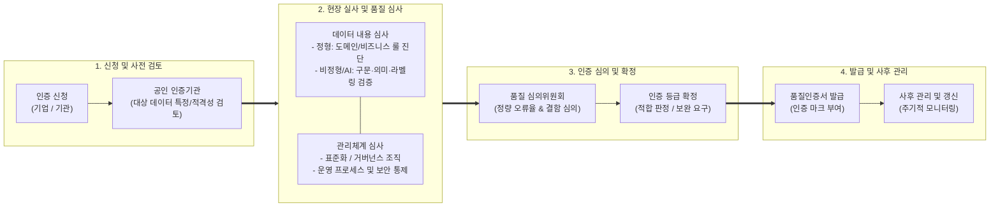

# 데이터 품질인증 가이드라인 (DQ인증)

---

## I. AI-Ready 데이터 신뢰성 및 유통 생태계 확립, 데이터 품질인증(DQ인증)의 개요

### 가. 데이터 품질인증 가이드라인의 정의

* 「데이터 산업진흥 및 이용촉진에 관한 기본법」(데이터산업법) 제20조에 근거하여 기업·기관이 구축·보유한 데이터의 내용(Content)과 관리체계(Process)의 품질 수준을 공인 시험·인증기관이 정량적으로 평가·인증하기 위한 표준 가이드라인
* 기존 정형 데이터 중심 검증(DQC 계승)을 넘어 AI 학습용 데이터(텍스트, 이미지, 음성 등 비정형) 및 생성형 AI 데이터셋 품질 평가(ISO/IEC 5259 반영)까지 포괄하는 국가 공인 데이터 [[신뢰성]] 보증 체계

### 나. 데이터 품질인증의 필요성 및 핵심 특징

* **필요성**: 저품질 데이터 주입에 따른 AI 성능 저하 및 GIGO(Garbage In, Garbage Out) 방지, 데이터 거래소 내 유통 데이터의 객관적 가격(Pricing) 산정 기준 제공, 데이터 담보금융 지원
* **핵심 특징**:
* **이원화 인증 구조**: 데이터 값의 정합성을 검증하는 '데이터 내용 인증'과 거버넌스 성숙도를 진단하는 '데이터 관리체계 인증' 분리·통합 운영
* **AI/멀티모달 수용**: 도메인 규칙 기반 정형 DB 진단 외에 라벨링 정확도, 구문·의미 적합성, 데이터 다양성 등 AI 특화 품질 지표 반영
* **정량적 오류율 기반 등급화**: 데이터 오류율(Error Rate, PPM 단위) 및 정량 측정 지표에 따른 공인 품질 등급 부여

---

## II. 데이터 품질인증(DQ인증)의 절차 및 핵심 기술 요소

### 가. 데이터 품질인증 프로세스 및 심사 아키텍처

* 신청 데이터셋에 대해 전문 진단 도구를 활용한 데이터 내용(정형·AI 비정형) 프로파일링과 관리체계 실사를 병행하고, 심의위원회 의결을 통해 공인 인증서 발급 및 사후 갱신 관리 수행

### 나. 데이터 품질인증 가이드라인의 핵심 기술 및 구성 요소

| 구분 | 요소기술(키워드) | 세부 설명 |
| --- | --- | --- |
| **법·제도 체계** | 데이터산업법 제20조 | 과기정통부 주관 공인 품질인증기관(K-DATA, TTA, 와이즈스톤 등) 지정 및 인증 운영 법적 근거 |
| **인증 트랙** | 데이터 내용 인증 (Content) | [[데이터베이스]] 내 저장된 데이터 값의 정확성, 유효성, 일관성 및 정량적 결함률(오류율) 검증 |
| **인증 트랙** | 관리체계 인증 (Process) | 데이터 품질 관리 방침, [[데이터 표준화]], 메타데이터 관리, 변경 통제 [[프로세스]] 성숙도 평가 |
| **정형 품질 모델** | ISO/IEC 25012 품질 특성 | 정형 데이터 대상 완전성(Completeness), 유일성(Uniqueness), 유효성(Validity), 정확성 측정 |
| **AI 품질 모델** | ISO/IEC 5259 표준 연계 | AI 학습용 데이터셋의 다양성(Diversity), 사실성, 라벨링 정확도([[Annotation]] Accuracy) 및 편향성 검증 |
| **진단 기술** | 규칙 기반 프로파일링 (Profiling) | 비즈니스 업무 규칙(Business Rule) 및 [[SQL(Structured Query Language)|SQL]]/스크립트 기반 전수·샘플링 데이터 오류 정밀 추출 |
| **AI 검증 기술** | 작업자 일치도 (IAA 지표) | 라벨링 신뢰성 확보를 위한 Cohen's / Fleiss' Kappa 계수 및 Bounding Box 대상 IoU 지표 산출 |
| **등급 산정** | 정량 결함 측정 (PPM 단위) | 데이터 결함 건수 기반 오류율(PPM/Sigma) 산출을 통한 인증 적합성 및 차등 등급 부여 |

---

## III. 데이터 품질인증 유형 비교 및 향후 전망

### 가. 데이터 품질인증 유형 비교 (내용 인증 vs 관리체계 인증)

| 비교 항목 | 데이터 내용 인증 (Data Content) | 데이터 관리체계 인증 (Data Management Process) |
| --- | --- | --- |
| **인증 대상** | 정형 데이터베이스(테이블), AI 학습용 데이터셋 | 전사 데이터 관리 프로세스, 품질 관리 조직 및 시스템 |
| **평가 관점** | 결과 중심 (Data at Rest / 데이터 값 자체의 [[무결성]]) | 과정 중심 (Process-Driven / [[데이터 거버넌스]] 성숙도) |
| **핵심 기준** | 유효율, 결측률, 라벨링 오류율, 다양성 충족도 | 품질 계획(Plan), 통제(Do), 측정(Check), 개선(Act) 체계 |
| **평가 방식** | 프로파일링 도구 분석, 데이터 샘플링 전수 검증 | 산출물 문서 심사, 관리 시스템 실사 및 인터뷰 |
| **주요 기대 효과** | 데이터 유통 기준가 확보, AI 모델 성능 보증 | 지속적 품질 결함 예방, 전사 데이터 신뢰성 확보 |

### 나. 향후 과제 및 발전 전망

* **[[합성 데이터|합성 데이터(Synthetic Data)]] 품질인증 규격 정립**: 개인정보 보호 및 희귀 데이터 보강을 위해 생성된 합성 데이터의 사실성(Fidelity), 다양성(Diversity), 프라이버시 보호도([[차분 프라이버시]] 충족) 평가 체계 수립 필요
* **DataOps 및 데이터 계약(Data Contract) 연계 지속 인증**: 1회성 정적 사후 인증의 한계를 극복하기 위해 CI/CD 배포 파이프라인 내 `Schema-as-Code`를 결합하여 실시간으로 인증 기준을 충족하는 지속적 인증(Continuous Certification) 모델로의 진화 전망

---

### 🔗 연관 토픽

- **소속 도메인**: [[00_데이터베이스_MOC|🗄️ 데이터베이스]]
- **세부 분류**: `2. 트랜잭션 & 동시성 제어 (Concurrency)`
- **핵심 연관 토픽**:
  - [[무결성]]
  - [[데이터 표준화]]
  - [[데이터베이스]]
  - [[데이터 거버넌스|데이터 거버넌스 (Data Governance)]]
  - [[SQL(Structured Query Language)]]
