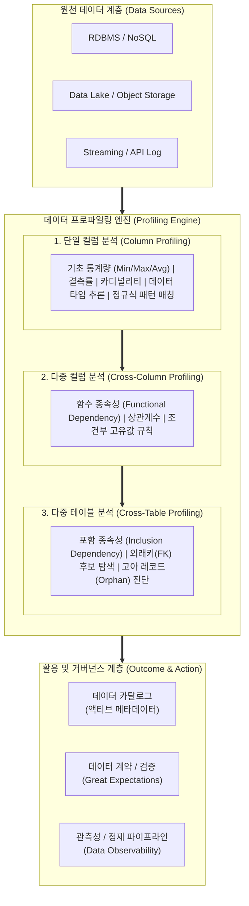

# 데이터 프로파일링 (Data Profiling)

---

## I. 데이터 진단 및 메타데이터 자동 추출, 데이터 프로파일링의 개요

### 가. 데이터 프로파일링의 정의

* 데이터셋의 구조, 내용, 관계 및 품질 상태를 정량적으로 파악하기 위해 통계적 요약, 패턴 인식, 종속성 검증 기법을 활용하여 데이터의 기술적 메타데이터를 수집·분석하는 진단 기법
* 원천 데이터의 수정 없이 데이터 [[무결성]], 일관성, 유효성을 사전 검증하여 [[데이터 거버넌스]] 및 차세대 AI/DW 파이프라인의 신뢰성을 보장하는 핵심 공학 절차

### 나. 데이터 프로파일링의 필요성 및 특징

* **GIGO(Garbage In, Garbage Out) 방지**: 정제되지 않은 [[이상치]] 및 [[결측치]] 사전 식별로 분석 모델 및 AI 학습 데이터 왜곡 방지
* **ETL/파이프라인 결함 예방(Shift-Left)**: 데이터 적재 이전 단계에서 [[스키마]] 변형 및 비표준 포맷을 조기 감지하여 파이프라인 중단 예방
* **핵심 특징**:
* **비침해적(Non-invasive)**: 원천 데이터를 직접 변경하지 않고 특성 정보(메타데이터)만 추출
* **계층적 분석(Multi-level)**: 단일 컬럼 단위부터 다중 컬럼, 다중 테이블 간 참조 관계까지 수직·수평 확장 분석
* **자동화된 룰 도출**: 프로파일링 결과를 바탕으로 데이터 품질 지표(DQI) 및 데이터 계약(Data Contract) 규칙 자동 생성

---

## II. 데이터 프로파일링의 아키텍처 및 핵심 기술 요소

### 가. 데이터 프로파일링의 프로세스 및 분석 아키텍처

* 원천 데이터를 단일 컬럼의 기초 통계·패턴부터 컬럼 간 함수 종속성($X \rightarrow Y$), 테이블 간 참조 무결성까지 순차 진단한 후, 도출된 메타데이터를 데이터 카탈로그 및 선언적 데이터 계약으로 자동 연계하는 구조

### 나. 데이터 프로파일링의 핵심 기술 및 구성 요소

| 구분 | 요소기술(키워드) | 세부 설명 |
| --- | --- | --- |
| **단일 컬럼** | 기초 통계량 (Descriptive Statistics) | 수치형 데이터의 평균, 표준편차, 사분위수(IQR), 왜도/첨도 및 결측치(Null) 비율 정량 산출 |
| **단일 컬럼** | 카디널리티 (Cardinality) 분석 | 고유값(Unique Values) 개수를 측정하여 식별자 적합성 및 범주형/연속형 속성 판별 |
| **단일 컬럼** | 패턴/포맷 식별 (Regex Profiling) | 정규표현식을 활용해 전화번호, 이메일, 주민번호 등 비즈니스 포맷 준수율 및 이상 패턴 검출 |
| **단일 컬럼** | 데이터 타입 추론 (Type Inference) | 문자열로 저장된 속성 내 실제 데이터의 형태(날짜, 부동소수점, 불리언 등)를 자동 추론 |
| **다중 컬럼** | 함수 종속성 (Functional Dependency) | 속성 $A$의 값이 속성 $B$를 고유하게 결정하는 규칙($A \rightarrow B$)을 탐색하여 정규화 위반 감지 |
| **다중 컬럼** | 상관관계 분석 (Correlation) | 피어슨/스피어만 상관계수를 적용하여 컬럼 간 [[다중공선성]](Multicollinearity) 및 종속 관계 진단 |
| **다중 테이블** | 포함 종속성 (Inclusion Dependency) | 테이블 간 교차 집합 분석을 통해 외래키(FK) 후보 탐색 및 고아 레코드(Orphan Record) 식별 |
| **지능화/연계** | AI 증강 PII 탐지 & Data Contract | [[초거대 언어 모델|LLM]]/분류기를 통한 민감정보(개인정보) 자동 라벨링 및 프로파일링 결과 기반 Great Expectations 테스트 코드 자동 생성 |

---

## III. 데이터 프로파일링 vs 데이터 마이닝 비교 및 발전 전망

### 가. 데이터 프로파일링 vs 데이터 마이닝 비교

| 비교 항목 | 데이터 프로파일링 (Data Profiling) | 데이터 마이닝 ([[데이터 마이닝|Data Mining]]) |
| --- | --- | --- |
| **핵심 목적** | 데이터 자체의 상태, 구조, 결함 및 품질 진단 | 대규모 데이터 속 잠재된 패턴, 상관관계 및 비즈니스 지식 발견 |
| **분석 대상** | 데이터의 기술적 메타데이터 (Metadata) | 비즈니스 [[트랜잭션]] 및 [[인스턴스]] 데이터 (Data Content) |
| **사용 기법** | 요약 통계, 정규식 매칭, 함수 종속성/포함 종속성 검증 | 머신러닝/[[딥러닝]], 분류, 회귀, 클러스터링, 연관규칙(Apriori) |
| **수행 시점** | 데이터 라이프사이클 초기 (ETL, 이관, 품질 진단 단계) | 데이터 라이프사이클 후기 (분석 모델링, 비즈니스 활용 단계) |
| **결과 산출물** | 데이터 프로필 리포트, 데이터 카탈로그, 품질 규칙(Rule) | 예측 모델, 분류 규칙, 고객 세그먼트, 비즈니스 인사이트 |
| **결과 활용** | 데이터 정제(Cleansing), 데이터 모델링 보정, 계약 검증 | 마케팅 캠페인, 수요 예측, 이탈 방지 등 비즈니스 의사결정 |

### 나. 데이터 프로파일링의 최신 기술 동향 및 향후 전망

* **Data Observability 연계 스트리밍 프로파일링**: 배치 기반 1회성 진단을 넘어 Kafka/Flink 환경에서 데이터 볼륨, 신선도, 스키마 변화를 실시간으로 프로파일링하는 인라인(In-line) 모니터링 고도화
* **Data-Centric AI 및 [[합성 데이터]] 품질 진단**: LLM 파인튜닝용 비정형 텍스트 및 합성 데이터(Synthetic Data)의 분포 일치도, 편향성, 프라이버시 누출 위험도를 다각도로 측정하는 AI 특화 프로파일링 체계로 확장 전망

---

### 🔗 연관 토픽

- **소속 도메인**: [[00_데이터베이스_MOC|🗄️ 데이터베이스]]
- **세부 분류**: `1. 데이터 모델링 & 관계형 DB 설계`
- **핵심 연관 토픽**:
  - [[스키마]]
  - [[데이터 클렌징|데이터 클렌징 (Data Cleansing)]]
  - [[무결성]]
  - [[데이터 거버넌스|데이터 거버넌스 (Data Governance)]]
  - [[EDW]]
