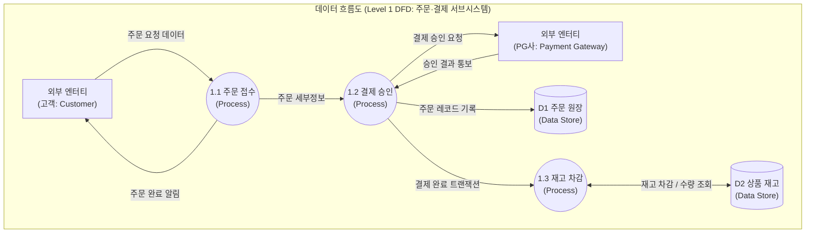

# 데이터 흐름도 (Data Flow Diagram, DFD)

---

## I. 기능 중심 시스템 분석 및 데이터 변환 시각화, 데이터 흐름도(DFD)의 개요

### 가. 데이터 흐름도(DFD)의 정의

* 시스템 내 데이터의 입력, 처리, 저장, 출력 및 이동 경로를 [[프로세스]] 중심으로 도형화하여 직관적으로 모델링하는 구조적 분석 기법의 대표적 다이어그램
* 제어 논리(Control Logic)나 시간적 실행 순서를 배제하고, 데이터가 어떤 처리 과정을 거쳐 어떻게 변환(Transformation)되는지를 나타내는 논리적 명세 도구

### 나. 데이터 흐름도의 등장배경 및 핵심 특징

* **제어 중심 순서도의 한계 극복**: 조건 분기 및 루프에 집중된 프로그램 순서도(Flowchart)의 복잡도를 탈피하여 데이터의 본질적 흐름 규명
* **의사소통 갭(Communication Gap) 해소**: 비전문가인 현업 도메인 담당자와 시스템 분석가 간 요구사항 검증을 위한 직관적 그래픽 인터페이스 제공
* **핵심 특징**:
* **프로세스 중심 변환**: 데이터가 시스템 내에서 어떻게 가공·변환되는지에만 집중
* **하향식 계층화(Layering)**: 전체 시스템(배경도)부터 단위 기능(원시 프로세스)까지 단계적 분할 지원
* **구현 독립성**: 물리적 저장 매체, [[네트워크 프로토콜]] 등 하드웨어적 제약을 배제한 논리적 모델링

---

## II. 데이터 흐름도의 개념도 및 핵심 구성 요소

### 가. 데이터 흐름도의 개념도 및 계층화 아키텍처

* 외부 엔터티 간 또는 엔터티-저장소 간 직접 연결을 배제하고, 데이터가 프로세스를 통과하며 상태가 변환되는 구조 (레벨 밸런싱 및 데이터 보존 법칙 엄격 준수)

### 나. 데이터 흐름도의 핵심 기술 및 구성 요소

| 구분 | 요소기술(키워드) | 세부 설명 |
| --- | --- | --- |
| **4대 심볼** | 프로세스 (Process) | 입력 데이터를 변환하여 출력 데이터를 생성하는 기능 단위 (원형: Yourdon, 둥근 사각형: Gane & Sarson) |
| **4대 심볼** | 데이터 흐름 (Data Flow) | 구성 요소 간 데이터 이동 방향을 명시하는 화살표 (이동하는 데이터 패킷 명칭 명기) |
| **4대 심볼** | 데이터 저장소 (Data Store) | 데이터가 영속적 또는 일시적으로 머무르는 공간 (두 줄 평행선: Yourdon, 개방형 직사각형: Gane & Sarson) |
| **4대 심볼** | 외부 엔터티 (External Entity) | 시스템 경계 외부에서 데이터를 생성(Source)하거나 소비(Sink)하는 개체 (사각형 표기) |
| **계층화 기법** | 배경도 (Context Diagram) | 시스템 전체를 하나의 단일 프로세스(Process 0)로 표현하고 외부 엔터티와의 입출력만 규정한 최상위 DFD |
| **계층화 기법** | 하향식 분할 (Functional Partitioning) | 배경도(Level 0) $\rightarrow$ 중간 다이어그램(Level 1) $\rightarrow$ 소단위 다이어그램(Level 2+)으로 기능을 세분화 |
| **정합성 규칙** | 레벨 균형 (Level Balancing) | 상위 프로세스의 입력/출력 데이터 흐름과 세부 분할된 하위 DFD의 입출력 데이터 흐름이 엄격히 일치해야 함 |
| **[[무결성]] 규칙** | 데이터 보존 법칙 (Conservation Rule) | 프로세스는 입력받은 데이터로만 출력을 생성해야 하며, 입력 없이 출력이 발생하는 Miracle 오류 방지 |
| **이상 패턴 방지** | Anti-Pattern 차단 | 입력만 있고 출력이 없는 Black Hole, 출력만 있는 Miracle, 입력 데이터가 불충분한 Gray Hole 원천 금지 |
| **명세 연계** | 소단위 명세서 (Mini-Spec) | 더 이상 쪼갤 수 없는 최하위 원시 프로세스(Functional Primitive)의 알고리즘을 구조적 언어(의사코드)로 기술 |

---

## III. 데이터 흐름도 vs 프로그램 순서도 비교 및 최신 발전 동향

### 가. 데이터 흐름도(DFD) vs 프로그램 순서도(Flowchart) 비교

| 비교 항목 | 데이터 흐름도 (Data Flow Diagram) | 프로그램 순서도 (Flowchart) |
| --- | --- | --- |
| **분석 관점** | 데이터 흐름 및 변환 중심 (Data-Centric / What) | 제어 흐름 및 처리 절차 중심 (Control-Centric / How) |
| **시간성 (Timing)** | 시간 순서 없음 (동시적·비동기적 처리 표현) | 엄격한 시간적 순차성 (시작부터 종료까지의 시계열) |
| **제어 로직 표현** | 조건 분기, 반복(Loop) 표현 불가 | 분기 기호(마름모), 반복문 등을 통한 상세 [[알고리즘]] 표현 |
| **시스템 범위** | 시스템 전반의 논리적 아키텍처 및 외부 인터페이스 | 단일 프로그램, 모듈, 함수 단위의 물리적 실행 경로 |
| **연계 문서** | 자료사전(DD), 소단위 명세서(Mini-Spec) | 상세 프로그램 소스코드, 의사코드(Pseudocode) |
| **사용 단계** | 시스템 분석 및 개념 설계 단계 | 상세 설계 및 물리 구현 단계 |

### 나. 최신 발전 동향 및 현대적 확장

* **보안 [[위협 모델링]]([[STRIDE]])의 핵심 [[프레임워크]]**: 마이크로소프트의 STRIDE 모델링에서 시스템의 자산, 데이터 흐름, 프로세스, 트러스트 바운더리(Trust Boundary)를 식별하고 데이터 위·변조(Tampering) 및 정보 유출(Information Disclosure) 공격 표면을 도출하는 보안 베이스라인으로 적극 활용
* **Modern Data [[Stack]] 기반 데이터 계보(Lineage)로의 진화**: 레거시 기능 분할의 한계를 넘어, 현대 빅데이터·AI 파이프라인에서 데이터 소스부터 레이크하우스, Feature Store, 모델 서빙까지의 종단간 데이터 흐름을 추적하는 OpenLineage 및 DAG([[방향성 비순환 그래프|Directed Acyclic Graph]]) 아키텍처의 이론적 기반으로 정착

---

### 🔗 연관 토픽

- **소속 도메인**: [[00_소프트웨어공학_MOC|🏗️ 소프트웨어공학]]
- **세부 분류**: `3. 요구사항 공학 & UML 객체지향 분석/설계`
- **핵심 연관 토픽**:
  - [[위협 모델링|위협 모델링(Threat Modeling) - Secure SDLC]]
  - [[STRIDE]]
  - [[Stack]]
  - [[프로세스]]
  - [[프레임워크]]
