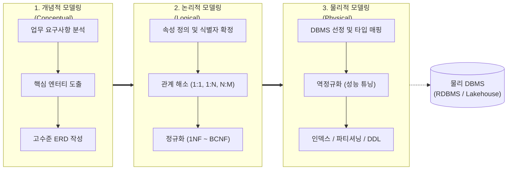

# 데이터베이스 모델링 (Database Modeling)

---

## I. 현실 세계의 데이터 자산화 프레임워크, 데이터베이스 모델링의 개요

### 가. 데이터베이스 모델링의 정의

* 현실 세계의 업무 [[프로세스]] 및 정보 요구사항을 컴퓨터 환경의 데이터베이스로 구축하기 위해 개념적, 논리적, 물리적 관점으로 추상화·구조화하는 데이터 엔지니어링 절차
* 데이터의 정합성, [[무결성]], 독립성을 보장하고 향후 시스템 확장 및 성능 최적화를 지원하도록 업무 규칙을 데이터 구조로 변환하는 명세 체계

### 나. 데이터베이스 모델링의 필요성 및 핵심 특징

* **필요성**: 데이터 중복 최소화, 무결성 제약 보장, 비즈니스 변경에 유연한 논리적 독립성 확보, 대용량 [[트랜잭션]] 처리 성능 최적화
* **핵심 특징**:
* **3대 관점(Things, Attributes, Relationships)**: 업무의 대상이 되는 엔터티, 세부 특성인 속성, 개체 간의 유기적 관계 규명
* **단계적 추상화(Phased [[추상화|Abstraction]])**: 비즈니스 도메인(개념) $\rightarrow$ 정규화 및 관계 규정(논리) $\rightarrow$ 물리 [[DBMS]] 구현(물리)으로의 체계적 전이
* **무결성 중심 설계**: 정규화(Normalization)를 통한 갱신 이상([[Anomaly(이상현상)|Anomaly]]) 원천 차단 및 비즈니스 룰의 제약조건화

---

## II. 데이터베이스 모델링의 프로세스 및 핵심 구성 요소

### 가. 데이터베이스 모델링의 절차 및 아키텍처

* 업무 요구사항을 바탕으로 개념 ERD를 도출하고, 정규화를 거쳐 논리 스키마로 상세화한 후, 성능 요건을 반영한 역정규화 및 인덱스 설계를 통해 최종 물리 스키마로 구현하는 3단계 순환 파이프라인

### 나. 데이터베이스 모델링의 핵심 기술 및 구성 요소

| 구분 | 요소기술(키워드) | 세부 설명 |
| --- | --- | --- |
| **개념 모델링** | 주제 영역 정의 (Subject Area) | 전사 비즈니스 도메인을 구매, 생산, 주문 등 독립적 단위 영역으로 그룹화하여 범위 식별 |
| **개념 모델링** | 핵심 엔터티 도출 (Core Entity) | 업무의 영속적 관리 대상이 되는 실체(Things)를 도출하고 개념적 ERD(Entity-Relationship Diagram) 수립 |
| **논리 모델링** | 식별자/비식별자 관계 | 부모 엔터티의 주식별자가 자식 엔터티의 주식별자로 상속되는지(식별) 일반 속성으로 상속되는지(비식별) 분기 정의 |
| **논리 모델링** | 함수 종속성 기반 정규화 | 1NF(원자값), 2NF(부분함수종속 제거), 3NF(이행함수종속 제거), [[BCNF]](결정자 함수종속 제거)를 통한 데이터 이상(Anomaly) 제거 |
| **논리 모델링** | M:N 다대다 관계 해소 | 관계형 구현 한계를 극복하기 위해 매핑(교차) 엔터티를 생성하여 두 개의 1:N 관계로 변환 |
| **물리 모델링** | 역정규화 (De-normalization) | 조회 성능 향상을 위해 정규화 원칙에 위배되더라도 테이블 병합/분할, 중복 컬럼 추가, 집계 테이블 설계 수행 |
| **물리 모델링** | 인덱스 전략 ([[RDBMS 인덱스(index)|Index]] Design) | B+Tree, Hash, Bitmap 등 엑세스 경로(Access Path)를 분석하여 선택도(Selectivity 10~15% 이내) 기반 인덱스 최적화 |
| **물리 모델링** | 테이블 [[파티셔닝]] (Partitioning) | 대용량 I/O 분산을 위해 Range, List, Hash, Composite 방식으로 물리 스토리지 분할 및 Pruning 지원 |

---

## III. 논리적 모델링 vs 물리적 모델링 비교 및 최신 발전 동향

### 가. 논리적 모델링 vs 물리적 모델링 다차원 비교

| 비교 항목 | 논리적 데이터 모델링 (Logical) | 물리적 데이터 모델링 (Physical) |
| --- | --- | --- |
| **설계 관점** | 비즈니스 정보 요구 중심 (Business View) | 시스템 자원 및 하드웨어 성능 중심 (System View) |
| **DBMS 의존성** | 특정 DBMS에 독립적 (RDBMS, [[NoSQL (CAP 이론 BASE 속성)|NoSQL]] 공통) | 대상 DBMS 엔진(Oracle, PostgreSQL 등)에 종속적 |
| **주요 활동** | 정규화, 식별자 확정, M:N 해소, 관계 명세 | 역정규화, 데이터 타입/길이 매핑, 인덱스/파티셔닝 설계 |
| **핵심 고려 사항** | 데이터 정합성, 중복 배제, 유연성, 일관성 | I/O 최소화, 트랜잭션 [[처리량]](TPS), 저장 공간 효율성 |
| **산출물** | 논리 ERD, 데이터 사전, 엔터티 정의서 | 물리 ERD, [[DDL]] 스크립트, 인덱스/스토리지 명세서 |

### 나. 최신 기술 동향 및 향후 전망

* **Data Vault 2.0 모델링 확산**: 분산 레이크하우스 및 엔터프라이즈 DW 환경에서 비즈니스 변경에 유연한 확장성을 제공하기 위해 Hub(핵심 비즈니스 키), Link(관계), Satellite(시계열 컨텍스트)로 분리 설계하는 Data Vault 기법 보편화
* **도메인 주도 설계([[DDD (Domain Driven Design)|DDD]]) 기반 모델링**: 마이크로서비스([[MSA (Micro Service Architecture)|MSA]]) 환경에서 전사 통합 단일 ERD 대신 각 도메인의 유비쿼터스 언어를 반영한 바운디드 컨텍스트(Bounded Context) 단위의 분산 데이터 모델링 정착
* **Schema-as-Code 및 CI/CD 연계**: 물리 모델 DDL을 수작업 배포하는 방식을 탈피하여 dbt, Flyway, Prisma 등을 활용해 데이터 모델 변경 이력을 Git으로 버전 관리하고 Data Contract 기반으로 자동 검증하는 아키텍처로 진화

---

### 🔗 연관 토픽

- **소속 도메인**: [[00_데이터베이스_MOC|🗄️ 데이터베이스]]
- **세부 분류**: `1. 데이터 모델링 & 관계형 DB 설계`
- **핵심 연관 토픽**:
  - [[DBMS]]
  - [[Anomaly(이상현상)]]
  - [[DDL]]
  - [[BCNF|BCNF (Boyce-Codd Normal Form 3.5NF)]]
  - [[NoSQL (CAP 이론 BASE 속성)]]
