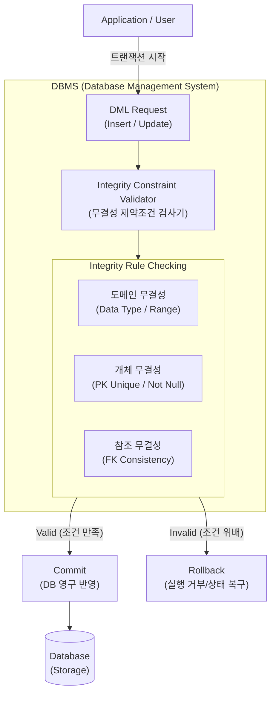

# 데이터베이스 무결성

---

## I. 신뢰성 있는 데이터 유지를 위한 데이터베이스 무결성의 개요

* **정의**: [[데이터베이스]] 내에 저장된 데이터의 정확성(Accuracy), 일관성(Consistency), 유효성(Validity)을 보장하기 위해 데이터의 변경 및 유지 관리에 대한 규칙과 조건을 정의한 성질
* **필요성**: 데이터 오염(Data Corruption) 방지, 애플리케이션 논리적 오류 예방, 기업 데이터 자산의 신뢰도 확보
* **특징**: [[DBMS]] 엔진을 통한 강제화, [[트랜잭션]](ACID) 기반 일관성 유지, [[스키마]] 정의 시 선언적 명시(Constraints) 및 절차적 통제(Trigger) 지원

---

## II. 데이터베이스 무결성의 개념도 및 핵심 기술 요소

### 가. 데이터베이스 무결성 검증 개념도 및 동작 원리

* 사용자 및 애플리케이션의 [[DML]] 수행 시 DBMS 내부 검사기를 통해 데이터의 유효성을 3단계(도메인, 개체, 참조)로 검증
* 모든 [[무결성]] 규칙 통과 시 트랜잭션을 Commit하여 DB에 반영하며, 하나라도 위배될 경우 Rollback 수행

### 나. 데이터베이스 무결성의 핵심 기술 요소

| 분류 | 핵심 기술(키워드) | 세부 설명 |
| --- | --- | --- |
| **무결성 유형** | 개체 무결성 (Entity) | 기본키(PK)를 구성하는 속성은 Null 값이나 중복값을 가질 수 없음 |
| **무결성 유형** | 참조 무결성 (Referential) | 외래키(FK) 값은 참조하는 릴레이션의 기본키 값과 일치하거나 Null이어야 함 |
| **무결성 유형** | 도메인 무결성 (Domain) | 릴레이션의 모든 속성 값은 정의된 데이터 타입, 크기, 유효 범위 내에 존재해야 함 |
| **무결성 유형** | 사용자정의 무결성 | 기업의 고유한 업무 규칙(Business Rule)에 따른 특정 데이터 제약 조건 만족 |
| **보장 메커니즘** | 선언적 제약조건 (Constraint) | [[DDL]] 스키마 생성 시 PK, FK, Unique, Check, Not Null 등의 제약조건을 선언하여 강제화 |
| **보장 메커니즘** | 절차적 무결성 (Trigger) | 특정 이벤트(Insert, Update) 발생 시 연쇄적인 데이터 변경을 위한 [[프로시저]] 자동 실행 |
| **보장 메커니즘** | 트랜잭션 제어 (ACID) | 동시성 제어([[Locking]], MVCC) 및 회복 기법을 통해 논리적 작업 단위의 무결성 보장 |
| **분산 환경 확장** | 분산 트랜잭션 제어 | [[MSA (Micro Service Architecture)|MSA]]/분산 DB 환경에서 2PC(2-Phase Commit) 및 Saga 패턴을 통한 글로벌 무결성 보장 |

---

## III. 데이터베이스 무결성 vs 보안 비교 및 최신 동향

### 가. 데이터베이스 무결성(Integrity)과 보안(Security) 비교

| 구분 | 데이터베이스 무결성 (Integrity) | 데이터베이스 보안 (Security) |
| --- | --- | --- |
| **주요 목적** | 데이터의 **정확성 및 일관성** 유지 | 데이터의 **[[기밀성]] 및 [[HA(High Availability)|가용성]]** 유지 |
| **보호 대상** | **인가된 사용자**의 실수 및 의미적 오류 | **비인가 사용자**의 악의적 접근 및 불법 유출 |
| **통제 수단** | 제약조건(Constraints), 트리거, 트랜잭션 | 접근제어([[DAC]]/[[MAC]]/[[RBAC]]), [[암호화]], [[방화벽]] |
| **주요 위협** | 오입력, 동시성 제어 실패, 시스템 장애 | 해킹, 권한 탈취, [[SQL Injection]], [[랜섬웨어]] |
| **해결 기법** | 정규화, 무결성 제약조건, 병행제어(Lock) | 인증(Authentication), 인가(Authorization) |

### 나. 분산 아키텍처 환경에서의 무결성 보장 동향

* **결과적 일관성(Eventual Consistency) 수용**: 클라우드 및 MSA 환경에서는 분산 합의의 한계(CAP 정리)로 인해 강한 일관성(Strict Consistency) 대신 BASE 모델 기반의 결과적 일관성을 채택하여 가용성과 무결성을 절충함
* **MSA 분산 트랜잭션 패턴 적용**: 데이터베이스가 서비스별로 분리된(Database per Service) 구조에서 데이터 무결성을 유지하기 위해 **Saga 패턴**, **Outbox 패턴**, **보상 트랜잭션(Compensating Transaction)** 을 적극 활용하는 추세임

---

### 🔗 연관 토픽

- **소속 도메인**: [[00_데이터베이스_MOC|🗄️ 데이터베이스]]
- **세부 분류**: `2. 트랜잭션 & 동시성 제어 (Concurrency)`
- **핵심 연관 토픽**:
  - [[무결성]]
  - [[트랜잭션]]
  - [[DML]]
  - [[Locking]]
  - [[데이터베이스]]
