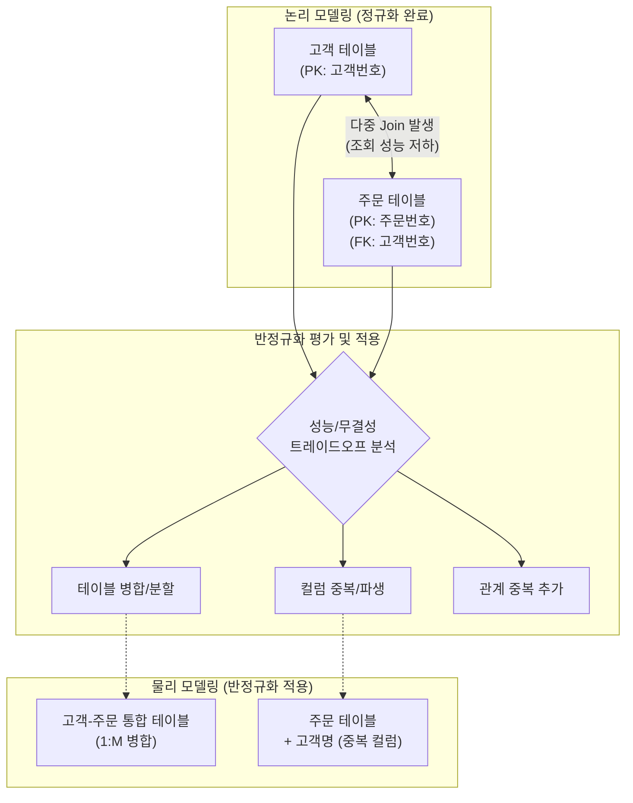

# 데이터베이스 반정규화(De-Normalization)

---

## I. 조인 연산 최소화 및 조회 성능 향상을 위한 반정규화의 개요

* **정의**: 시스템의 조회(Read) 성능 향상 및 개발·운영의 단순화를 위해, 정규화된 데이터 모델을 의도적으로 통합, 중복, 분리하여 데이터의 중복을 허용하는 물리적 [[데이터베이스]] 설계 기법
* **배경 및 특징**:
* 다중 테이블 [[조인]](Join)으로 인한 [[CPU]] 및 I/O 오버헤드 극복 필요
* 데이터 [[무결성]](Integrity) 보장과 처리 성능(Performance) 간의 트레이드오프(Trade-off) 산물
* 정규화 수행 완료 후 물리적 데이터 모델링 단계에서 조건부 및 제한적으로 적용 (비정규화와 구분)

---

## II. 반정규화의 개념도 및 핵심 구성 요소

### 가. 반정규화의 적용 프로세스 및 동작 개념도

* 철저한 정규화 수행 후, 데이터 조회 빈도 및 조인 복잡도를 평가하여 테이블, 컬럼, 관계 수준의 반정규화를 선택적 적용
* [[DML]](Insert/Update/Delete) 수행 시 데이터 정합성 유지(Trigger, Application Logic)를 위한 추가 비용 발생

### 나. 반정규화의 핵심 기술 요소

| 분류 | 요소기술(키워드) | 세부 설명 |
| --- | --- | --- |
| **테이블 반정규화** | 1:1, 1:M 테이블 병합 | 조인 횟수를 줄이기 위해 두 개 이상의 연관된 테이블을 하나로 통합 |
| **테이블 반정규화** | 슈퍼/서브 타입 병합 | 논리적 모델의 슈퍼/서브 타입을 물리적으로 단일, 개별, 서브타입 테이블로 변환 |
| **테이블 반정규화** | 테이블 분할(수직/수평) | 디스크 I/O 분산을 위해 컬럼 단위(수직) 또는 로우 단위 [[파티셔닝]](수평) 적용 |
| **테이블 반정규화** | 통계/이력 테이블 추가 | 다량의 집계 연산 부하 방지를 위해 마감, 통계용 요약 테이블 별도 생성 |
| **컬럼 반정규화** | 중복 컬럼 추가 | 빈번한 조인을 피하기 위해 다른 테이블의 컬럼을 현재 테이블에 중복 저장 |
| **컬럼 반정규화** | 파생 컬럼 추가 | 수식 연산 및 [[트랜잭션]] 집계에 의한 산출 값(총계, 평균 등)을 미리 계산하여 저장 |
| **관계 반정규화** | 중복 관계 추가 | 여러 경로를 거쳐야 하는 조인을 단축하기 위해 논리적으로 불필요한 외래키(FK) 추가 |
| **정합성 유지** | Trigger / Batch 처리 | 반정규화로 인한 데이터 불일치([[Anomaly(이상현상)|Anomaly]]) 방지를 위한 동기화 메커니즘 적용 |

---

## III. 정규화와 반정규화 비교 및 최신 아키텍처에서의 대안

### 가. 정규화(Normalization)와 반정규화(De-Normalization) 비교

| 구분 | 정규화 (Normalization) | 반정규화 (De-Normalization) |
| --- | --- | --- |
| **핵심 목적** | 데이터 중복 최소화 및 무결성 확보 | 데이터 조회(SELECT) 연산 성능 극대화 |
| **적용 단계** | 논리적 데이터 모델링 단계 | 물리적 데이터 모델링 단계 |
| **주요 장점** | 삽입/수정/삭제(CUD) 이상현상(Anomaly) 방지 | 복잡한 쿼리 및 다중 조인 오버헤드 감소 |
| **주요 단점** | 다중 조인으로 인한 SELECT 성능 저하 | 중복 데이터로 인한 CUD 성능 저하 및 정합성 훼손 |
| **최적 환경** | 트랜잭션 중심의 [[OLTP]] 시스템 | 데이터 분석 및 집계 중심의 데이터 웨어하우스([[OLAP]]) |

### 나. 분산 환경에서의 반정규화 대안 및 향후 전망

* **CQRS(Command Query Responsibility Segregation) 패턴 적용**: [[MSA (Micro Service Architecture)|MSA]](마이크로서비스 아키텍처) 환경에서는 쓰기 DB(정규화)와 읽기 DB(반정규화/[[NoSQL (CAP 이론 BASE 속성)|NoSQL]])를 분리하여 성능과 정합성을 동시 확보
* **인메모리 캐싱(Redis, Memcached)**: RDBMS의 반정규화를 무리하게 진행하지 않고, 자주 조회되는 조인 결과를 인메모리 DB에 캐싱하여 조회 성능 이슈 해결
* **Materialized View(구체화된 뷰) 적극 활용**: 배치 주기에 따라 집계/조인된 뷰의 물리적 결과를 저장하는 스냅샷 기능을 활용하여 원본 데이터의 무결성을 훼손하지 않고 성능 향상 도모

---

### 🔗 연관 토픽

- **소속 도메인**: [[00_데이터베이스_MOC|🗄️ 데이터베이스]]
- **세부 분류**: `1. 데이터 모델링 & 관계형 DB 설계`
- **핵심 연관 토픽**:
  - [[데이터베이스]]
  - [[Anomaly(이상현상)]]
  - [[조인|조인(Join)]]
  - [[OLAP]]
  - [[NoSQL (CAP 이론 BASE 속성)]]
