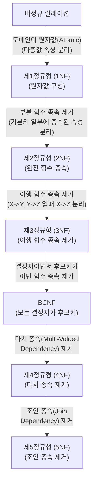

# 데이터베이스 정규화(Normalization)

---

## I. 데이터 중복 최소화 및 무결성 확보를 위한 데이터베이스 정규화의 개요

* **정의**: [[데이터베이스]] 릴레이션(Table)의 데이터 중복을 최소화하고 이상현상([[Anomaly(이상현상)|Anomaly]])을 방지하기 위해, [[함수적 종속성]](Functional Dependency)을 기반으로 데이터를 무손실 분해하는 논리적 데이터 모델링 기법
* **필요성/특징**:
* **이상현상(Anomaly) 예방**: 데이터 삽입(Insert), 수정(Update), 삭제(Delete) 시 발생하는 논리적 오류 원천 차단
* **데이터 [[무결성]]/일관성 보장**: 종속성 제거를 통한 구조적 안정성 확보 및 저장 공간의 효율적 활용
* **성능 트레이드오프**: 과도한 정규화는 다중 [[조인]](Join)을 유발하여 읽기(SELECT) 성능 저하 가능성 존재

---

## II. 데이터베이스 정규화의 단계별 수행 프로세스 및 핵심 기술 요소

### 가. 정규화의 단계별 수행 프로세스 (개념도)

* 단계별 조건(도부이결다조)을 만족하며 무손실 분해(Lossless Decomposition) 원칙을 철저히 준수하여 정규화 수행
* 실무적 물리 설계 단계에서는 [[BCNF]] 또는 제3정규형까지만 진행하는 것이 일반적임

### 나. 데이터베이스 정규화의 핵심 기술 요소

| 분류 | 요소기술(키워드) | 세부 설명 |
| --- | --- | --- |
| **기반 이론** | 이상현상 (Anomaly) | 비정규화된 릴레이션에서 발생하는 데이터 불일치(삽입 이상, 수정 이상, 삭제 이상) |
| **기반 이론** | 함수적 종속 (FD) | 속성 X의 값이 속성 Y의 값을 유일하게 결정하는 관계 ($X \rightarrow Y$) |
| **정규형 단계** | 제1정규형 (1NF) | 릴레이션의 모든 속성 값이 더 이상 분해 불가능한 원자값(Atomic Value)으로만 구성 |
| **정규형 단계** | 제2정규형 (2NF) | 1NF를 만족하고, 기본키가 아닌 모든 일반 속성이 기본키에 '완전 함수 종속' 상태 |
| **정규형 단계** | 제3정규형 (3NF) | 2NF를 만족하고, 기본키가 아닌 일반 속성 간의 '이행적 함수 종속($X \rightarrow Y \rightarrow Z$)' 제거 |
| **정규형 단계** | 보이스-코드 (BCNF) | 3NF를 만족하고, 릴레이션의 모든 결정자(Determinant)가 후보키(Candidate Key)인 상태 |
| **고급 정규형** | 제4정규형 (4NF) | 릴레이션에 존재하는 비자명한 다치 종속($A \twoheadrightarrow B$)을 제거 |
| **고급 정규형** | 제5정규형 (5NF) | 후보키를 통하지 않은 모든 조인 종속(Join Dependency)을 제거 |

---

## III. 정규화와 반정규화(De-Normalization) 비교 및 최신 적용 동향

### 가. 정규화(Normalization)와 반정규화(De-Normalization) 비교

| 비교 항목 | 정규화 (Normalization) | 반정규화 (De-Normalization) |
| --- | --- | --- |
| **설계 목적** | 데이터 중복 최소화 및 무결성 보장 | 조인 연산 감소를 통한 조회(Read) 성능 향상 |
| **수행 시점** | 논리적 데이터 모델링 단계 | 물리적 데이터 모델링 단계 |
| **적용 방법** | 릴레이션의 무손실 분해 (테이블 쪼개기) | 테이블 병합, 중복 컬럼 추가, 중복 관계 설정 |
| **성능 특성** | CUD(삽입/수정/삭제) 성능 최적화 | R(조회) 성능 최적화 (단, CUD 성능 저하 유발) |
| **최적 환경** | [[트랜잭션]] 중심의 [[OLTP]] 핵심 시스템 | 대량 데이터 분석 목적의 [[OLAP]] / DW 시스템 |

### 나. 현대 아키텍처에서의 정규화 적용 동향 및 한계 극복 방안

* **CQRS (Command Query Responsibility Segregation) 아키텍처 도입**: [[MSA (Micro Service Architecture)|MSA]](마이크로서비스) 환경에서 쓰기(Command) DB는 철저한 정규화를 적용하여 무결성을 확보하고, 읽기(Query) DB는 [[NoSQL (CAP 이론 BASE 속성)|NoSQL]] 기반의 반정규화를 적용해 성능 극대화
* **인메모리 캐싱 및 구체화된 뷰(Materialized View) 적극 활용**: 원본 데이터베이스는 3NF/BCNF 수준의 정규형을 엄격하게 유지하되, 애플리케이션 레벨의 캐싱(Redis 등)을 통해 정규화로 인한 조인 오버헤드 상쇄

---

### 🔗 연관 토픽

- **소속 도메인**: [[00_데이터베이스_MOC|🗄️ 데이터베이스]]
- **세부 분류**: `1. 데이터 모델링 & 관계형 DB 설계`
- **핵심 연관 토픽**:
  - [[데이터베이스]]
  - [[Anomaly(이상현상)]]
  - [[조인|조인(Join)]]
  - [[OLAP]]
  - [[BCNF|BCNF (Boyce-Codd Normal Form 3.5NF)]]
