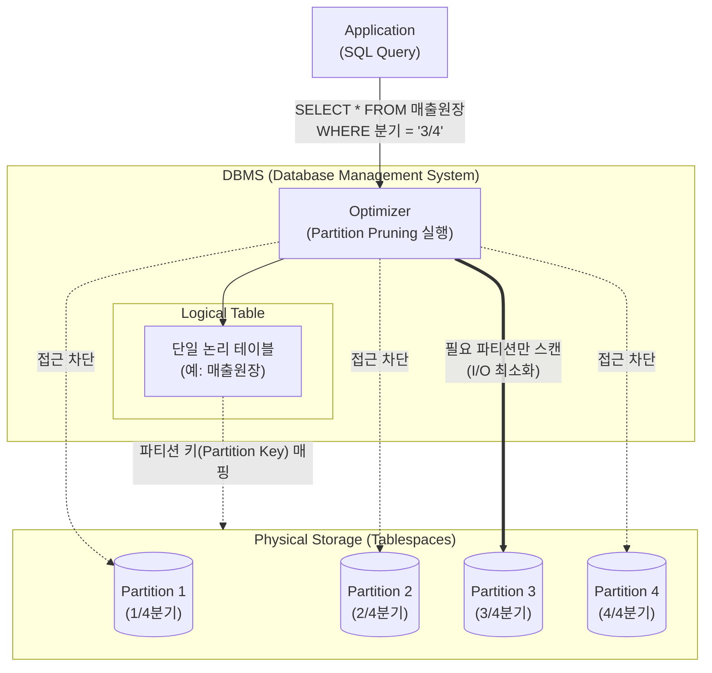

# 데이터베이스 파티셔닝 (Database Partitioning)

---

## I. 대용량 데이터베이스 성능 향상 및 관리 효율화를 위한, 데이터베이스 파티셔닝의 개요

* **정의**: 대용량 테이블이나 인덱스를 논리적 일관성은 유지하되, 물리적으로 독립적인 여러 개의 작은 단위(Partition)로 분할하여 분산 저장하는 물리적 [[데이터베이스]] 설계 기법
* **필요성**: 대용량 데이터 검색 시 I/O 병목 해소, 테이블 단위 락(Lock) 경합 감소, 백업 및 복구 단위의 축소를 통한 유지보수성 향상 필요
* **특징**: 투명성(애플리케이션 수정 불필요), 파티션 독립성(개별 파티션별 [[DDL]] 수행 가능), [[HA(High Availability)|가용성]] 향상(일부 파티션 장애 시에도 타 파티션 접근 가능)

---

## II. 데이터베이스 파티셔닝의 개념도 및 핵심 기술 요소

### 가. 데이터베이스 파티셔닝의 개념도 및 동작 원리

* 사용자 쿼리 인입 시 [[DBMS]] 옵티마이저가 파티션 키(Partition Key)를 분석하여 조건에 맞지 않는 파티션의 접근을 차단(Partition Pruning)하고, 필요한 파티션만 물리적으로 스캔함

### 나. 데이터베이스 파티셔닝의 핵심 기술 요소

| 분류 | 요소기술(키워드) | 세부 설명 |
| --- | --- | --- |
| **분할 방향** | 수평 [[파티셔닝]] (Horizontal) | 행(Row) 단위 분할, [[스키마]] 동일, 대용량 데이터의 분산 저장에 주로 활용 |
| **분할 방향** | 수직 파티셔닝 (Vertical) | 열(Column) 단위 분할, 갱신 위주 컬럼과 조회 위주 컬럼 분리를 통한 I/O 분산 |
| **분할 기준** | Range 파티셔닝 | 날짜, 숫자 등 연속된 값의 범위(Range)를 기준으로 분할 (예: 월별, 연도별) |
| **분할 기준** | Hash 파티셔닝 | 해시 함수 결괏값을 기준으로 분할, 데이터의 균등 분포 목적 (특정 범위 조회 불가) |
| **분할 기준** | List 파티셔닝 | 특정 컬럼의 명시적인 값의 목록(코드, 지역 등)을 기준으로 데이터 분할 |
| **분할 기준** | Composite 파티셔닝 | 2개 이상의 파티셔닝 기법 결합 (예: Range 분할 후 해당 파티션 내 Hash 분할 적용) |
| **성능 최적화** | 파티션 프루닝 (Pruning) | [[SQL(Structured Query Language)|SQL]] 하드파싱/실행 시 조건절을 분석하여 불필요한 파티션 접근을 원천 차단 |
| **인덱스 구조** | Global / Local [[RDBMS 인덱스(index)|Index]] | 전체 파티션을 통합한 단일 인덱스(Global) 또는 각 파티션과 1:1 대응되는 인덱스(Local) 적용 |

---

## III. 파티셔닝과 샤딩(Sharding)의 비교 및 최신 동향

### 가. 파티셔닝(Partitioning)과 샤딩(Sharding) 비교

| 비교 항목 | 데이터베이스 파티셔닝 (Partitioning) | 데이터베이스 [[샤딩|샤딩 (Sharding)]] |
| --- | --- | --- |
| **분할 환경** | **단일 DBMS** [[인스턴스]] 내 물리적 분할 | **다수 DBMS (노드)** 인스턴스 간 물리적 분할 |
| **핵심 목적** | 관리 편의성 증대, I/O 부하 분산 | 시스템의 수평적 확장성(Scale-Out) 극대화 |
| **분산 구조** | 스토리지/테이블스페이스 단위의 분할 | 독립적인 데이터베이스 서버(Shard Node)로 분할 |
| **라우팅 주체** | DBMS 자체 [[OPTIMIZER|Optimizer]] 내장 (투명성 보장) | 애플리케이션(Application) 또는 Shard 미들웨어 |
| **결함 허용** | 단일 인스턴스 종속성 (DB 장애 시 전체 중단) | 노드 단위 격리 (특정 Shard 장애 시 타 Shard 생존) |
| **[[트랜잭션]]** | 단일 노드 트랜잭션 (ACID 보장 용이) | 분산 트랜잭션 제어(2PC 등) 필요 (복잡도 높음) |

### 나. 분산 클라우드 환경에서의 파티셔닝 동향

* **자동화된 파티션 관리(Auto-Partitioning)**: Snowflake의 마이크로 파티션(Micro-Partitioning)과 같이 데이터 적재 시 엔진이 자동으로 최적의 크기와 범위로 파티션을 분할·관리하는 기술 주류화
* **정보 수명 주기 관리(ILM)와의 결합**: 자주 접근하는 최신 데이터(Hot)는 고성능 SSD 파티션에, 과거 데이터(Cold)는 저비용 오브젝트 스토리지 파티션에 자동 이관하는 [[클라우드 네이티브]] DBMS 아키텍처 확산

---

### 🔗 연관 토픽

- **소속 도메인**: [[00_데이터베이스_MOC|🗄️ 데이터베이스]]
- **세부 분류**: `2. 트랜잭션 & 동시성 제어 (Concurrency)`
- **핵심 연관 토픽**:
  - [[트랜잭션]]
  - [[RDBMS 인덱스(index)]]
  - [[데이터베이스]]
  - [[DBMS]]
  - [[스키마]]
