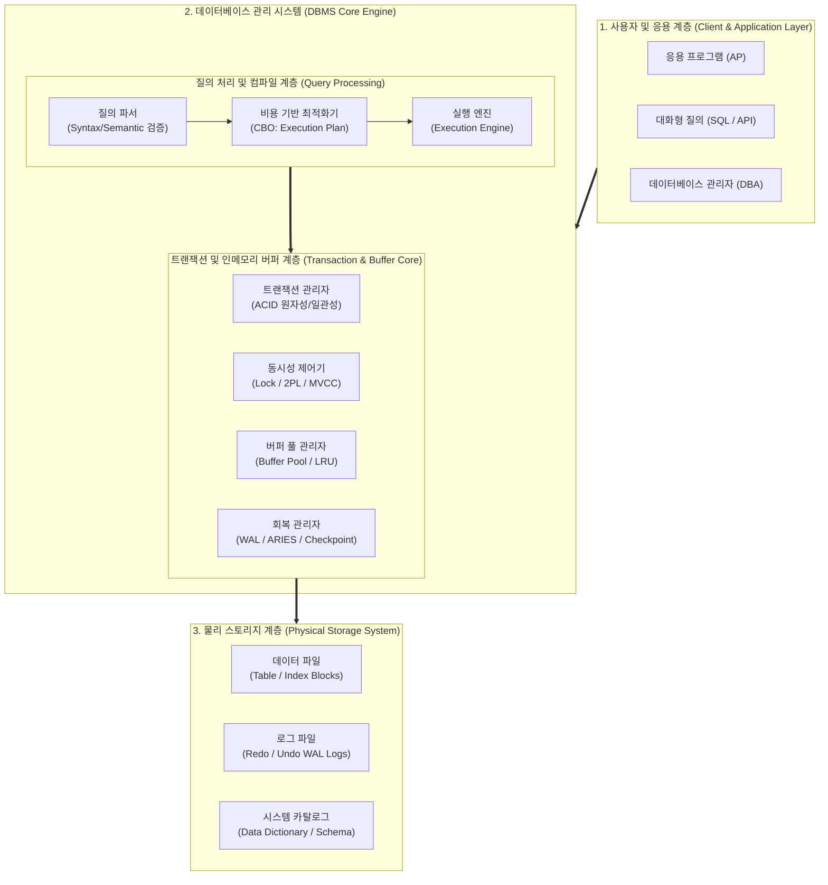

# 데이터베이스 (Database)

---

## I. 데이터 공유·통합 기반 정보 자산화의 핵심 인프라, 데이터베이스의 개요

### 가. 데이터베이스(Database)의 정의

* 특정 조직의 고유 업무를 수행하기 위해 다수의 사용자 및 응용 시스템이 동시 공유(Shared), 중복 배제 통합(Integrated), 저장 매체 영속화(Stored), 실시간 갱신 운영(Operational)하는 상호 연관된 구조화된 데이터의 집합체
* 파일 시스템의 종속성·중복성 한계를 해소하고, [[DBMS]]를 매개로 물리적·논리적 데이터 독립성과 ACID [[트랜잭션]] 무결성을 보장하는 데이터 관리 기반 체계

### 나. 데이터베이스의 필요성 및 핵심 특징

* **등장배경 및 필요성**: 파일 처리 시스템의 데이터 중복성(Redundancy) 및 프로그램 종속성(Dependency) 극복, 불일치(Inconsistency) 차단, 다중 동시 접근 시 정합성 유지
* **핵심 특징**:
* **데이터 4대 요건 (공·통·저·운)**: 공유 데이터(Shared), 통합 데이터(Integrated), 저장 데이터(Stored), 운영 데이터(Operational)
* **운영적 4대 특성 (실·계·동·내)**: 실시간 접근성(Real-time Accessibility), 계속적인 변화(Continuous Evolution), 동시 공유(Concurrent Sharing), 내용에 의한 참조(Content Reference)

---

## II. 데이터베이스의 개념도 및 핵심 기술 요소

### 가. 데이터베이스의 아키텍처 및 동작 원리

* 사용자 질의([[SQL(Structured Query Language)|SQL]])가 파서와 CBO 최적화기를 거쳐 최적의 실행 계획으로 변환되며, 트랜잭션 관리자(ACID) 및 동시성 제어(MVCC) 하에 인메모리 버퍼 풀과 WAL 로그를 거쳐 물리 블록으로 안전하게 영속화되는 구조

### 나. 데이터베이스의 핵심 기술 및 구성 요소

| 구분 | 요소기술(키워드) | 세부 설명 |
| --- | --- | --- |
| **[[추상화]] 구조** | ANSI-SPARC 3단계 구조 | 외부(사용자 뷰), 개념(전사 논리 모델), 내부(물리 저장 구조) [[스키마]] 분리를 통한 논리적/물리적 데이터 독립성 보장 |
| **[[옵티마이저]]** | 비용 기반 최적화 (CBO) | 테이블 통계, 카디널리티, I/O 비용을 연산하여 최단 비용의 실행 계획(Access Path, Join 순서)을 수립하는 엔진 |
| **트랜잭션** | ACID 특성 | 원자성(Atomicity), 일관성(Consistency), 고립성(Isolation), 영속성(Durability)을 보장하는 작업의 논리적 최소 단위 |
| **동시성 제어** | 다중 버전 동시성 제어 (MVCC) | Undo 세그먼트의 스냅샷을 활용하여 읽기/쓰기 상호 블로킹을 배제하고 격리 수준(Read Committed, Serializable) 유지 |
| **장애 회복** | WAL (Write-Ahead Logging) & [[ARIES]] | 디스크 블록 기록 전 변경 로그를 선기록하고, 분석-Redo(재현)-Undo(취소) 3단계 [[알고리즘]] 기반 고속 [[무결성]] 복구 지원 |
| **색인 엔진** | B+Tree / LSM-Tree | 균형 트리 기반 범위 검색(Range Scan)을 최적화하는 B+Tree 및 순차 쓰기(Append-only) 기반 고속 수집용 LSM-Tree 구현 |
| **무결성 제약** | 도메인/개체/참조 무결성 | PK(고유값/Not Null), FK(참조 유효성), Check 조건을 DBMS 엔진 레벨에서 강제하여 데이터 오류 유입 원천 차단 |
| **메타데이터** | 데이터 딕셔너리 (Data Dictionary) | 스키마 명세, 제약조건, 인덱스 정보, 계정 권한 및 옵티마이저용 객체 통계 정보를 저장하는 [[시스템 카탈로그]] |

---

## III. 데이터베이스의 세대별 비교 및 최신 발전 동향

### 가. 데이터베이스 세대별 유형 다차원 비교

| 비교 항목 | 관계형 DB (RDBMS) | [[NoSQL (CAP 이론 BASE 속성)|NoSQL]] | [[New SQL|NewSQL]] | 벡터 DB (Vector DB) |
| --- | --- | --- | --- | --- |
| **데이터 모델** | 정형 테이블(Row-Column) | Key-Value, Document, Graph | 정형 관계형 테이블 | 고차원 실수 벡터 ($\mathbb{R}^d$) |
| **트랜잭션 보장** | 엄격한 ACID 보장 | BASE (Eventual Consistency) | 강력한 분산 ACID 보장 | 원자적 인덱스 갱신 / 유연한 일관성 |
| **확장성 방식** | 수직 확장 (Scale-Up 위주) | 분산 수평 확장 (Scale-Out) | 무제한 분산 수평 확장 | 벡터 [[샤딩]] 기반 분산 Scale-Out |
| **스키마 규격** | Schema-on-Write (고정 스키마) | Schema-on-Read (Schemaless) | Schema-on-Write | 차원($d$) 정의 및 유연 메타데이터 |
| **질의 방식** | 표준 SQL (선언적 질의) | 전용 API, CQL, JSONPath | 표준 분산 SQL | 근사 최근접 탐색 (ANN, Cosine) |
| **대표 솔루션** | Oracle, PostgreSQL, MySQL | MongoDB, Redis, Cassandra | [[CockroachDB]], TiDB, Spanner | Milvus, Pinecone, pgvector |

### 나. 최신 기술 동향 및 향후 전망

* **[[클라우드 네이티브]] 스토리지-컴퓨팅 분리**: AWS Aurora, Snowflake 등 연산 노드와 공유 스토리지를 물리적으로 분리하여 서버리스 탄력적 오토스케일링 및 장애 격리 구조 정착
* **HTAP (Hybrid Transactional/Analytical Processing)**: 단일 데이터베이스 아키텍처 내에서 행 기반 엔진([[OLTP]])과 열 지향 인메모리 엔진([[OLAP]])을 융합하여 실시간 비즈니스 의사결정 지원
* **AI-Native 데이터베이스로의 진화**: [[초거대 언어 모델|LLM]] 및 RAG(검색 증강 생성) 인프라 수요 급증에 맞춰 기존 관계형/분산 DB 내 고차원 벡터 인덱싱(HNSW, IVF-PQ)을 통합 내재화하는 Multi-Model 패러다임 가속화

---

### 🔗 연관 토픽

- **소속 도메인**: [[00_데이터베이스_MOC|🗄️ 데이터베이스]]
- **세부 분류**: `1. 데이터 모델링 & 관계형 DB 설계`
- **핵심 연관 토픽**:
  - [[DBMS]]
  - [[스키마]]
  - [[NoSQL (CAP 이론 BASE 속성)]]
  - [[OLAP]]
  - [[시스템 카탈로그|시스템 카탈로그 (System Catalog)]]
