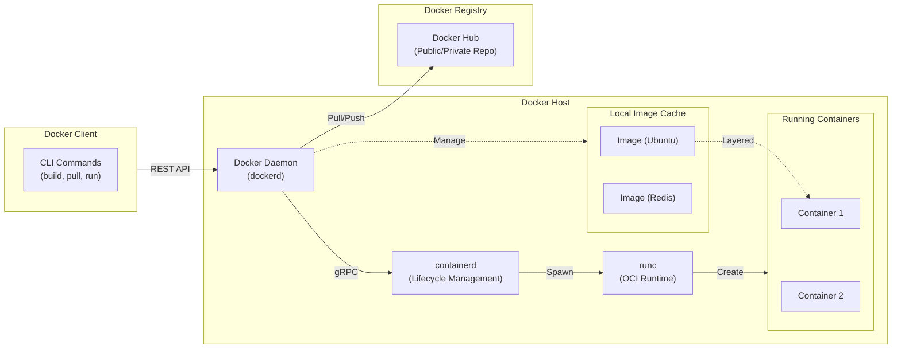

# 도커(Docker)

---

## I. 애플리케이션의 신속한 배포 및 이식성 보장을 위한 도커의 개요

* **정의**: 리눅스 [[커널]] 기능(Namespace, cgroups 등)을 활용하여 애플리케이션과 실행 환경을 격리된 [[컨테이너]](Container) 단위로 패키징하고 배포·실행하는 오픈소스 [[가상화]] 플랫폼
* **등장배경**: 하이퍼바이저([[Hypervisor (VMM)|Hypervisor]]) 기반 가상화 머신(VM)의 무거운 오버헤드 극복, [[MSA (Micro Service Architecture)|MSA]](마이크로서비스 아키텍처) 및 [[DevOps]] 환경의 확산으로 인한 빠르고 일관된 배포 파이프라인 요구
* **특징**: 호스트 OS 커널 공유(경량화 및 밀집도 향상), 불변 인프라(Immutable Infrastructure) 제공, 코드 기반 인프라 구성(Dockerfile)

---

## II. 도커의 아키텍처 및 핵심 구성요소

### 가. 도커의 시스템 아키텍처 및 동작 원리

* 도커 클라이언트의 REST API 요청을 도커 데몬(dockerd)이 수신하여 containerd를 통해 컨테이너 런타임(runc)을 구동하는 OCI(Open Container Initiative) 표준 준수 구조

### 나. 도커의 핵심 기술 요소

| 분류 | 핵심 기술(키워드) | 세부 설명 |
| --- | --- | --- |
| **커널 격리** | Namespace | [[프로세스]], 네트워크, 마운트, IPC, UTS, 사용자 등 6가지 리소스의 독립적 공간을 할당하여 격리 수준 제공 |
| **자원 제어** | cgroups (Control Groups) | 컨테이너별 [[CPU]], 메모리, Network I/O 등 하드웨어 자원 사용량의 제한 및 모니터링 수행 |
| **파일 시스템** | UnionFS (Overlay2) | 복수의 파일 시스템을 하나의 레이어로 병합(Layered Architecture), 이미지 [[재사용]] 및 스토리지 공간 최적화 |
| **엔진 코어** | Docker Daemon (dockerd) | 클라이언트 API 요청 처리, 이미지, 컨테이너, 네트워크, 볼륨 등 도커 객체의 전반적 상태 관리 |
| **표준 런타임** | containerd / runc | OCI 규격을 준수하는 고수준/저수준 런타임으로, 컨테이너 생명주기 관리 및 실제 커널 수준의 컨테이너 생성 |
| **빌드 도구** | Dockerfile / BuildKit | 텍스트 기반의 명령어 스크립트로 이미지를 정의(IaC)하고, 병렬 빌드 및 캐싱을 지원하는 차세대 빌드 엔진 |
| **이미지 저장** | Docker Registry | 도커 이미지를 보관하고 배포하는 저장소 시스템 (Docker Hub 등 퍼블릭 및 프라이빗 레지스트리 지원) |
| **다중 컨테이너** | Docker Compose | YAML 파일을 사용하여 다중 컨테이너로 구성된 애플리케이션의 서비스, 네트워크, 볼륨을 일괄 정의 및 실행 |

---

## III. 도커와 기존 가상화 기술 비교 및 최신 동향

### 가. 도커(컨테이너 가상화)와 하이퍼바이저(VM) 비교

| 비교 항목 | 도커 (Container Virtualization) | 하이퍼바이저 (VM Virtualization) |
| --- | --- | --- |
| **가상화 레벨** | [[OS(운영체제)|운영체제]](OS) 레벨 가상화 | 하드웨어 레벨 가상화 |
| **Guest OS** | 불필요 (Host OS 커널 공유) | 필수 (각 VM마다 독립적인 OS 탑재) |
| **격리 수준** | 논리적 격리 (보안 수준 상대적 낮음) | 물리적 수준 격리 (보안 수준 높음) |
| **구동 속도** | 초 단위 (프로세스 기동 속도와 유사) | 분 단위 (OS 부팅 시간 소요) |
| **리소스 효율** | 오버헤드 최소화 (가볍고 집적도 높음) | 오버헤드 큼 (무겁고 집적도 낮음) |
| **주요 용도** | MSA, 무상태(Stateless) 앱, CI/CD 환경 | 레거시 인프라, 격리가 필수적인 보안 환경 |

### 나. 도커 기술 동향 및 향후 전망

* **보안 아키텍처 강화 (Rootless Mode)**: 데몬을 root 권한 없이 실행하는 Rootless 모드 확산 및 Docker Content Trust(DCT)를 통한 이미지 디지털 서명 검증 필수화
* **[[쿠버네티스]](Kubernetes) 생태계 역할 재정립**: 쿠버네티스의 Dockershim 지원 중단(v1.24) 이후, 운영 환경 런타임(containerd, CRI-O)과 개발/빌드 도구(Docker Desktop, BuildKit)로서의 역할이 명확히 분리됨
* **Wasm(WebAssembly) 통합**: Docker Desktop 내 Wasm 런타임(WasmEdge 등) 통합을 통해 기존 컨테이너보다 더욱 가볍고 빠른 초경량 격리 실행 환경 지원 추세

---

### 🔗 연관 토픽

- **소속 도메인**: [[00_디지털서비스_MOC|🚀 디지털서비스]]
- **세부 분류**: `1. 클라우드 컴퓨팅 & 가상화 인프라`
- **핵심 연관 토픽**:
  - [[컨테이너|컨테이너 (Container)]]
  - [[가상화]]
  - [[Hypervisor (VMM)]]
  - [[프로세스]]
  - [[재사용]]
