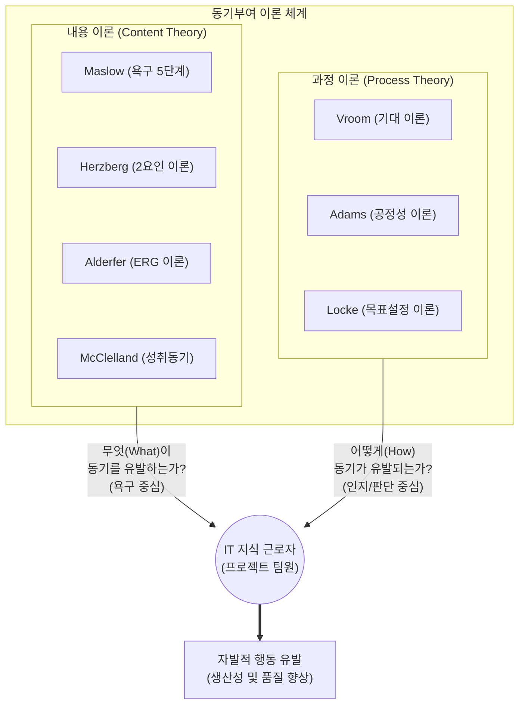

# 동기부여 이론 (Motivation Theory)

---

## I. 성공적인 IT 프로젝트 수행 및 팀 몰입을 위한, 동기부여 이론의 개요

* **정의**: 조직 구성원(프로젝트 팀원)이 공동의 목표 달성을 위해 자발적이고 지속적으로 노력하도록 유도하는 심리적 기제와 행동 원리를 설명하는 이론 체계
* **필요성 및 등장배경**:
* **IT 프로젝트 복잡성 증가**: 창의성과 문제해결 능력이 중시되는 지식 근로자(Knowledge Worker) 중심의 업무 환경 변화
* **조직 몰입도 저하 극복**: 단순 금전적 보상의 한계 도달, MZ세대 등 다양한 가치관을 가진 인력의 동인(Motive) 파악 필요

* **특징**: 인간의 본원적 욕구에 초점을 맞춘 내용 이론(Content Theory)과 인지적 판단 과정에 초점을 맞춘 과정 이론(Process Theory)으로 대별됨

---

## II. 동기부여 이론의 개념도 및 핵심 이론 요소

### 가. 동기부여 이론의 체계도 및 동작 메커니즘

* 내용 이론은 직무 환경 및 개인의 내재적 욕구 충족을 통해 동기를 자극하고, 과정 이론은 목표 달성 시 주어질 보상에 대한 기대치와 공정성 인지를 통해 동기를 형성함

### 나. 동기부여 이론의 핵심 구성 요소

| 구분 | 이론명 (제창자) | 세부 설명 (핵심 키워드) |
| --- | --- | --- |
| **내용 이론** | 욕구단계 이론 (Maslow) | 생리적, 안전, 사회적, 존경, 자아실현 욕구의 [[PMBOK 프로세스 그룹 (5단계)|5단계]] 순차적 충족 (하위 욕구 충족 시 상위 욕구 발현) |
| **내용 이론** | 2요인 이론 (Herzberg) | 불만족을 막는 **위생 요인**(급여, 환경)과 만족을 주는 **동기 요인**(성취, 인정)을 독립적으로 분리 |
| **내용 이론** | ERG 이론 (Alderfer) | 존재(Existence), 관계(Relatedness), 성장(Growth) 욕구 정의 및 좌절-퇴행(Frustration-Regression) 개념 제시 |
| **내용 이론** | 성취동기 이론 (McClelland) | 성취, 권력, 친교 욕구 중 개인별 지배적 욕구를 파악하여 맞춤형 직무 할당 및 동기 부여 |
| **과정 이론** | 기대 이론 (Vroom) | 동기부여(M) = **기대감**(Expectancy) × **수단성**(Instrumentality) × **유의성**(Valence)의 곱으로 산출 |
| **과정 이론** | 공정성 이론 (Adams) | 타인과 자신의 투입(Input) 대비 산출(Outcome) 비율을 비교하여, 형평성을 인지할 때 동기 유발 |
| **과정 이론** | 목표설정 이론 (Locke) | 구체적(Specific)이고 도전적인 목표(SMART 원칙)의 부여가 강력한 동기 및 성과를 유발함 |
| **현대 이론** | Motivation 3.0 (D.Pink) | 애자일/IT 환경의 지식근로자를 위한 내재적 동기(자율성, 숙련도, 목적성)의 중요성 강조 |

---

## III. 내용 이론과 과정 이론의 비교 및 IT 프로젝트 환경의 적용 동향

### 가. 내용 이론 vs 과정 이론 비교

| 비교 항목 | 내용 이론 (Content Theory) | 과정 이론 (Process Theory) |
| --- | --- | --- |
| **핵심 질문** | "무엇(What)이 사람을 움직이는가?" | "어떻게(How) 행동이 유도되는가?" |
| **인간관** | 정태적 (본연의 욕구를 지닌 수동적 존재) | 동태적 (계산하고 인지하는 합리적 존재) |
| **주요 변수** | 인간 내부의 욕구(Needs), 충족 여부 | 인지(Cognition), 기대(Expectation), 보상 |
| **IT관리 적용** | 쾌적한 개발 환경 조성, 인정과 칭찬 문화 | 성과급(Incentive), 명확한 KPI/[[OKR]] 설정 |
| **한계점** | 개인별 욕구의 다양성과 변화 설명 부족 | 인간의 합리성에 대한 과도한 가정 |

### 나. IT 조직 및 최신 트렌드에서의 동기부여 적용 방향

* **내재적 동기(Intrinsic Motivation)의 극대화**: 금전적 보상(Motivation 2.0)을 넘어, 자기 주도적 업무 수행(자율성)과 기술적 성장(숙련도)을 지원하는 애자일 조직 문화 정착 필수
* **심리적 안전감(Psychological Safety) 확보**: 구글의 '아리스토텔레스 프로젝트'에서 증명되었듯, 실패를 용인하고 자유로운 의견 개진을 보장하는 환경이 고성과 IT 팀의 최우선 동기부여 요소로 작용함

---

### 🔗 연관 토픽

- **소속 도메인**: [[00_프로젝트관리_MOC|📋 프로젝트관리]]
- **세부 분류**: `5. 애자일 프로젝트 관리 & 개발 운영 (Agile PM)`
- **핵심 연관 토픽**:
  - [[PMBOK 프로세스 그룹 (5단계)]]
  - [[PMBOK 7판 (Project Management Body of Knowledge 7th Ed.)]]
  - [[OKR]]
  - [[터크만 팀 개발 5단계]]
  - [[SAST]]
