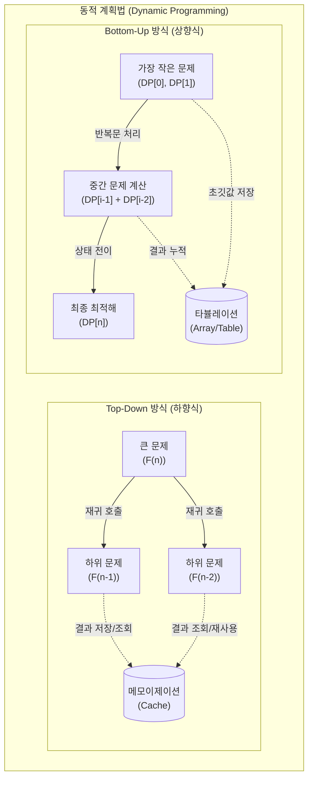

# 동적 계획법 (Dynamic Programming)

---

## I. 중복 연산 최소화를 위한 알고리즘 최적화 기법, 동적 계획법의 개요

* **정의**: 복잡한 문제를 여러 개의 작은 하위 문제(Subproblems)로 분할하여 해결하고, 그 결괏값을 저장하여 재사용함으로써 전체 문제의 최적해를 구하는 [[알고리즘]] 설계 기법
* **배경/특징**:
* 지수 시간(Exponential Time)이 소요되는 중복 연산을 다항 시간(Polynomial Time)으로 단축하여 실행 효율성 극대화
* 하위 문제의 결괏값을 임시 저장(Memoization/Tabulation)하는 '기억하며 풀기' 원리 적용
* 최적 부분 구조(Optimal Substructure) 및 부분 문제 중복(Overlapping Subproblems) 조건 충족 필수

---

## II. 동적 계획법의 개념도 및 핵심 기술 요소

### 가. 동적 계획법의 동작 원리 (하향식 및 상향식)

* 하향식은 큰 문제에서 작은 문제로 재귀 호출하며 Cache를 활용하고, 상향식은 작은 문제부터 반복문으로 Table에 누적하며 최종해를 도출함

### 나. 동적 계획법의 핵심 기술 요소

| 분류 | 요소기술(키워드) | 세부 설명 |
| --- | --- | --- |
| **적용 조건** | 최적 부분 구조 (Optimal Substructure) | 큰 문제의 최적해가 작은 하위 문제들의 최적해를 조합하여 자연스럽게 도출되는 성질 |
| **적용 조건** | 부분 문제 중복 (Overlapping Subproblems) | 하위 문제로 분할하는 과정에서 동일한 계산이 반복적으로 발생하여 연산 중복 유발 |
| **핵심 기법** | 메모이제이션 (Memoization) | Top-Down 방식에서 한 번 계산된 하위 문제의 결과를 캐시에 저장하여 중복 연산 차단 |
| **핵심 기법** | 타뷸레이션 (Tabulation) | Bottom-Up 방식에서 작은 하위 문제부터 순차적으로 계산하여 1차원/2차원 배열에 누적 |
| **설계 요소** | 점화식 (Recurrence Relation) | 현재 상태와 이전 상태 간의 관계를 수식으로 정의한 상태 전이 방정식 (State Transition) |
| **구현 방식** | 재귀 호출 (Recursion) | 하향식 구현의 핵심으로 기저 조건(Base Case)에 도달할 때까지 함수 자신을 지속 호출 |
| **구현 방식** | 반복문 (Iteration) | 상향식 구현의 핵심으로 for/while 문을 활용하여 콜스택 오버헤드 없이 순차적 결과 도출 |
| **활용 알고리즘** | 벨만-포드 / 냅색 (Knapsack) | 그래프 최단 경로 탐색(벨만-포드, 플로이드-워셜) 및 자원 할당 최적화(0-1 배낭 문제) |

---

## III. 동적 계획법과 분할 정복 비교 및 최신 산업 적용 동향

### 가. 동적 계획법(DP)과 분할 정복(Divide & Conquer) 비교

| 비교 항목 | 동적 계획법 (Dynamic Programming) | 분할 정복 (Divide & Conquer) |
| --- | --- | --- |
| **설계 철학** | 이전 계산 결과를 메모리에 저장 후 [[재사용]] | 문제를 분할 후 독립적으로 계산하여 병합 |
| **하위 문제 관계** | **의존적** (부분 문제의 연산 중복 발생) | **독립적** (부분 문제 간 연산 중복 없음) |
| **구현 방식** | Top-Down(재귀), Bottom-Up(반복문) | Top-Down(재귀 호출 및 Merge 중심) |
| **추가 메모리** | 하위 문제 기록용 공간(Cache, Table) 필요 | 재귀 호출용 콜스택 제외 추가 메모리 불필요 |
| **대표 알고리즘** | 피보나치 수열, 최단 경로, 부분합 탐색 | [[병합 정렬]](Merge Sort), [[퀵 정렬]], 이진 탐색 |

### 나. 최신 AI/ML 분야에서의 동적 계획법 활용 동향

* **[[강화학습]](Reinforcement Learning) 가치 최적화**: 마르코프 결정 과정(MDP) 기반의 에이전트 학습 시, 벨만 방정식(Bellman Equation)을 DP(Value/Policy Iteration) 연산으로 풀어내어 최적 행동 정책 도출
* **[[초거대 언어 모델|LLM]] 인퍼런스 최적화 철학 공유**: 대형 언어 모델(LLM)에서 이전 생성 토큰의 Attention 연산 상태를 메모리에 임시 저장해 재사용하는 **KV Cache** 기술은 DP의 메모이제이션(Memoization) 철학을 [[딥러닝]] 아키텍처로 진화시킨 사례임
* **차원의 저주(Curse of Dimensionality) 극복**: 상태 공간이 방대해질 경우 메모리 부족 및 계산량이 기하급수적으로 폭증하는 정통 DP의 한계를 극복하기 위해, 최근에는 심층 신경망을 결합한 근사 동적 계획법(ADP, Approximate DP) 및 DQN(Deep Q-Network) 모델로 발전 중임

---

---

### 🔗 연관 토픽

- **소속 도메인**: [[00_컴퓨터구조_MOC|💻 컴퓨터구조]]
- **세부 분류**: `5. 핵심 알고리즘 & 계산 복잡도 (Algorithms)`
- **핵심 연관 토픽**:
  - [[알고리즘]]
  - [[강화학습]]
  - [[퀵 정렬|퀵 정렬 (Quick Sort)]]
  - [[병합 정렬|병합 정렬 (Merge Sort)]]
  - [[그리디 알고리즘|그리디 (탐욕) 알고리즘]]
