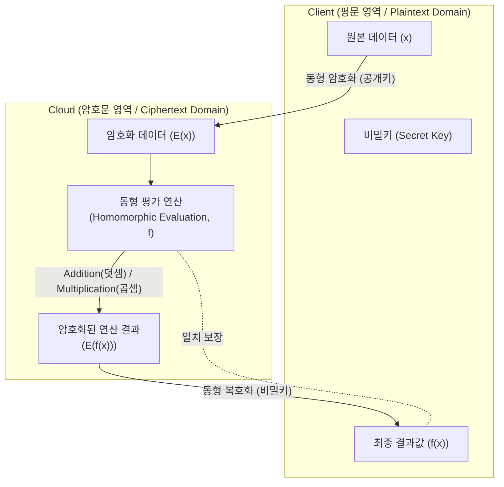

# 동형 암호 (Homomorphic Encryption)

---

## I. 데이터 프라이버시 보장을 위한 차세대 암호 기술, 동형 암호의 개요

* **정의**: 암호화된 상태(Ciphertext)에서 복호화 과정 없이 연산을 수행할 수 있으며, 그 결과의 복호화 값이 평문(Plaintext)의 연산 결과와 동일함을 보장하는 4세대 동형(Homomorphic) 암호 기술
* **필요성 및 특징**:
* **데이터의 보호와 활용 양립**: 클라우드 환경 및 AI 분석 시 개인정보(데이터) 유출 위협 원천 차단
* **양자 내성 확보**: 다항식 시간 내 해독이 불가능한 격자 기반(Lattice-based) 수학적 난제 적용
* **종단간([[End-to-End]]) [[암호화]]**: 연산 과정 중 메모리에 평문이 노출되지 않아 내부자 위협 방지

---

## II. 동형 암호의 개념도 및 핵심 기술 요소

### 가. 동형 암호의 개념도 및 동작 원리

* 평문 데이터를 암호화하여 클라우드로 전송 후, 복호화 없이 암호문 상태로 연산(덧셈, 곱셈)을 수행하고 결과만 반환받아 클라이언트에서 복호화하는 구조

### 나. 동형 암호의 핵심 기술 요소

| 분류 | 요소기술(키워드) | 세부 설명 |
| --- | --- | --- |
| **핵심 기법** | 재부팅 (Bootstrapping) | 암호문 연산(특히 곱셈) 시 기하급수적으로 누적되는 노이즈(Noise)를 초기화하여 무한 연산을 가능케 하는 FHE 핵심 기술 |
| **핵심 기법** | 동형 평가 (Evaluation) | 암호문 공간에서 평문의 덧셈(Add)과 곱셈(Mult)이 보존되도록 지원하는 논리 연산 기능 |
| **수학적 난제** | LWE / RLWE | 양자 컴퓨터로도 풀기 어려운 '오류를 수반한 학습(Learning With Errors)' 및 Ring 기반의 격자(Lattice) 난제 적용 |
| **암호화 스킴** | BGV / BFV 스킴 | 정수(Integer) 기반의 정확한 산술 연산을 지원하는 2세대 완전 동형 암호 체계 |
| **암호화 스킴** | CKKS 스킴 | 실수(Real Number) 단위의 근사치 연산을 지원하여 머신러닝(AI) 통계 분석에 최적화된 동형 암호 스킴 |
| **보안 요소** | 노이즈 관리 (Noise Mgmt) | 안전성 확보를 위해 추가된 임의의 에러(Noise)가 임계치를 넘어 데이터가 훼손되지 않도록 통제하는 기법 |
| **키 관리** | 평가지원키 (Evaluation Key) | 클라우드 환경에서 암호문의 연산(주로 회전이나 부트스트래핑)을 수행하기 위해 제공되는 공개키 형태의 키 |
| **패킹 기술** | SIMD 패킹 (Packing) | 하나의 암호문에 여러 개의 평문 슬롯을 담아 한 번의 연산으로 다수의 데이터를 병렬 처리하는 최적화 기법 |

---

## III. 동형 암호의 세대별 진화 및 최근 활용 동향

### 가. 동형 암호의 세대별 진화 발전 비교

| 비교 항목 | 1세대: 부분 동형 암호 (PHE) | 2세대: 좀 더 동형 암호 (SHE) | 3세대: 완전 동형 암호 (FHE) |
| --- | --- | --- | --- |
| **영문명** | Partially HE | Somewhat HE | Fully HE |
| **지원 연산** | 덧셈 **또는** 곱셈 중 1개만 지원 | 덧셈 **및** 곱셈 모두 지원 | 덧셈 **및** 곱셈 모두 지원 |
| **연산 횟수** | 해당 연산 무한 지원 | 횟수 제한 (노이즈 임계치 한계) | **횟수 제한 없음 (무한 연산)** |
| **재부팅 적용** | 미적용 | 미적용 | **적용 (Bootstrapping)** |
| **대표 [[알고리즘]]** | [[RSA (Rivest Shamir Adleman)|RSA]](곱셈), Paillier(덧셈) | BGN (곱셈 1회 지원) | Gentry 스킴, BFV, CKKS |
| **주요 활용** | 전자투표, 단순 집계 | 제한적 질의응답 | **의료/금융 데이터 AI 학습 (PPML)** |

### 나. 동형 암호의 한계점 극복 및 향후 전망

* **하드웨어 가속화 (FHE Accelerator)**: 동형 암호의 가장 큰 한계인 연산 오버헤드(Ciphertext 확장 및 부트스트래핑 부하)를 극복하기 위해, [[GPU]] 병렬 처리 및 FHE 전용 ASIC/FPGA 반도체 개발 가속화
* **프라이버시 보존형 머신러닝 (PPML)**: 민감한 의료 데이터, 금융 마이데이터를 암호화된 상태 그대로 [[연합 학습]](Federated Learning) 및 추론하는 서비스 모델 상용화 추진
* **PET(Privacy Enhancing Tech)와의 융합**: 다자간 컴퓨팅(MPC), 영지식 증명([[영지식증명|ZKP]]), 동형 암호(FHE)를 상호 보완적으로 결합하여 보안성과 처리 성능의 트레이드오프를 최적화하는 하이브리드 아키텍처 연구 확산

---

### 🔗 연관 토픽

- **소속 도메인**: [[00_보안_MOC|🛡️ 보안]]
- **세부 분류**: `2. 현대 암호학 & 키 관리 · 전자서명`
- **핵심 연관 토픽**:
  - [[암호화|암호화 (Encryption)]]
  - [[연합 학습]]
  - [[RSA (Rivest Shamir Adleman)]]
  - [[블록체인 암호기술 가이드라인]]
  - [[암호 분석 공격 기법|암호 분석 공격(Cryptanalysis Attacks) 기법]]
