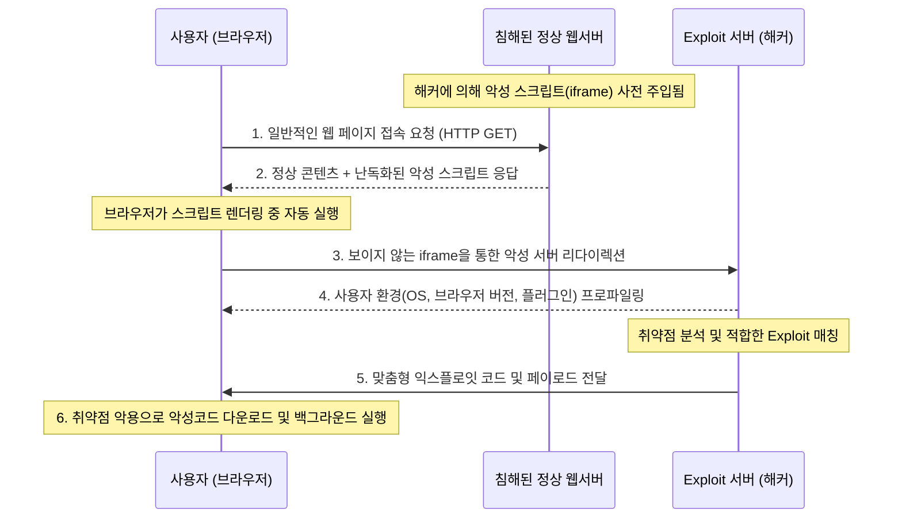

# 드라이브 바이 다운로드 (Drive By Download)

---

## I. 사용자 개입 없는 자동 감염 기법, 드라이브 바이 다운로드의 개요

* **정의**: 사용자가 해커에 의해 침해된 정상 웹페이지를 방문하는 것만으로, 사용자의 인지나 동의(클릭, 다운로드 등) 없이 취약점을 악용해 악성코드가 백그라운드에서 자동 설치 및 실행되는 사이버 공격 기법
* **등장배경**: 사용자 속임수(사회공학적 기법)에 의존하던 기존 방식에서 탈피하여, 브라우저 및 플러그인의 보안 취약점을 직접 타격하는 Zero-Click 기반 감염 메커니즘의 필요성 대두
* **특징**: 무결함(Zero-Click) 감염, 다단계 리다이렉션(은닉), 익스플로잇 킷([[Exploit]] Kit)을 활용한 공격의 자동화 및 대중화

---

## II. 드라이브 바이 다운로드의 개념도 및 핵심 기술 요소

### 가. 드라이브 바이 다운로드의 개념도 및 동작 원리

* 취약점이 존재하는 엔드포인트(브라우저)가 침해된 웹 서버 방문 시, 숨겨진 리다이렉션 코드를 통해 Exploit 서버로 연결되어 악성코드가 자동 감염되는 [[프로세스]]

### 나. 드라이브 바이 다운로드의 핵심 기술 요소

| 구분 | 요소기술(키워드) | 세부 설명 |
| --- | --- | --- |
| **공격 도구** | 익스플로잇 킷 (Exploit Kit) | 사용자의 브라우저 및 플러그인 취약점을 자동으로 스캔하고 공격 코드를 배포하는 해킹 도구 (예: [[RIG(Retrieval Interleaved Generation)|RIG]], Fallout) |
| **공격 기법** | [[난독화]] (Obfuscation) | 보안 솔루션(WAF, 백신)의 시그니처 탐지를 우회하기 위해 JavaScript 및 iframe 코드를 알아볼 수 없게 변형 |
| **인프라** | 랜딩 페이지 (Landing Page) | 리다이렉션 된 사용자의 환경을 프로파일링하고, 실제 익스플로잇 코드를 인젝션하는 해커 측 웹 페이지 |
| **인프라** | 다중 리다이렉션 (TDS) | Traffic Direction System을 이용해 분석가 추적을 피하고 여러 경유지를 거쳐 최종 착취지로 트래픽 우회 |
| **페이로드** | 악성코드 (Payload) | 익스플로잇 성공 후 시스템에 설치되는 실질적인 악성 파일 ([[랜섬웨어]], 크립토재킹, 봇넷 에이전트 등) |
| **대응 기술** | RBI (원격 브라우저 격리) | 웹 콘텐츠 렌더링을 로컬 디바이스가 아닌 원격 가상 환경에서 수행하여 스크립트 실행을 물리적/논리적으로 격리 |
| **대응 기술** | [[EDR(Endpoint Detection and Response)|EDR]] (엔드포인트 탐지/대응) | 백신이 탐지하지 못한 파일리스(Fileless) 공격이나 비정상적인 백그라운드 프로세스 실행 행위를 실시간 탐지 및 차단 |
| **대응 기술** | 패치 관리 시스템 (PMS) | OS, 웹 브라우저, 플러그인(PDF 리더 등)의 최신 보안 패치를 강제 적용하여 근본적인 공격 표면(취약점) 제거 |

---

## III. 유사 공격 기법과의 비교 및 향후 전망

### 가. 드라이브 바이 다운로드와 워터링 홀(Watering Hole) 비교

| 비교 항목 | 드라이브 바이 다운로드 (Drive By Download) | 워터링 홀 (Watering Hole) |
| --- | --- | --- |
| **핵심 목적** | 봇넷 구성, 랜섬웨어 유포 등 불특정 다수 감염 | 특정 타겟(기업, 기관)의 내부망 침투 및 정보 탈취 |
| **공격 대상** | 취약점이 있는 **불특정 다수** 방문자 | APT 공격 대상 집단이 **자주 방문하는 특정 웹사이트** |
| **작동 방식** | 방문 즉시 자동 다운로드 및 감염 유도 | 목표 대상이 접근할 때까지 잠복 및 선별적 익스플로잇 |
| **위협 수준** | 대규모 피해 발생 (개인 사용자 중심) | 치명적 정보 유출 및 시스템 파괴 (기업/국가 중심) |
| **기술적 성격** | 공격의 자동화 및 대량 유포(Exploit Kit 의존도 높음) | 표적형(Spear) 지능적 지속 위협(APT)의 초기 침투 수단 |

### 나. 향후 전망 및 대응 동향

* **파일리스(Fileless) 공격과의 결합**: 디스크에 파일을 생성하지 않고 메모리 상에서만 PowerShell 등을 이용해 실행되는 파일리스 기법과 결합되어 기존 시그니처 기반 백신 탐지를 무력화하는 추세임.
* **제로 트러스트([[제로 트러스트 보안모델|Zero Trust]]) 기반 아키텍처 도입 확산**: 네트워크 트래픽을 신뢰하지 않는 제로 트러스트 관점에서, 브라우저 격리 기술(RBI) 및 샌드박싱(Sandboxing) 기반의 선제적 방어 체계 구축이 필수로 자리매김하고 있음.

---

### 🔗 연관 토픽

- **소속 도메인**: [[00_보안_MOC|🛡️ 보안]]
- **세부 분류**: `4. 웹 & 애플리케이션 보안 · 취약점 점검`
- **핵심 연관 토픽**:
  - [[Exploit]]
  - [[EDR(Endpoint Detection and Response)]]
  - [[제로 트러스트 보안모델|제로 트러스트 (Zero Trust) 보안모델]]
  - [[랜섬웨어]]
  - [[난독화]]
