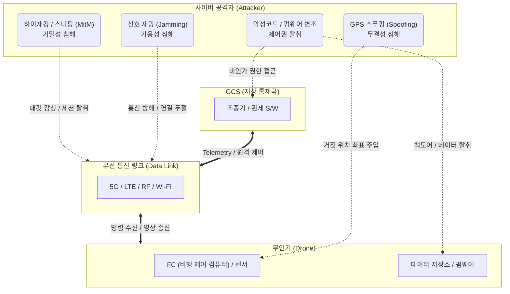

# 드론 취약점 및 대응

---

## I. 안전한 3차원 공간 모빌리티 확보를 위한, 드론 취약점 및 대응의 개요

* **정의**: 원격 조종 또는 자율 비행하는 무인 항공기(UAV)의 기체, 무선 통신 링크, 지상통제국(GCS) 영역에서 발생하는 사이버 위협을 식별하고 이를 기술적/물리적으로 방어하는 일련의 보안 대응 체계
* **필요성 및 특징**:
* **다양한 공격 표면(Attack Surface) 존재**: GPS, RF 통신, 애플리케이션 등 다계층 취약점 노출로 인한 탈취 및 물리적 테러 위험성 증대
* **SWaP(Size, Weight, Power) 제약 극복 필수**: 드론의 경량화 및 배터리 한계 특성상 무거운 보안 솔루션 탑재가 어려워 경량 [[암호화]] 및 최적화된 방어 기법 적용 요구

---

## II. 드론 취약점 개념도 및 영역별 핵심 대응 기술 요소

### 가. 드론 사이버 위협 및 취약점 발생 개념도

* 공격자는 GCS, 통신망, 기체 전 구간을 타격 대상으로 삼아 [[HA(High Availability)|가용성]](재밍), [[무결성]](기만), [[기밀성]](감청)을 침해하여 제어권 탈취 및 물리적 피해를 유발함

### 나. 드론 영역별 취약점 및 핵심 보안 대응 기술

| 영역 | 주요 취약점(위협) | 핵심 대응 기술 (키워드) | 세부 설명 |
| --- | --- | --- | --- |
| **기체 (UAV)** | 센서 기만 (GPS Spoofing) | **Anti-Spoofing / 복합 측위** | 암호화된 군용 GPS 사용, 비전 센서 및 IMU를 융합한 교차 검증으로 기만 신호 방어 |
| **기체 (UAV)** | 펌웨어 위·변조 | **Secure Boot / TEE** | 기체 부팅 및 업데이트 시 전자서명 기반 펌웨어 무결성 검증 체계(Secure Boot) 적용 |
| **통신망 (Link)** | 신호 재밍 (Jamming) | **주파수 도약 (FHSS/DSSS)** | 항재밍 안테나 및 확산 대역 기술을 활용하여 주파수 간섭 및 서비스 거부([[DDOS|DDoS]]) 방어 |
| **통신망 (Link)** | 데이터 스니핑 / MitM | **경량 암호화 / E2EE** | SWaP 제약을 고려한 경량 [[암호 알고리즘]](LEA) 및 기체-GCS 간 종단간 암호화([[VPN]]) 적용 |
| **GCS (지상통제)** | 비인가 접근 및 탈취 | **MFA / 인증·인가 체계** | 조종기 및 관제 앱 접근 시 다중 인증(MFA) 및 역할 기반 접근 통제([[RBAC]]) 강화 |
| **GCS (지상통제)** | 악성코드 및 [[랜섬웨어]] | **[[EDR(Endpoint Detection and Response)|EDR]] / 망분리** | 지상통제국 PC의 EDR 탑재 및 관제망-인터넷망 간 물리적/논리적 망분리 환경 구축 |
| **인프라/제도** | 미확인 기체의 불법 비행 | **Remote ID (원격 식별)** | 비행 중인 드론의 식별 번호, 소유자, 위치 정보를 실시간 브로드캐스팅하는 표준 의무화 |
| **인프라/제도** | 악성 [[드론]] 침투 및 테러 | **Anti-Drone (안티 드론)** | 레이더/RF 탐지 기술과 결합된 무력화 수단(Soft Kill: 전파방해, Hard Kill: 그물/타격) 운용 |

---

## III. 안전한 드론 생태계 조성을 위한 인프라 연계 동향 및 전망

### 가. 전주기적 드론 보안 프레임워크 구축 동향 및 향후 전망

* **UTM(UAS Traffic Management) 기반 통합 보안 관제**: 단일 기체의 보안을 넘어, 다수의 무인기가 비행하는 도심항공교통(K-[[UAM]]) 환경에서는 UTM과 연동된 실시간 항로 이탈 모니터링 및 충돌 방지 시스템 구축이 필수적으로 요구됨
* **AI 및 [[01_IT Tech/블록체인]] 연계 보안 고도화**: 머신러닝(ML) 기반의 비정상 비행 패턴 실시간 탐지(IDS/IPS 연계) 기술이 상용화되고 있으며, 드론 간 통신 데이터의 무결성 보장 및 블랙박스 기록을 위해 블록체인 분산 원장 기술 도입 연구가 활발히 진행 중임
* **국방 및 산업 표준 가이드라인 준수**: 국방부 '국방 드론 보안 가이드라인' 및 국정원 보안 인증 체계를 바탕으로, 설계(Security by Design) 단계부터 폐기까지 전 생애주기에 걸친 공급망 보안(Supply Chain Security) 검증이 점차 의무화되는 추세임

---

### 🔗 연관 토픽

- **소속 도메인**: [[00_보안_MOC|🛡️ 보안]]
- **세부 분류**: `4. 웹 & 애플리케이션 보안 · 취약점 점검`
- **핵심 연관 토픽**:
  - [[암호화|암호화 (Encryption)]]
  - [[기밀성]]
  - [[랜섬웨어]]
  - [[암호 알고리즘]]
  - [[무결성]]
