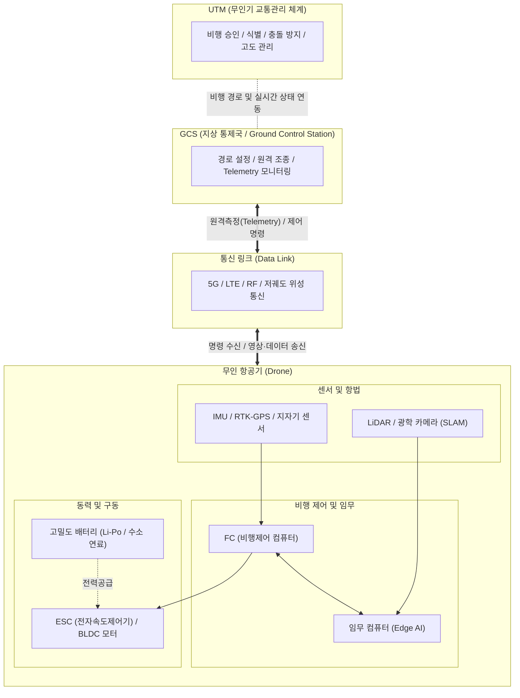

# 드론 (Drone)

---

## I. 3차원 공간 모빌리티 혁신, 드론(무인기)의 개요

* **정의**: 조종사가 탑승하지 않고 무선 전파 유도 및 내장된 자율 비행 시스템(FC)에 의해 원격 조종 및 자율 비행이 가능한 무인 항공기(UAV: Unmanned Aerial Vehicle)
* **등장배경**: 군사적 목적(정찰/타격)에서 출발하여 센서(IMU, GPS), 배터리, 5G 통신 기술의 비약적 발달로 산업용 및 민수용(물류, 농업, 촬영 등)으로 급격히 확산
* **특징**: 3차원 공간 활용(지형지물 제약 극복), 비가시권(BVLOS) 비행, [[EDGE|Edge]] AI 및 군집 제어 결합을 통한 임무 수행 지능화

---

## II. 드론의 개념도 및 핵심 기술 요소

### 가. 드론의 아키텍처 및 시스템 동작 원리

* 센서(GPS, IMU) 데이터를 기반으로 FC가 비행을 제어하며, 5G/위성 통신을 통해 GCS 및 UTM과 연동되어 비가시권 자율 임무를 수행하는 통합 시스템 구조

### 나. 드론의 핵심 기술 요소

| 구분 | 요소기술(키워드) | 세부 설명 |
| --- | --- | --- |
| **비행 제어** | FC (Flight Controller) | 드론의 두뇌로, 센서 데이터를 융합하여 모터 회전수(ESC)를 제어하고 비행 자세 및 고도 유지 |
| **항법 및 센서** | IMU / RTK-GPS | 관성측정장치(가속도, 자이로) 및 실시간 이동 측위(RTK)를 통한 cm 단위의 초정밀 위치 식별 |
| **상황 인식** | Vision / LiDAR / SLAM | 카메라 및 라이다 센서로 주변 환경을 3D 매핑하고, 실시간 위치 추정 및 장애물 회피 수행 |
| **통신 시스템** | BVLOS / 5G / [[저궤도 위성]] | 육안 확인이 불가능한 비가시권(Beyond Visual Line of Sight) 비행을 위한 초저지연·광대역 무선 통신 |
| **관제 체계** | UTM / K-[[UAM]] | 다수의 드론 비행을 안전하게 통제하기 위한 무인기 교통관리 체계 (식별, 충돌방지, 항로배분) |
| **임무 지능화** | Edge AI | 클라우드 의존 없이 드론 자체 탑재 컴퓨터를 활용한 실시간 객체 인식, 화재 감지, 자율 추적 |
| **협업 제어** | 군집 비행 (Swarm) | 자연계 생물체의 군집 행동 모델링을 적용하여 다수의 드론이 충돌 없이 유기적으로 협력 비행 |
| **보안 및 식별** | Remote ID (원격 식별) | 비행 중인 드론의 소유자, 식별 번호, 위치, 고도 등을 실시간으로 주변에 브로드캐스팅하는 보안 표준 |

---

## III. 드론의 최신 기술 동향 및 향후 전망

### 가. 드론의 산업 적용 한계점 극복 및 향후 발전 전망

* **UAM/AAM으로의 모빌리티 진화**: 소형 페이로드(Payload) 중심의 드론에서 벗어나, 사람과 대형 화물을 운송하는 도심항공교통(UAM) 및 미래항공교통(AAM)으로 기체 크기 및 활용 영역의 폭발적 확장 진행 중
* **법·제도 규제 완화 및 인프라 구축**: K-UAM 그랜드 챌린지 추진, 규제 샌드박스를 통한 도심 내 비가시권 비행(BVLOS) 허용, 버티포트(Vertiport) 및 전용 항로 설정 등 운항 생태계 조성 가속화
* **자율 비행의 고도화 (AI & Digital Twin)**: 단방향 원격 조종을 넘어, 디지털 트윈과 융합된 3D 정밀 지도를 기반으로 AI가 스스로 최적 경로를 탐색하고 장애물을 회피하는 완전 자율 비행(Level 4~5) 체계로 진화 중

---

### 🔗 연관 토픽

- **소속 도메인**: [[00_디지털서비스_MOC|🚀 디지털서비스]]
- **세부 분류**: `3. 사물인터넷 (IoT) & 스마트 플랫폼 · 메타버스`
- **핵심 연관 토픽**:
  - [[UAM|UAM (Urban Air Mobility)]]
  - [[물리적 AI]]
  - [[측위기술|측위기술 (LDT Location Determination Technology)]]
  - [[C-ITS|C-ITS (Cooperative-Intelligent Transport Systems)]]
  - [[6G]]
