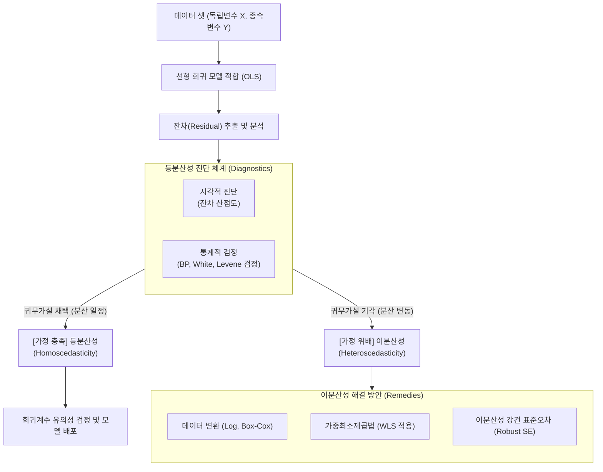

# 등분산성 (Homoscedasticity)

---

## I. 신뢰성 있는 통계 모델링의 핵심 전제, 등분산성의 개요

* **정의**: [[회귀분석]] 및 분산분석([[ANOVA(Analysis of variance)|ANOVA]])에서 모든 독립변수 값에 대해 오차항(잔차, Residual)의 분산이 동일하고 일정하게 유지되는 통계적 성질 ($Var(\epsilon_i) = \sigma^2$)
* **필요성 및 특징**:
* **가우스-마르코프 정리 충족**: 최우수 선형 불편 추정량(BLUE; Best Linear Unbiased Estimator) 도출을 위한 필수 가정
* **통계적 [[가설 검정]] [[신뢰성]] 확보**: 위배 시(이분산성 발생) 표준오차가 왜곡되어 [[t-검정 (t-test)|t-test]], F-test의 [[유의확률|p-value]] 신뢰도 하락 유발
* **예측 모델 안정성**: 독립변수의 크기와 무관하게 모델의 예측 오차 범위가 일정함을 보장

---

## II. 등분산성의 개념도 및 핵심 기술 요소

### 가. 등분산성 진단 및 해결 프로세스 개념도

* 회귀모형 적합 후 잔차를 추출하여 시각적/통계적 검정을 수행하며, 위배 시 데이터 변환 및 모델링 보정(WLS, Robust SE)을 통해 해결함

### 나. 등분산성 진단 및 대응 핵심 기술 요소

| 구분 | 요소기술(키워드) | 세부 설명 |
| --- | --- | --- |
| **기본 전제** | BLUE 충족 조건 | OLS 추정량이 편향되지 않고 최소 분산을 가지기 위한 조건 (선형성, 독립성, 등분산성, 정규성) |
| **시각적 진단** | 잔차 산점도 (Residual Plot) | X축을 예측값(Fitted), Y축을 잔차(Residual)로 두어 무작위로 흩어진 띠 모양인지(깔때기 모양이 아닌지) 확인 |
| **통계적 검정** | Breusch-Pagan 검정 | 잔차의 제곱합을 종속변수로 하여 독립변수와의 선형적 이분산성을 검정하는 기법 |
| **통계적 검정** | White 검정 | 독립변수의 교차항 및 제곱항까지 포함하여 비선형적인 형태의 이분산성까지 포괄적으로 검정 |
| **통계적 검정** | Levene / Bartlett 검정 | 분산분석(ANOVA) 수행 전, 집단(그룹) 간 잔차의 분산이 동일한지 검정 (정규성 여부에 따라 선택 적용) |
| **해결 방안** | 변수 변환 (Transformation) | 값의 스케일 차이가 클 경우 종속변수에 로그(Log)나 Box-Cox 변환을 적용하여 분산 편차 완화 |
| **해결 방안** | 가중최소제곱법 (WLS) | 잔차의 분산이 큰 관측치에는 작은 가중치를, 작은 관측치에는 큰 가중치를 부여하여 OLS 적합 |
| **해결 방안** | 강건 표준오차 (Robust SE) | White 추정량 등을 활용하여 회귀계수 자체는 유지하되, 왜곡된 표준오차(Standard Error)만 재추정 |

---

## III. 등분산성과 이분산성의 비교 및 모델링 최신 동향

### 가. 등분산성 (Homoscedasticity) vs 이분산성 (Heteroscedasticity) 비교

| 비교 항목 | 등분산성 (Homoscedasticity) | 이분산성 (Heteroscedasticity) |
| --- | --- | --- |
| **개념/정의** | 오차항의 분산이 모든 X에 대해 일정함 | 특정 독립변수의 구간에 따라 분산이 커지거나 작아짐 |
| **산점도(Plot) 형태** | 중심축(0) 기준 일정한 두께의 띠 모양 | 나팔꽃, 깔때기, 활 모양 등 특정 패턴 발생 |
| **회귀계수(추정량)** | 불편성(Unbiasedness) 유지 | 불편성(Unbiasedness)은 유지됨 |
| **추정량 분산(효율성)** | **최소 분산 달성 (효율성 높음)** | 분산이 커짐 (비효율적, BLUE 성립 불가) |
| **가설검정(p-value)** | 신뢰 가능 (t-검정, F-검정 유효) | **표준오차 왜곡에 따른 1종/2종 오류 증가 (신뢰 불가)** |

### 나. 최신 데이터 분석 환경에서의 동향 및 전망

* **비모수적 및 앙상블 알고리즘의 대두**: 통계적 가정(정규성, 등분산성 등)에 민감한 전통적 선형 회귀의 한계를 극복하기 위해, XGBoost, Random Forest, LightGBM 등 분포 가정에 얽매이지 않는 트리 기반 머신러닝 [[알고리즘]] 활용 가속화
* **딥러닝에서의 적용**: 신경망 모델은 근본적으로 비선형성을 내포하여 등분산성에 엄격하지 않으나, 예측의 불확실성을 측정하는 [[딥러닝]](Bayesian Neural Networks, [[Dropout]] 기반 몬테카를로) 추론 시 Aleatoric Uncertainty(데이터 자체 노이즈) 모델링의 핵심 원리로 이분산성/등분산성 개념을 차용하여 적용 중임

---

### 🔗 연관 토픽

- **소속 도메인**: [[00_인공지능_MOC|🤖 인공지능]]
- **세부 분류**: `1. 수학 · 통계학 & 데이터 전처리`
- **핵심 연관 토픽**:
  - [[t-검정 (t-test)]]
  - [[ANOVA(Analysis of variance)]]
  - [[회귀분석|회귀분석(Regression Analysis)]]
  - [[가설 검정]]
  - [[Dropout]]
