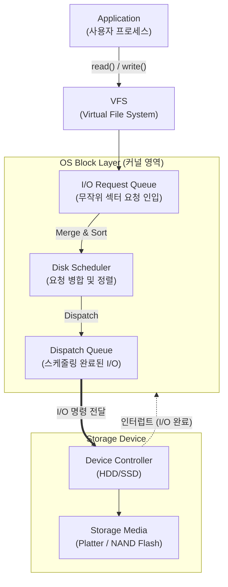

# 디스크 스케줄링 (Disk Scheduling)

---

## I. I/O 응답 시간 최소화를 위한 디스크 스케줄링의 개요

* **정의**: 운영체제가 스토리지(디스크)의 기계적 움직임인 탐색 시간(Seek Time)을 최소화하고 [[처리량]](Throughput)을 극대화하기 위해 다수의 I/O 요청 처리 순서를 결정하는 기법
* **필요성 및 특징**:
* **성능 병목 해소**: [[CPU]]/메모리 대비 상대적으로 느린 보조기억장치의 기계적 지연 시간(Rotational Latency, Seek Time) 극복
* **기아 현상(Starvation) 방지**: 특정 디스크 I/O 요청이 무한정 대기하는 현상을 방지하여 응답 시간의 편차 최소화
* **최신 패러다임 변화**: 물리적 구동계가 없는 SSD 및 NVMe의 대중화로 인해, 위치 기반 정렬보다는 멀티 큐(Multi-[[Queue]]) 기반의 병렬 처리 극대화로 진화 중

---

## II. 디스크 스케줄링의 개념도 및 핵심 알고리즘 요소

### 가. 디스크 스케줄링의 동작 아키텍처

* 애플리케이션의 무작위 I/O 요청을 OS 블록 레이어의 큐에 적재 후, 스케줄러가 [[알고리즘]](SCAN, SSTF 등)을 적용해 최적의 순서로 재정렬하여 디바이스로 전달함

### 나. 디스크 스케줄링 핵심 알고리즘 및 기술 요소

| 분류 | 요소기술(키워드) | 세부 설명 |
| --- | --- | --- |
| **기본 알고리즘** | FCFS (First-Come, First-Served) | 큐에 도착한 순서대로 I/O를 처리, 구현이 단순하나 탐색 시간이 길어 비효율적임 |
| **거리 우선** | SSTF (Shortest Seek Time First) | 현재 헤드 위치에서 탐색 거리가 가장 짧은 요청을 우선 처리, 처리량은 높으나 바깥쪽 트랙의 **기아 현상(Starvation)** 발생 가능 |
| **방향성 유지** | SCAN (엘리베이터 알고리즘) | 헤드가 디스크의 한쪽 끝에서 반대쪽 끝까지 이동하며 경로상의 모든 요청을 처리 후 방향을 반전함 |
| **응답 편차 감소** | C-SCAN (Circular SCAN) | 헤드가 한쪽 방향으로만 이동하며 서비스하고, 끝에 도달하면 서비스 없이 처음 출발점으로 빠르게 복귀하여 응답 시간 편차를 줄임 |
| **효율성 개선** | LOOK / C-LOOK | SCAN/C-SCAN과 유사하나, 디스크의 끝까지 가지 않고 해당 방향의 **마지막 요청이 있는 위치까지만 이동** 후 반전/복귀 |
| **SSD 최적화** | NOOP (No Operation) | 기계적 탐색이 없는 SSD에 적합하며, 위치 기반 정렬 없이 인접한 I/O 요청의 **병합(Merge)**만 수행하는 단순 큐잉 방식 |
| **멀티 큐 [[프레임워크]]** | Blk-mq (Block Multi-Queue) | 최신 커널에서 지원하며, CPU 코어별로 독립적인 I/O 큐를 할당하여 Lock 경합을 최소화하고 NVMe의 병렬성을 극대화 |
| **최신 [[스케줄러]]** | BFQ (Budget Fair Queueing) | 프로세스별로 I/O 예산(시간/섹터 수)을 할당하여 공평성을 보장하는 최신 디스크 스케줄러 |

---

## III. 매체 변화에 따른 스케줄링 비교 및 최신 동향

### 가. HDD 환경과 SSD/NVMe 환경의 스케줄링 패러다임 비교

| 비교 항목 | HDD 중심 환경 (Legacy) | SSD 및 NVMe 중심 환경 (Modern) |
| --- | --- | --- |
| **핵심 목적** | 헤드의 물리적 탐색 시간(Seek Time) 최소화 | 병렬 I/O 극대화 및 플래시 수명 연장(Wear Leveling) |
| **주요 알고리즘** | SCAN, C-SCAN, LOOK, SSTF | NOOP, Kyber, mq-deadline, BFQ |
| **큐(Queue) 구조** | 단일 큐 (Single Request Queue) 기반 | 멀티 큐 (Multi-Queue, blk-mq) 기반 설계 |
| **I/O 동시성** | 낮음 (물리적 헤드가 1개이므로 순차 처리) | 매우 높음 (NVMe 최대 64K개 큐, 큐당 64K 명령어) |
| **주요 병목 지점** | 디스크의 스핀들 모터 및 액추에이터 암 | PCIe 버스 대역폭 및 스토리지 컨트롤러 처리량 |

### 나. 디스크 스케줄링 최신 동향 및 향후 전망

* **OS 개입의 최소화 및 지능형 스토리지(FTL)의 부상**: 기계적 구동계가 사라진 SSD 환경에서는 OS 레벨의 복잡한 위치 기반 정렬이 오히려 레이턴시를 유발하므로, 스토리지 내부의 FTL(Flash Translation Layer)이 매핑과 스케줄링을 직접 주도하는 방향으로 진화 중임
* **Blk-mq(Block Multi-Queue) 아키텍처의 표준화**: 멀티코어 시스템과 고속 NVMe 스토리지의 병목 현상(Software Lock Contention)을 해소하기 위해, 리눅스 커널은 기존 단일 큐 스케줄러(CFQ 등)를 폐기하고 blk-mq 기반의 다중 큐 아키텍처로 완전히 전환함
* **애플리케이션 주도형 I/O (io_uring)**: 최신 [[커널]] 환경에서는 OS의 블록 레이어를 우회하거나 비동기 I/O 효율을 극대화하기 위해 `io_uring`과 같은 새로운 시스템 콜 인터페이스를 도입하여 I/O 스케줄링의 주도권이 애플리케이션 프레임워크로 일부 이동하고 있음

---

### 🔗 연관 토픽

- **소속 도메인**: [[00_운영체제_MOC|⚙️ 운영체제]]
- **세부 분류**: `2. CPU 스케줄링 알고리즘`
- **핵심 연관 토픽**:
  - [[스케줄러|스케줄러 (Scheduler)]]
  - [[처리량]]
  - [[커널|커널(Kernel)]]
  - [[기한부 스케줄링|기한부(Deadline) 스케줄링]]
  - [[알고리즘]]
