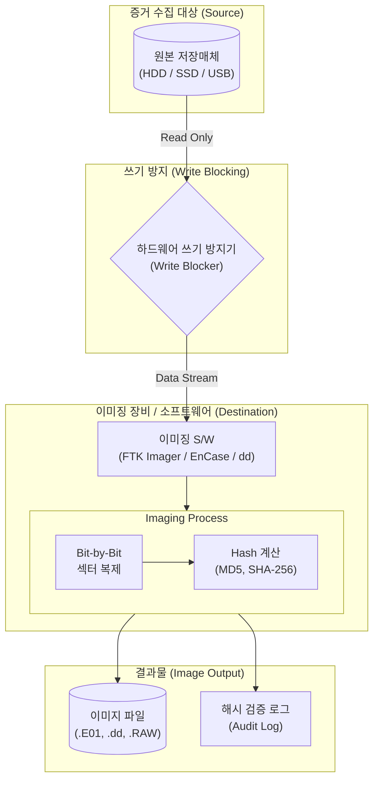

# 디스크 이미징 (Disk Imaging)

---

## I. 디지털 증거 무결성 확보를 위한 디스크 이미징의 개요

* **정의**: [[디지털 포렌식]] 조사를 위해 원본 저장 매체의 물리적 섹터를 비트 단위(Bit-by-Bit)로 완벽하게 복제하여 단일 파일(이미지 파일) 형태로 생성하는 기술
* **필요성 및 특징**:
* **증거 능력 확보**: 원본 데이터 훼손 방지 및 법적 증거 능력(Forensic Soundness) 유지
* **은닉 데이터 추출**: 단순 파일 복사로 획득할 수 없는 슬랙 공간(Slack Space) 및 비할당 영역(Unallocated Space)의 삭제된 데이터 복원 지원
* **[[무결성]] 입증**: 복제 전후의 해시(Hash) 값 비교를 통한 데이터의 동일성 및 위변조 여부 검증

---

## II. 디스크 이미징의 개념도 및 핵심 기술 요소

### 가. 디스크 이미징의 개념도 및 동작 원리

* 원본 매체의 훼손을 막기 위해 반드시 쓰기 방지기를 거쳐 읽기 전용으로 접근하며, 비트 단위 복제와 동시에 해시값을 계산하여 사본 이미지와 로그를 생성함

### 나. 디스크 이미징의 핵심 기술/구성 요소

| 분류 | 요소기술(키워드) | 세부 설명 |
| --- | --- | --- |
| **무결성 보장** | 쓰기 방지기 (Write Blocker) | 원본 매체에 데이터가 기록(수정/삭제/시간정보 변경)되는 것을 물리적/논리적으로 원천 차단하는 장치 |
| **복제 기법** | 비트 스트림 복사 (Bit-by-Bit) | 파일 시스템이나 OS 체제와 무관하게 0과 1의 물리적 섹터 단위로 매체 전체를 1:1 복제 |
| **증명 기술** | 해시 [[알고리즘]] (Hash) | 원본 매체와 생성된 이미지 파일 간의 동일성 증명을 위해 MD5, SHA-1, SHA-256 등의 해시값 추출 및 비교 |
| **분석 영역** | 비할당 영역 (Unallocated) | 운영체제에서는 파일이 삭제된 것으로 인식하나, 실제 물리적 데이터는 남아있는 데이터 복구 핵심 영역 |
| **분석 영역** | 슬랙 공간 (Slack Space) | 클러스터 크기와 실제 파일 크기의 차이로 인해 발생하는 잔여 공간 (램 슬랙, 드라이브 슬랙 등 은닉에 악용) |
| **저장 포맷** | Raw (.dd) | 부가적인 정보(메타데이터, 압축 등) 없이 원본 매체의 비트 배열을 그대로 저장하는 기본 포맷 |
| **저장 포맷** | E01 (EnCase Image) | 디지털 포렌식 사실상 표준 포맷으로, 데이터 압축, 해시값, 조사자 정보 등 메타데이터를 포함하여 저장 |
| **수집 도구** | FTK Imager / dd | 윈도우 환경에서 널리 쓰이는 GUI 기반 복제 도구(FTK) 및 리눅스/유닉스 환경의 강력한 CLI 기반 복제 명령어(dd) |

---

## III. 유사 기술 비교 및 클라우드/최신 환경의 포렌식 동향

### 가. 디스크 이미징 vs 디스크 클로닝 vs 단순 복사 비교

| 비교 항목 | 디스크 이미징 (Disk Imaging) | 디스크 클로닝 (Disk Cloning) | 단순 파일 복사 (File Copy) |
| --- | --- | --- | --- |
| **목적** | 디지털 증거 획득 및 무결성 보존 | 시스템 마이그레이션 및 1:1 하드웨어 백업 | 일반적인 데이터 백업 및 이동 |
| **산출물 형태** | **단일 파일 (Image File)** | **물리적 저장 매체 (복제된 HDD/SSD)** | 개별 파일 및 폴더 |
| **복제 범위** | 물리적 섹터 전체 (비할당/슬랙 포함) | 물리적 섹터 전체 (비할당/슬랙 포함) | 할당된 영역의 논리적 파일만 복사 |
| **무결성 검증** | 해시 검증 로그 필수 동반 | 일반적으로 해시 검증 생략 | 메타데이터(시간, 권한) 변형 발생 |
| **포렌식 적합성** | **매우 높음 (법정 증거로 채택)** | 보통 (원본과 매체 특성 차이로 해시 불일치 가능) | 부적합 (증거 능력 상실 위험) |

### 나. 최신 스토리지 환경에서의 한계점 및 대응 전망

* **SSD/NVMe의 Trim 및 GC(Garbage Collection) 문제**: 최신 플래시 스토리지는 OS 삭제 명령 시 컨트롤러가 자체적으로 데이터를 영구 삭제(Wipe)하므로, 사후 디스크 이미징만으로는 증거 확보가 어려워 **활성 시스템 포렌식(Live Forensics) 및 휘발성 메모리 덤프**의 중요성이 극대화됨
* **[[클라우드 컴퓨팅]] 및 [[가상화]] 환경 포렌식 (Cloud Forensics)**: 물리적 디스크 압수가 불가능한 클라우드(IaaS) 환경에서는 [[CSP]](Cloud Service Provider)가 제공하는 **원격 볼륨 스냅샷(Snapshot)** 기능과 API를 활용한 원격 디스크 이미징 획득 기술로 패러다임이 전환 중임

---

### 🔗 연관 토픽

- **소속 도메인**: [[00_보안_MOC|🛡️ 보안]]
- **세부 분류**: `1. 정보보안 원칙 & 거버넌스 · 인증`
- **핵심 연관 토픽**:
  - [[디지털 포렌식|디지털 포렌식(Digital Forensic)]]
  - [[CSP|CSP (Cloud Service Provider)]]
  - [[클라우드 컴퓨팅|클라우드 컴퓨팅 (Cloud Computing)]]
  - [[TPM|TPM (Trusted Platform Module)]]
  - [[암호화|암호화 (Encryption)]]
