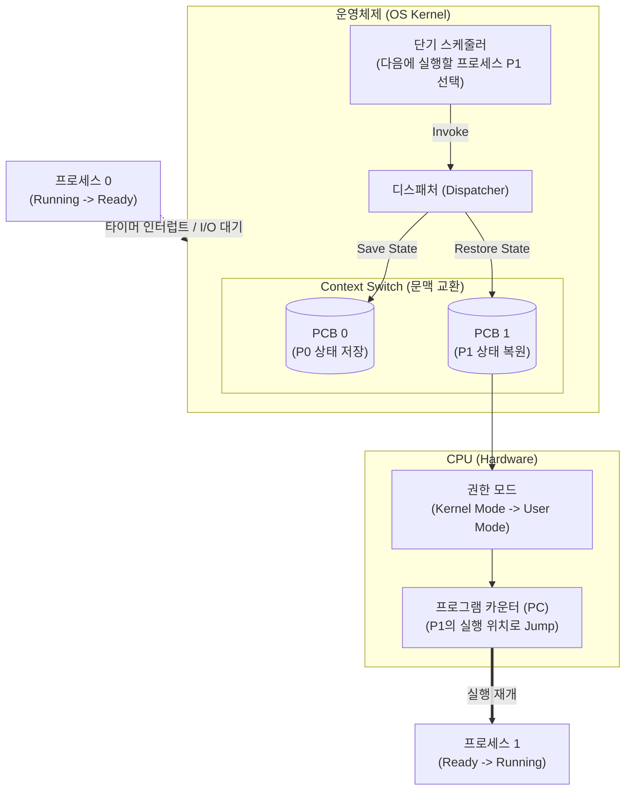

# 디스패치 (Dispatch)

---

## I. CPU 제어권 할당의 핵심 기제, 디스패치의 개요

* **정의**: 운영체제의 단기 [[스케줄러]](Short-term Scheduler)가 선택한 [[프로세스]](또는 스레드)에게 실질적인 [[CPU]] 제어권을 넘겨주어 실행 상태(Running State)로 전환하는 일련의 과정 및 커널 모듈
* **필요성 및 특징**:
* **[[문맥 교환]](Context Switching) 수행**: 현재 실행 중인 프로세스의 상태를 저장하고, 새 프로세스의 상태를 복원
* **CPU 활용도 극대화**: 멀티프로그래밍 환경에서 프로세스 간 끊김 없는 실행 흐름 보장
* **디스패치 지연(Dispatch Latency)**: 프로세스 전환에 소요되는 시간으로, 실시간 시스템(RTOS)의 핵심 성능 지표로 작용

---

## II. 디스패치의 개념도 및 핵심 기술 요소

### 가. 디스패치의 동작 메커니즘 및 프로세스 상태 전이도

* 스케줄러의 결정 직후 디스패처가 호출되어 기존 프로세스의 문맥(Context)을 [[PCB(Process Control Block)|PCB]]에 저장하고, 새 프로세스의 문맥을 복원한 후 사용자 모드 전환 및 PC 점프를 수행함.

### 나. 디스패치의 핵심 구성/기술 요소

| 구분 | 요소기술(키워드) | 세부 설명 |
| --- | --- | --- |
| **핵심 기능** | 문맥 교환 (Context Switch) | 실행 중인 프로세스의 레지스터, 메모리 상태를 PCB에 저장하고 새 프로세스의 정보를 CPU에 적재 |
| **핵심 기능** | 모드 전환 (Mode Switch) | 디스패치 작업(커널 모드) 완료 후, 사용자 프로그램 실행을 위해 권한을 사용자 모드(User Mode)로 강등 |
| **핵심 기능** | PC 점프 (PC Jump) | 새롭게 실행될 프로세스가 이전에 중단되었던 코드 위치(프로그램 카운터)로 분기하여 실행 재개 |
| **자료 구조** | PCB / TCB | 프로세스(Process) 또는 스레드(Thread) 단위의 제어 블록으로 문맥 교환 시 상태 정보가 저장되는 메모리 영역 |
| **성능 지표** | 디스패치 지연 (Latency) | 하나의 프로세스를 정지하고 다른 프로세스를 실행시키기까지 걸리는 시간 (작을수록 성능 우수) |
| **트리거 요소** | 타이머 [[인터럽트]] (Timer) | 선점형(Preemptive) [[스케줄링]] 환경에서 타임 슬라이스(Time Slice) 만료 시 디스패치를 유발하는 하드웨어 인터럽트 |
| **상호 작용** | 단기 스케줄러 (Short-term) | 준비(Ready) 큐에서 CPU를 할당받을 프로세스를 선택하는 주체 (스케줄러: 결정 / 디스패처: 실행) |

---

## III. 스케줄러와 디스패처 비교 및 최신 동향

### 가. 스케줄러(Scheduler)와 디스패처(Dispatcher)의 비교

| 비교 항목 | 스케줄러 (Short-term Scheduler) | 디스패처 (Dispatcher) |
| --- | --- | --- |
| **핵심 역할** | **의사 결정** (Who is next?) | **실제 실행** (How to run?) |
| **주요 기능** | 우선순위 계산, 큐([[Queue]]) 관리, 정책(RR, SJF 등) 적용 | PCB 상태 저장/복원, 모드 전환, PC 점프 |
| **호출 시점** | 프로세스 상태 변화 시 (생성, 대기, 종료 등) | 스케줄러가 다음 프로세스를 결정한 직후 |
| **소요 시간** | 스케줄링 [[알고리즘]] 복잡도에 따라 변동 | 시스템 아키텍처 의존적 (상대적으로 고정된 오버헤드) |

### 나. 디스패치 오버헤드 극복 및 최신 최적화 동향

* **사용자 수준 스레드(User-level Thread) 디스패칭**: [[컨테이너]] 및 마이크로서비스 환경에서 수만 개의 동시 처리를 위해, 커널 개입과 모드 전환(Mode Switch) 오버헤드가 없는 Goroutine(Go 언어), Fiber 등의 경량 스레드 기반 사용자 수준 디스패칭 기법 주류화
* **실시간 [[OS(운영체제)|운영체제]](RTOS)의 선점형 커널(Preemptive [[커널|Kernel]]) 고도화**: [[Smart Car(자율주행)|자율주행]], 항공우주 등 하드 실시간(Hard Real-time) 시스템에서 커널 모드 수행 중에도 즉각적인 디스패치가 가능하도록 커널 선점 구조를 채택하여 디스패치 지연(Dispatch Latency)을 마이크로초 단위로 엄격히 보장
* **[[가상화]] 환경의 vCPU 디스패치**: 하이퍼바이저([[Hypervisor (VMM)|Hypervisor]]) 레벨에서 물리적 CPU(pCPU)에 가상 CPU(vCPU)를 디스패치하는 2단계 스케줄링 체계 최적화 진행 중

---

### 🔗 연관 토픽

- **소속 도메인**: [[00_운영체제_MOC|⚙️ 운영체제]]
- **세부 분류**: `1. 프로세스 & 스레드 관리`
- **핵심 연관 토픽**:
  - [[프로세스]]
  - [[커널|커널(Kernel)]]
  - [[OS(운영체제)]]
  - [[스케줄링]]
  - [[인터럽트|인터럽트 (Interrupt)]]
