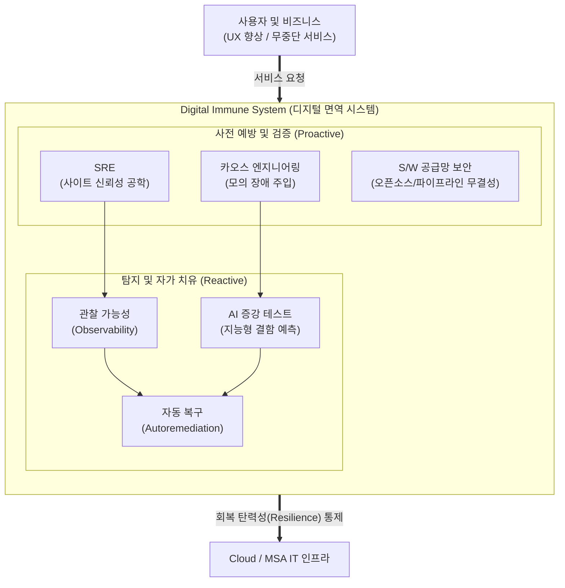

# 디지털 면역 시스템 (DIS, Digital Immune System)

---

## I. 무중단 비즈니스 가치 창출을 위한, 디지털 면역 시스템의 개요

* **정의**: 인체의 면역 체계처럼 IT 인프라 및 애플리케이션의 결함, 보안 위협 등을 스스로 탐지하고 치유하여 비즈니스 연속성과 시스템의 회복탄력성(Resilience)을 극대화하는 융합형 IT 운영 전략
* **등장배경 및 특징**:
* **인프라 복잡성 심화**: [[클라우드 네이티브]], [[MSA (Micro Service Architecture)|MSA]] 도입으로 인한 장애 포인트 증가 및 추적의 어려움 발생
* **Gartner 전략 기술**: 가트너(Gartner)의 2023년 10대 전략 기술 트렌드로 선정 (다운타임 최대 80% 감축 목표)
* **특징**: 사후 대응(Reactive)에서 선제적 방어 및 자동 복구(Proactive & Self-Healing) 패러다임으로의 전환

---

## II. 디지털 면역 시스템의 개념도 및 핵심 구성요소

### 가. 디지털 면역 시스템의 개념도 및 동작 원리

* [[SRE (Site Reliability Engineering)|SRE]], 카오스 엔지니어링을 통해 잠재적 장애를 사전에 검증하고, 관찰 가능성과 AI 기반 테스트로 이상 징후를 탐지하여 사람의 개입 없이 스크립트 기반으로 자동 복구(자가 치유) 수행

### 나. 디지털 면역 시스템의 6대 핵심 기술 요소 (가트너 기준)

| 분류 | 요소기술(키워드) | 세부 설명 |
| --- | --- | --- |
| **운영 혁신** | SRE (사이트 [[신뢰성]] 공학) | 소프트웨어 엔지니어링 관점을 IT 운영에 적용, SLI/SLO 기반의 서비스 신뢰성 및 [[HA(High Availability)|가용성]] 자동 관리 |
| **선제 검증** | [[카오스 엔지니어링]] (Chaos Eng.) | 운영 환경에 고의로 무작위 장애(지연, 서버 다운 등)를 주입하여 시스템의 내결함성(Fault Tolerance) 사전 검증 |
| **가시성 확보** | 관찰 가능성 (Observability) | 단순 모니터링을 넘어 시스템 외부로 노출된 텔레메트리(Log, Metric, Trace)를 융합하여 내부 상태와 근본 원인 심층 분석 |
| **지능형 분석** | AI 증강 테스트 (AI-Augmented) | 머신러닝/AI를 활용하여 [[소프트웨어 테스트]] 케이스를 자동 생성하고 결함 발생 패턴을 능동적으로 학습 및 예측 |
| **보안 강화** | S/W 공급망 보안 (SSCS) | [[SBOM]](S/W 자재명세서) 활용 및 [[DevSecOps]] 연계를 통해 서드파티 라이브러리 위협으로부터 파이프라인 [[무결성]] 보장 |
| **자가 치유** | 자동 복구 (Autoremediation) | 이상 징후 탐지 시 사람의 개입 없이 워크플로우 로직 및 오케스트레이션(K8s 등)을 통해 시스템 상태를 자동 원상 복구 |

---

## III. 전통적 장애 대응 체계와의 비교 및 향후 발전 전망

### 가. 전통적 IT 모니터링 체계와 디지털 면역 시스템(DIS) 비교

| 비교 항목 | 전통적 IT 장애 대응 체계 | 디지털 면역 시스템 (DIS) |
| --- | --- | --- |
| **운영 패러다임** | 사후 복구 중심 (Reactive) | 사전 예방 및 자가 치유 (Proactive & Self-healing) |
| **초점 영역** | 인프라 컴포넌트([[CPU]], Memory) 가용성 | 전체 비즈니스 흐름 및 사용자 경험(UX) 최적화 |
| **테스트 방식** | 정해진 시나리오 기반 수동/단순 자동화 | AI 증강 기반 예측 테스트 및 운영 중 결함 주입(Chaos) |
| **복구 주체** | 시스템 관리자 (매뉴얼 기반 개입) | 오케스트레이션 엔진 (AIOps 기반 자동 복구 로직) |
| **사일로(Silo)** | 보안, 개발, 운영 도구의 파편화 | 6대 핵심 요소가 통합된 단일 회복탄력성 [[프레임워크]] |

### 나. 산업 적용 동향 및 향후 전망

* **AIOps 및 초자동화(Hyperautomation)와의 융합**: 룰 기반의 자동 복구를 넘어, [[초거대 언어 모델|LLM]](대형 언어 모델)과 AIOps 엔진이 결합하여 장애 근본 원인(RCA)을 추론하고 자율적으로 복구 스크립트를 생성하는 완전 자율 운영(Autonomous IT Operations)으로 진화 중
* **비즈니스 경쟁력 직결 (고객 이탈 방지)**: 금융(오픈뱅킹), 이커머스 등 무중단 서비스가 필수적인 도메인에서 다운타임 제로화 및 사용자 경험 보장을 위해 최우선 도입 중이며, 향후 엔터프라이즈 아키텍처(EA) 설계의 핵심 필수 요건으로 자리매김할 전망

---

### 🔗 연관 토픽

- **소속 도메인**: [[00_보안_MOC|🛡️ 보안]]
- **세부 분류**: `6. 개인정보보호 & 프라이버시 강화 기술`
- **핵심 연관 토픽**:
  - [[DevSecOps]]
  - [[무결성]]
  - [[클라우드 네이티브]]
  - [[신뢰성]]
  - [[카오스 엔지니어링|카오스 엔지니어링 (Chaos Engineering)]]
