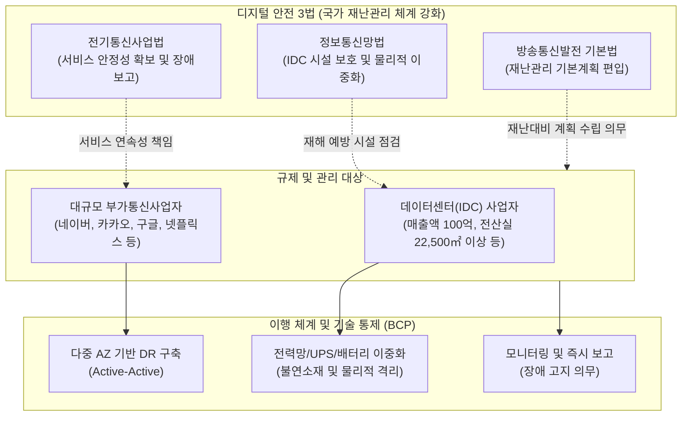

# 디지털 안전 3법

---

## I. 초연결 사회의 인프라 장애 방지를 위한, 디지털 안전 3법의 개요

* **정의**: 판교 데이터센터 화재(2022)를 계기로 대형 부가통신사업자와 집적정보통신시설(IDC)을 국가 재난관리 체계에 포함하여, 대국민 디지털 서비스의 연속성 및 안정성을 보장하기 위해 개정된 3가지 핵심 법률
* **배경 및 특징**:
* **카카오 먹통 사태의 교훈**: 단일 물리적 거점(Point of Failure) 마비가 국가 인프라급 서비스 중단으로 이어지는 사태 발생
* **사각지대 해소**: 기존 기간통신사업자 위주의 재난관리 규제를 대규모 부가통신사업자 및 데이터센터로 확대
* **특징**: 물리적 이중화(망법), 서비스 연속성(사업법), 재난관리 의무화(기본법)를 통한 총체적 [[BCP]](Business Continuity Plan) 법제화

---

## II. 디지털 안전 3법의 개념도 및 핵심 구성 요소

### 가. 디지털 안전 3법의 개념도 및 동작 원리

* 과학기술정보통신부 주관 하에 대형 부가통신사업자와 데이터센터 사업자가 물리적/논리적 이중화 및 재난관리 의무를 수행하여 서비스 무중단 달성

### 나. 디지털 안전 3법의 핵심 법률 및 기술 요소

| 구분 | 법률 및 기술 요소 | 세부 설명 (키워드) |
| --- | --- | --- |
| **법률 체계** | 방송통신발전 기본법 | 대규모 부가통신사업자 및 데이터센터(IDC)를 '재난관리 기본계획' 수립 대상에 포함 의무화 |
| **법률 체계** | 정보통신망법 | IDC 사업자의 재난(화재, 지진 등) 대비 물리적/기술적 보호조치, 정기 점검 및 시정 명령 근거 마련 |
| **법률 체계** | 전기통신사업법 | 부가통신사업자의 서버/네트워크 이중화, 트래픽 분산 등 서비스 안정성 확보 조치 의무화 |
| **재난 관리** | 장애 고지 및 보고 체계 | 서비스 장애 발생 시 이용자 대상 즉각적 원인 고지 의무 및 주무부처(과기정통부) 신속 보고 |
| **인프라(IDC)** | 전력 및 배터리 이중화 | 리튬이온 배터리(Li-ion) 열폭주 대비 배터리실 분리, UPS [[다중화]], 불연/난연성 케이블 적용 |
| **인프라(IDC)** | 물리적 공간 격리 (Cell) | 화재 발생 시 주변 확산을 방지하기 위한 전산실 및 배터리실의 [[방화벽]] 기반 물리적 셀(Cell) 격리 |
| **아키텍처** | 다중 가용영역 (Multi-AZ) | 단일 IDC 장애를 대비하여 지리적으로 분리된 2개 이상의 IDC에 Active-Active 기반 분산 아키텍처 구현 |
| **회복 탄력성** | [[카오스 엔지니어링]] | 운영 환경에 무작위 결함(네트워크 지연, 서버 다운 등)을 고의로 주입하여 시스템의 내결함성 사전 검증 |

---

## III. 디지털 안전 3법의 한계점 및 발전 전망

### 가. 규제 환경의 한계점 및 해결 방안

| 구분 | 한계점 및 이슈 | 해결 방안 및 기술 동향 |
| --- | --- | --- |
| **비용 증가** | 중소/중견 IDC 및 통신사업자의 인프라 구축 및 [[유지보수]] 비용 급증 | [[클라우드 네이티브]] 아키텍처 전환 및 SaaS 기반의 경제적 재해복구([[DRaaS]]) 활용 |
| **기준 모호성** | 서비스 중단의 '중대한 위협' 기준 및 이중화 범위 산정에 대한 해석 이견 | [[SLA]](Service Level Agreement) 기반의 명확한 정량적 규제 가이드라인 지속 보완 |
| **혁신 저해** | 과도한 규제로 인한 국내 IT 스타트업의 진입 장벽 상향 우려 | 규제 임계치(일평균 이용자수, 트래픽 기준)를 통한 핀셋 규제 적용 및 소규모 기업 유예 |

### 나. 향후 산업 적용 동향

* **[[디지털 면역 시스템]](Digital Immune System) 구축**: 단순한 법적 컴플라이언스 준수를 넘어, AIOps, 자가 치유(Self-Healing) 알고리즘을 도입하여 장애 발생 시 사람의 개입 없이 시스템이 스스로 복구되는 면역 체계로의 진화
* **K-Cloud 및 글로벌 리전 분산**: 국내 특정 지역(수도권)에 집중된 데이터센터 지형을 탈피하여, 지역 거점별 분산 및 하이브리드 멀티 클라우드(Hybrid Multi-Cloud) 전략을 통한 지정학적 재난 리스크(Geopolitical Risk) 회피 구조로 발전 중

---

### 🔗 연관 토픽

- **소속 도메인**: [[00_경영전략_MOC|📈 경영전략]]
- **세부 분류**: `5. IT 투자 성과 평가 & 비즈니스 연속성 계획 (BCP)`
- **핵심 연관 토픽**:
  - [[SLA|SLA (Service Level Agreement)]]
  - [[DRaaS]]
  - [[유지보수]]
  - [[BCP|BCP (Business Continuity Planning)]]
  - [[디지털 면역 시스템|디지털 면역 시스템(DIS, Digital Immune System)]]
