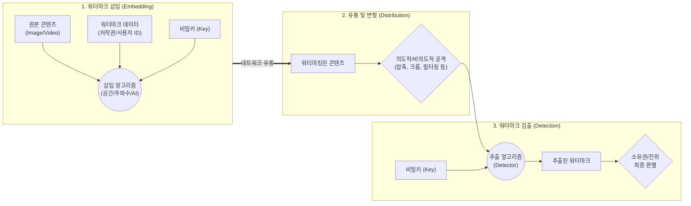

# 디지털 워터마킹 (Digital Watermarking)

---

## I. 저작권 보호와 AI 생성물 식별을 위한, 디지털 워터마킹의 개요

* **정의**: 디지털 콘텐츠(이미지, 오디오, 비디오, 텍스트 등)에 저작권자 정보나 식별 마크를 인간의 인지 범위를 넘어 삽입하고, 필요시 추출하여 소유권 증명 및 무결성을 확인하는 기술
* **배경 및 특징**:
* **등장배경**: 불법 복제물 유통 증가, 생성형 AI(Deepfake, [[초거대 언어 모델|LLM]])의 확산으로 인한 콘텐츠 진위 판별 및 최초 유포자 추적 요구 증대
* **주요특징**: 비가시성(Invisibility, 사용자 인지 불가), 강인성(Robustness, 파일 변형에도 생존), 연성(Fragility, 위변조 즉시 파기)

---

## II. 디지털 워터마킹의 개념도 및 핵심 기술 요소

### 가. 디지털 워터마킹의 아키텍처 및 동작 원리

* 원본 콘텐츠에 비밀키를 기반으로 데이터를 은닉 삽입(Embedding)하며, 유통 과정에서 발생하는 변형(Attack) 이후에도 검출기(Detector)를 통해 워터마크를 추출 및 판별함

### 나. 디지털 워터마킹의 핵심 기술 요소

| 분류 | 요소기술(키워드) | 세부 설명 |
| --- | --- | --- |
| **삽입 영역** | 공간 영역 (Spatial Domain) | LSB(Least Significant Bit) 기법 등 픽셀의 하위 비트를 직접 조작하여 삽입 (구현 단순, 변형에 취약) |
| **삽입 영역** | 주파수 영역 (Frequency) | DCT, DWT 알고리즘으로 콘텐츠를 주파수 대역으로 변환 후 고주파/저주파 영역에 삽입 (압축 강인성 확보) |
| **적용 목적** | 강인성 (Robust Watermarking) | 포맷 변환, 리사이징, JPEG 압축 등 공격에도 워터마크가 파괴되지 않도록 설계 (저작권 보호용) |
| **적용 목적** | 연성 (Fragile Watermarking) | 미세한 픽셀 조작이나 데이터 훼손 시 워터마크가 즉시 파괴되도록 설계 (데이터 [[무결성]] 및 위변조 탐지용) |
| **인간 인지** | 비가시성 (Invisibility) | HVS(Human Visual System) 특성을 활용하여 사람의 눈이나 귀로 워터마크 삽입 여부를 인지할 수 없도록 통제 |
| **AI 최신기술** | [[딥러닝]] 워터마킹 (AutoEncoder) | 인코더를 통해 워터마크를 픽셀 단위로 분산 삽입하고 디코더로 복원하여 비가시성과 강인성 극대화 (예: SynthID) |
| **AI 텍스트** | 로짓(Logit) 기반 제어 | LLM이 텍스트를 생성할 때 특정 단어 토큰의 확률 분포(Logit)를 미세 변조하여 AI 생성 텍스트임을 식별 |
| **추적 기술** | 포렌식 마킹 (Forensic Mark) | 다운로드 시점의 사용자 ID, [[세션]] 정보 등을 실시간 [[핑거프린팅]](Fingerprinting)하여 최초 유출자 추적 |

---

## III. 디지털 콘텐츠 보호 기술 비교 및 최신 동향

### 가. 콘텐츠 보호 핵심 기술(DRM, 워터마킹, 스테가노그래피) 비교

| 비교 항목 | [[DRM(Digital Right Management)|DRM]] (Digital Rights Mgmt) | 워터마킹 (Watermarking) | 스테가노그래피 (Steganography) |
| --- | --- | --- | --- |
| **보안 목적** | **사전 접근 통제 (예방)** | **사후 소유권 증명 (추적)** | **통신 사실 은닉 (기밀 통신)** |
| **주요 기법** | 데이터 [[암호화]], 권한 제어([[XML|XmL]]) | 공간/주파수 영역 데이터 은닉 | 이미지/오디오 내 기밀 메시지 은닉 |
| **보호 대상** | 디지털 콘텐츠 자체 | 저작권자 또는 구매자 식별 정보 | 메시지(데이터)의 존재 자체 |
| **변형 내성** | 해독 불가 (복호화 키 필수) | 높은 강인성 (Robustness 요구) | 변형에 취약 (은닉 데이터 훼손) |
| **활용 분야** | 유료 VOD, 전자책, 사내 문서 | 불법 복제 추적, AI 생성물 식별 | 스파이 통신, 은밀한 데이터 교환 |

### 나. 디지털 워터마킹 기술의 최신 동향 및 전망

* **생성형 AI (Generative AI) 식별 의무화**: 글로벌 규제(EU AI Act 등)와 바이든 행정부 행정명령에 따라, AI로 생성된 이미지, 텍스트, 오디오에 'Invisible Watermark(비가시적 워터마크)' 삽입이 기술 표준 및 법적 의무로 강제화되는 추세임
* **[[01_IT Tech/블록체인]](Blockchain) 연계를 통한 [[신뢰성]] 강화**: 워터마크 원본 정보와 추출 해시값을 블록체인 스마트 컨트랙트에 기록하여, 저작권 증명의 단일 장애점(SPOF)을 제거하고 법적 증거 능력을 확보하는 분산형 저작권 관리 체계로 발전 중임

---

### 🔗 연관 토픽

- **소속 도메인**: [[00_보안_MOC|🛡️ 보안]]
- **세부 분류**: `1. 정보보안 원칙 & 거버넌스 · 인증`
- **핵심 연관 토픽**:
  - [[핑거프린팅|핑거프린팅(Fingerprinting)]]
  - [[암호화|암호화 (Encryption)]]
  - [[DRM(Digital Right Management)]]
  - [[무결성]]
  - [[01_IT Tech/블록체인|블록체인 (Block Chain)]]
