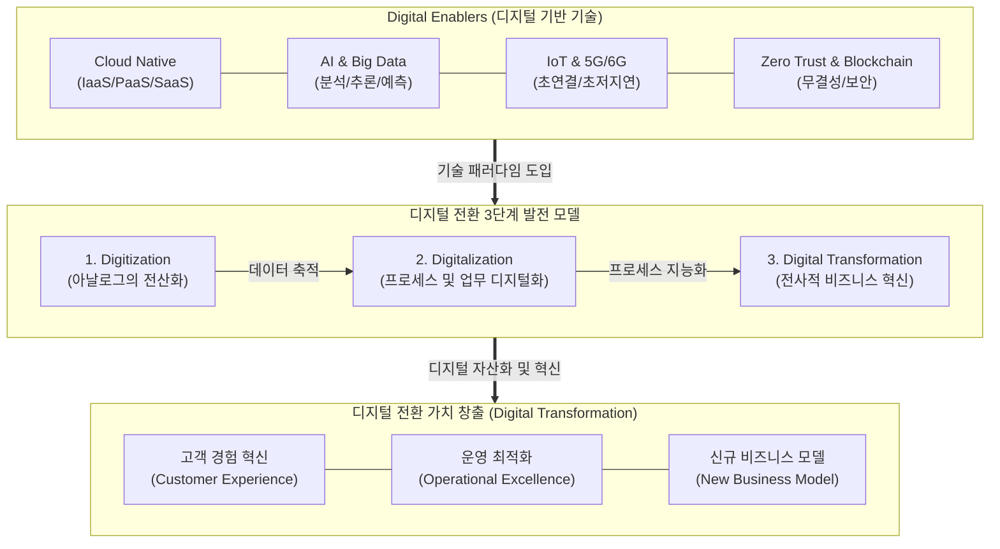

# 디지털 전환 (Digital Transformation, DX)

---

## I. 비즈니스 모델 및 고객 경험 혁신, 디지털 전환(DX)의 개요

* **정의**: 기업의 전략, 조직, [[프로세스]], 비즈니스 모델 등 경영 전반에 걸쳐 디지털 기술(AI, Cloud, Big Data 등)을 적용하여 근본적인 혁신을 창출하고 고객 가치를 극대화하는 전사적 경영 전략
* **필요성 및 등장배경**:
* **파괴적 혁신(Disruptive Innovation) 대응**: 디지털 네이티브 기업의 부상 및 산업 경계의 붕괴(Big Blur)
* **고객 니즈 변화**: 초개인화(Hyper-personalization) 및 끊김 없는(Seamless) 다옴니채널 고객 경험 요구 증대

* **특징**: 데이터 기반 의사결정(Data-Driven), 애자일([[Agile]]) 기반 비즈니스 민첩성, 소프트웨어 중심의 가치 사슬 재편

---

## II. 디지털 전환(DX)의 개념도 및 핵심 기술 요소

### 가. 디지털 전환(DX)의 개념도 및 프로세스

* 아날로그 데이터의 전산화(Digitization)와 업무 프로세스의 디지털화(Digitalization)를 거쳐 최종적인 비즈니스 모델 혁신(DX)으로 진화함
* 핵심 동인(Digital Enablers) 기술을 바탕으로 고객 경험, 운영, 비즈니스 모델의 3대 영역을 근본적으로 탈바꿈시킴

### 나. 디지털 전환(DX)의 핵심 기술/구성 요소

| 분류 | 요소기술(키워드) | 세부 설명 |
| --- | --- | --- |
| **인프라 혁신** | [[클라우드 네이티브]] (Cloud Native) | [[MSA (Micro Service Architecture)|MSA]], [[컨테이너]], 서버리스 등 클라우드의 이점을 극대화하여 유연하고 확장 가능한 IT 인프라 구축 |
| **지능화/분석** | [[인공지능]] (AI / GenAI) | 기계학습 및 대형언어모델([[초거대 언어 모델|LLM]])을 활용한 비즈니스 통찰력 획득 및 의사결정 자동화 |
| **데이터 자산화** | 빅데이터 (Big Data) | 정형/비정형 데이터의 수집, 저장(Data Lake), 실시간 처리 및 분석을 통한 가치 창출 |
| **초연결성 확보** | 사물인터넷 (IoT) & 5G | 물리적 공간의 자산을 디지털로 연결하고 센서 데이터를 초저지연으로 수집·제어 |
| **프로세스 자동화** | RPA / 초자동화 (Hyperautomation) | 규칙 기반의 단순 반복 업무(RPA)와 AI를 결합하여 기업의 전 프로세스를 식별, 검증, 자동화 수행 |
| **고객 경험(CX)** | 확장현실 (XR / Metaverse) | 물리적 제약을 뛰어넘는 가상 공간을 구축하여 실감형 상호작용 및 새로운 고객 접점 제공 |
| **신뢰 및 보안** | 제로 트러스트 ([[제로 트러스트 보안모델|Zero Trust]]) | 경계 기반 보안을 탈피하여 "아무것도 신뢰하지 않고 항상 검증"하는 강력한 데이터 보안 체계 |
| **조직/문화** | 애자일(Agile) & 데브옵스([[DevOps]]) | 시장 변화에 신속하게 대응하기 위한 점진적/반복적 개발 방법론 및 개발-운영의 유기적 통합 |

---

## III. 디지털 전환 단계별 비교 및 최신 산업 동향

### 가. 디지털 전환 발전 단계 (Digitization vs Digitalization vs DX)

| 비교 항목 | 전산화 (Digitization) | 디지털화 (Digitalization) | 디지털 전환 ([[Digital Transformation]]) |
| --- | --- | --- | --- |
| **핵심 개념** | **아날로그 정보의 디지털 변환** | **업무 프로세스의 최적화** | **비즈니스 모델 및 기업 문화 혁신** |
| **주요 목적** | 데이터의 효율적 보관 및 검색 | 비용 절감 및 운영 효율성 강화 | 새로운 고객 가치 창출 및 수익 모델 확보 |
| **수행 주체** | IT 부서 (실무자 레벨) | 현업 부서 (비즈니스 부서장) | 전사적 차원 (CEO, CDO 주도) |
| **적용 사례** | 종이 문서의 스캔(PDF), 수기 장부의 엑셀화 | ERP 시스템 도입, RPA를 통한 정산 자동화 | 오프라인 유통업체의 옴니채널 플랫폼화, 구독 경제 모델 |

### 나. 디지털 전환의 향후 전망 및 동향

* **AX([[AX (AI Transformation)|AI Transformation]])로의 패러다임 진화**: 단순한 디지털 기술 도입(DX)을 넘어, 생성형 AI(GenAI)를 비즈니스 프로세스 설계의 중심에 두고 조직 전체의 생산성을 극대화하는 인공지능 전환(AX)으로 기업의 최우선 전략이 이동 중임
* **컴포저블 비즈니스(Composable Business) 확산**: 변화하는 시장 환경에 즉각 대응하기 위해 기업의 아키텍처를 블록처럼 조립/분해 가능한 모듈형(PBC: Packaged Business Capabilities) 구조로 재편하여 회복탄력성(Resilience) 확보 추진

---

### 🔗 연관 토픽

- **소속 도메인**: [[00_경영전략_MOC|📈 경영전략]]
- **세부 분류**: `1. 경영 환경 분석 & 전략 수립 프레임워크`
- **핵심 연관 토픽**:
  - [[Digital Transformation]]
  - [[AX (AI Transformation)]]
  - [[환경분석]]
  - [[Backcasting|Backcasting (백캐스팅)]]
  - [[클라우드 네이티브]]
