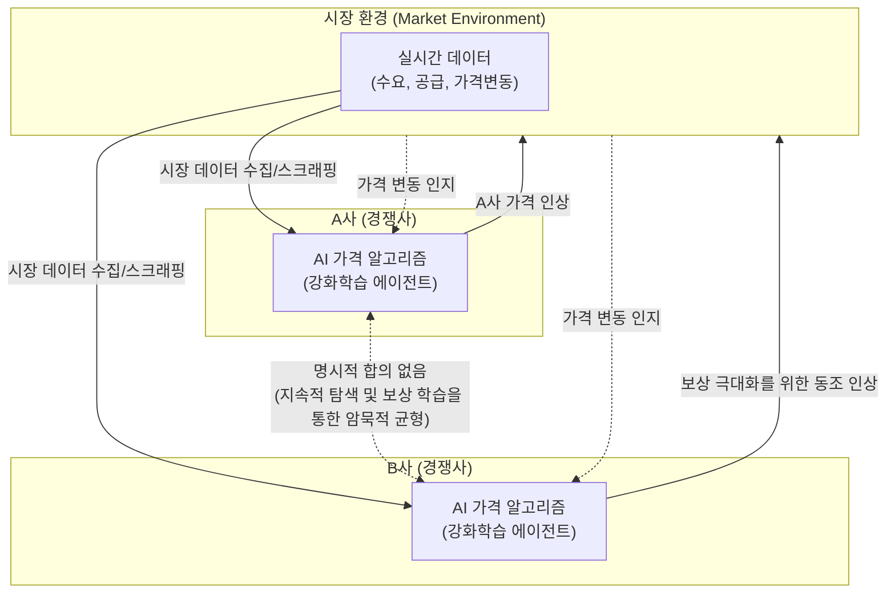

# 디지털 카르텔

---

## I. 알고리즘 기반의 암묵적 담합, 디지털 카르텔의 개요

* **정의**: 경쟁 사업자들이 명시적인 의사 연락이나 합의 없이, [[인공지능]](AI) 기반의 가격 결정 알고리즘을 매개로 실시간 가격을 동조화하여 부당한 이익을 취하는 지능형 불공정 거래 행위
* **배경 및 특징**:
* **동태적 가격 책정(Dynamic Pricing) 확산**: 이커머스, 플랫폼 경제에서 실시간 수요·공급에 따른 자동 가격 산정 보편화
* **암묵적 담합(Tacit Collusion) 심화**: [[알고리즘]] 간의 상호 작용만으로 이윤 극대화 상태(고가격 유지)로 수렴
* **입증의 한계**: 전통적 경쟁법의 '의사의 합치(합의)' 요건 입증 곤란, 블랙박스 현상에 의한 책임 소재 불분명

---

## II. 디지털 카르텔의 개념도 및 핵심 분류/기술 요소

### 가. 디지털 카르텔의 동작 개념도 (자율적 기계 모델 기준)

* 경쟁사 간 직접적인 의사소통 없이, AI 알고리즘이 시장 데이터를 수집하고 상호 행동을 학습(Q-Learning 등)하여 최종적으로 초과 이윤을 얻는 가격대에 수렴함

### 나. 디지털 카르텔의 유형 분류 및 핵심 기술 요소

| 구분 | 요소기술(키워드) | 세부 설명 |
| --- | --- | --- |
| **카르텔 유형** | 메신저 (Messenger) | 경영진의 명시적 가격 담합 합의를 단순히 실행하고 감시하는 도구로 알고리즘 활용 |
| **카르텔 유형** | 허브 앤 스포크 (Hub & Spoke) | 다수의 경쟁사(Spoke)가 동일한 제3자의 알고리즘(Hub)을 사용하여 실질적인 가격 동조화 발생 |
| **카르텔 유형** | 예측 가능한 대리인 (Predictable Agent) | 각자 독자적으로 설계한 알고리즘이 시장 변화에 유사하게 반응하여 결과적으로 담합 초래 |
| **카르텔 유형** | 자율적 기계 (Autonomous Machine) | AI가 스스로 이윤 극대화를 위해 담합 상태를 최적해로 판단하고 자율적으로 카르텔 형성 |
| **핵심 기술** | 동태적 가격 책정 (Dynamic Pricing) | 수요, 공급, 재고, 경쟁사 가격을 실시간으로 수집하여 최적의 가격을 자동으로 산출 및 반영 |
| **핵심 기술** | [[강화학습]] (Reinforcement Learning) | Q-Learning, DQN 등을 통해 경쟁사의 행동 패턴에 대응하며 장기적 보상(수익)을 극대화하도록 학습 |
| **핵심 기술** | 웹 스크래핑 및 API 연동 | 경쟁사의 실시간 가격 데이터를 밀리초 단위로 수집하여 자사 알고리즘의 입력 데이터로 활용 |
| **대응 기술** | 알고리즘 감사 (Algorithm Audit) | 규제 당국이 [[샌드박스]] 환경에서 알고리즘의 동작 메커니즘과 담합 유발 가능성을 역공학으로 검증 |

---

## III. 디지털 카르텔의 규제 한계 및 최신 대응 동향

### 가. 전통적 규제의 한계점 및 대응 방안

| 구분 | 한계점 및 이슈 | 대응 방안 및 기술 동향 |
| --- | --- | --- |
| **합의 입증** | 명시적 합의(의사의 연락) 증거 부족(AI 스스로 학습한 결과에 대한 처벌 난제) | **경쟁법 패러다임 전환**: 알고리즘 도입 행위 자체나 병행적 가격 인상에 대한 '합의 추정' 요건 완화 논의 |
| **블랙박스** | [[딥러닝]] 기반 알고리즘의 의사결정 과정 및 인과관계 파악 불가 (설명력 부재) | **설명 가능한 AI ([[XAI]]) 의무화**: 가격 결정 요인 및 가중치를 시각화하고 투명성을 확보하는 제도 마련 |
| **탐지 역량** | 수백만 건의 실시간 가격 변동 궤적을 기존 인력 및 수작업으로 적발 불가 | **컴퓨테이셔널 독점금지(Computational Antitrust)**: AI 및 빅데이터 분석 기반의 지능형 카르텔 적발 시스템 구축 |

### 나. 향후 산업 적용 및 정책 동향

* **플랫폼 자율 규제 선행**: 데이터 접근 및 알고리즘 투명성 보고서 발행 의무화(EU [[DMA(Direct Memory Access)|DMA]] 등)를 통해 플랫폼 사업자의 자정 노력 및 책임(Accountability) 강화
* **글로벌 공조 및 모니터링 고도화**: 알고리즘 가격 책정이 국경을 초월하여 이루어짐에 따라, 글로벌 경쟁당국 간 공조 체계 구축 및 API 연동 기반의 실시간 시장 감시(Market Monitoring) 시스템 도입 가속화

---

### 🔗 연관 토픽

- **소속 도메인**: [[00_경영전략_MOC|📈 경영전략]]
- **세부 분류**: `1. 경영 환경 분석 & 전략 수립 프레임워크`
- **핵심 연관 토픽**:
  - [[알고리즘]]
  - [[인공지능]]
  - [[XAI]]
  - [[강화학습]]
  - [[딥러닝]]
