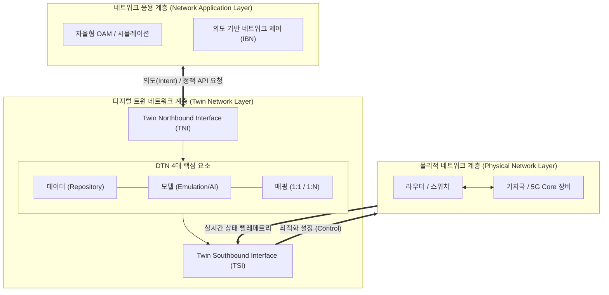

# 디지털 트윈 네트워크 (Digital Twin Network)

---

## I. 무중단 자율 운영을 위한, 디지털 트윈 네트워크(DTN)의 개요

* **정의**: 물리적 네트워크 인프라를 가상 공간에 실시간으로 복제하여, 네트워크의 기획, 운영, 최적화를 시뮬레이션하고 자동 제어하는 지능형 통신 네트워크 모델
* **필요성 및 등장배경/특징**:
* **자율형 네트워크(Autonomous Network) 진화**: 5G/6G 초연결 환경의 복잡성 증가로 사람 개입 없는 Zero-Touch 운영 필수
* **사전 검증(What-If Simulation)**: 장애 인젝션, 트래픽 폭증 등 극한 상황을 트윈 환경에서 테스트하여 무중단 운영 보장
* **폐쇄 루프 제어(Closed-loop Control)**: AI 분석을 통해 최적의 라우팅과 설정을 물리적 네트워크에 실시간 반영 및 자가 치유 수행

---

## II. 디지털 트윈 네트워크의 개념도 및 핵심 기술 요소

### 가. 디지털 트윈 네트워크의 개념도 및 동작 원리

* 물리 계층의 실시간 데이터를 수집하여 트윈망을 구축하고, 상위 애플리케이션의 시뮬레이션 결과를 바탕으로 물리 망을 자율 최적화함

### 나. 디지털 트윈 네트워크의 핵심 기술/구성 요소

| 분류 | 요소기술(키워드) | 세부 설명 |
| --- | --- | --- |
| **표준 아키텍처** | ITU-T Y.3090 | 물리적 통신 인프라를 가상화하여 분석, 에뮬레이션, 제어하기 위한 요구사항 및 참조 아키텍처 표준 |
| **4대 구성요소** | 네트워크 데이터 (Data) | 물리적 네트워크의 실시간 상태, 토폴로지, 메트릭, 설정(Configuration) 정보를 이기종 데이터베이스에 저장 |
| **4대 구성요소** | 네트워크 모델 (Model) | 트래픽 시뮬레이션 및 장애 진단을 위한 데이터 기반 지식 그래프 및 네트워크 [[엔티티]] 에뮬레이션 구조 |
| **4대 구성요소** | 엔티티 매핑 (Mapping) | 물리망과 트윈망 간(1:1) 또는 트윈 상호 간(1:N) 엔티티를 식별하고 실시간 상호작용 동기화 수행 |
| **4대 구성요소** | 연동 인터페이스 (Interface) | 물리망(SBI), 내부(Internal), 상위 플랫폼(NBI) 간 데이터 교환 및 이기종 장치 상호운용성 보장 |
| **데이터 수집** | 스트리밍 텔레메트리 | 기존 SNMP의 지연 한계를 극복하고 In-band Network Telemetry(INT) 기반의 고해상도 네트워크 상태 정보 실시간 수집 |
| **운영 혁신** | 폐쇄 루프 통제 (Closed-Loop) | 트윈망 시뮬레이션에서 도출된 최적 라우팅/정책을 관리자 개입 없이 물리 장비에 즉각 반영하여 자가 최적화 실현 |
| **보안 [[프레임워크]]** | ITU-T X.2011 | 트윈망 변조 방지 및 데이터 저장소 보안을 위한 인증, 권한 부여, E2E [[암호화]] 및 [[무결성]] 보호 가이드라인 |

---

## III. 디지털 트윈 네트워크의 한계점 및 향후 전망

* **네트워크 디지털 트윈의 한계점 극복 방향**:
* **데이터 동기화 지연 및 정확도 문제**: 초저지연을 요구하는 6G 통신망 적용을 위해 [[EDGE|Edge]] AI 연계 및 지능형 추론을 통한 토폴로지 자동 업데이트로 트윈 모델의 실시간성(Real-time) 한계 극복 필요
* **표준화 파편화 해소**: ITU-T, IRTF, IETF 등 다양한 기구의 개별 표준화 난립을 방지하기 위해 공통 정보 모델 기반의 글로벌 오픈소스 연대([[O-RAN]] 등) 생태계 통합 가속화

* **초자동화 자율형 네트워크(Zero-Touch)로의 산업 적용**:
* **의도 기반 네트워킹([[IBN(Intent-Based Networking)|IBN]]) 연계**: 관리자가 "비디오 스트리밍 대역폭 99% 보장"이라는 비즈니스 의도(Intent)만 상위 계층에 입력하면, DTN이 수백 가지 가설을 시뮬레이션한 후 스스로 [[네트워크 슬라이싱]] 및 자원 배분을 실행하는 AI-Native 통신 아키텍처로 완전 진화 중임

---

### 🔗 연관 토픽

- **소속 도메인**: [[00_네트워크_MOC|🌐 네트워크]]
- **세부 분류**: `1. OSI 7계층 & 데이터링크 계층 (L1/L2)`
- **핵심 연관 토픽**:
  - [[네트워크 슬라이싱]]
  - [[CoAP|CoAP (Constrained Application Protocol)]]
  - [[무결성]]
  - [[암호화|암호화 (Encryption)]]
  - [[엔티티|엔티티(Entity)]]
