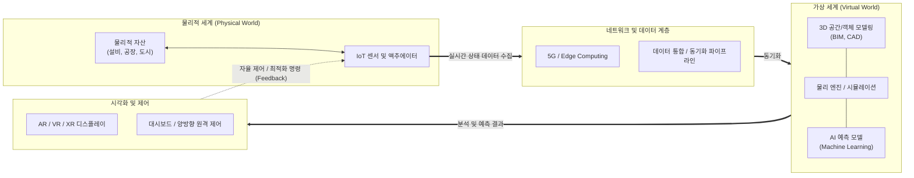

# 디지털 트윈 (Digital Twin)

---

## I. 현실 공간의 실시간 복제 및 최적화, 디지털 트윈의 개요

* **정의**: 현실 세계의 물리적 자산(Asset), 시스템, 프로세스를 가상 공간에 쌍둥이처럼 똑같이 복제하고, 실시간 데이터를 동기화하여 시뮬레이션 및 최적의 의사결정을 지원하는 지능형 모형 기술
* **등장배경 및 특징**:
* **배경**: [[인더스트리 4.0 5.0|인더스트리 4.0]] 및 스마트 팩토리의 확산, 복잡한 시스템의 사전 위험 예측 및 [[유지보수]] 비용 절감 요구 증대
* **특징**: 물리/가상 세계 간 **초연결성(Hyper-connectivity)**, 센서 데이터 기반 **실시간 양방향 동기화**, AI 모델링 기반 **사전 시뮬레이션(Simulation) 및 자율 제어**

---

## II. 디지털 트윈의 개념도 및 핵심 기술 요소

### 가. 디지털 트윈의 개념도 및 동작 원리

* 물리적 자산에서 수집된 실시간 센서 데이터가 가상 공간의 3D 모델에 동기화되며, 가상 시뮬레이션을 통해 도출된 최적의 인사이트(예측, 제어)가 다시 물리적 객체로 피드백되는 양방향 순환 구조

### 나. 디지털 트윈의 핵심 기술 요소

| 구분 | 요소기술(키워드) | 세부 설명 |
| --- | --- | --- |
| **데이터 수집** | IoT & 스마트 센서 | 물리적 객체의 상태(온도, 진동, 위치 등)를 실시간으로 감지하고 디지털 신호로 변환 |
| **연결 및 통신** | 5G & 에지 컴퓨팅 | 대용량의 트윈 데이터를 초저지연으로 전송하고, 단말 인근([[EDGE|Edge]])에서 분산 처리하여 응답성 확보 |
| **모델링/구조화** | 3D CAD / BIM | 물리적 객체의 형상, 속성, 공간 정보를 3차원으로 구현 (건축/건설 분야의 Building Information Modeling) |
| **시뮬레이션** | 물리 엔진 (Physics Engine) | 중력, 마찰, 유체 역학 등 현실 세계의 물리 법칙을 가상 환경에 동일하게 모사하여 테스트 [[신뢰성]] 확보 |
| **분석 및 예측** | AI / Machine Learning | 수집된 시계열 데이터를 분석하여 장비 고장 사전 예측(Predictive Maintenance) 및 자율 [[최적화 알고리즘]] 구동 |
| **시각화** | AR / VR / XR | 복잡한 시뮬레이션 결과와 3D 모델을 작업자가 직관적으로 인지하고 제어할 수 있는 실감형 인터페이스 제공 |
| **상호 운용성** | 디지털 스레드 (Digital Thread) | 제품의 설계-제조-운영-폐기 전 생애주기(Lifecycle) 동안 단일 진실 공급원(SSOT)을 유지하는 데이터 연결 체계 |
| **보안 및 신뢰** | [[01_IT Tech/블록체인]] / 데이터 [[암호화]] | 트윈 생성 및 제어 명령 송수신 시 데이터 위변조를 방지하고 제어권 [[무결성]](Integrity) 보장 |

---

## III. 디지털 트윈과 시뮬레이션 비교 및 최신 동향

### 가. 디지털 트윈과 전통적 시뮬레이션 비교

| 비교 항목 | 전통적 시뮬레이션 (Traditional Simulation) | 디지털 트윈 (Digital Twin) |
| --- | --- | --- |
| **데이터 동기화** | 정적 데이터, 일회성 입력 (Offline) | **실시간 데이터, 지속적 동기화 (Real-time)** |
| **적용 시점** | 주로 설계 및 개발 단계 | 설계부터 제조, 운영, 유지보수 전 생애주기 |
| **데이터 흐름** | 단방향 (입력값 설정 → 결과 확인) | **양방향 (데이터 수집 ↔ 가상 분석 ↔ 현실 제어)** |
| **예측 범위** | 특정 환경 변수 하의 제한적 상황 예측 | AI 결합을 통한 복합적, 동태적 상황에 대한 자율 예측 |
| **확장성** | 개별 시스템 및 단위 공정 중심 | 전체 시스템 및 생태계(스마트 시티, 공장 전체) 통합 |

### 나. 디지털 트윈의 최신 산업 동향 및 향후 전망

* **산업용 [[메타버스]](Industrial Metaverse) 진화**: NVIDIA Omniverse와 같이 여러 개발자와 기업이 동시에 접속하여 가상 공장을 짓고 협업 시뮬레이션을 수행하는 '개방형 디지털 트윈 생태계' 확산
* **연합 디지털 트윈(Federated Digital Twins)**: 개별 장비나 공장의 디지털 트윈을 넘어, 스마트 시티의 교통망, 전력망, 상하수도 트윈들이 상호 데이터를 교환하고 연동되는 거대 통합 시스템으로 진화 중
* **메디컬 트윈(Medical Twin)의 부상**: 제조/건축을 넘어 환자의 의료 데이터(CT, MRI, 유전 정보)를 기반으로 가상 인체를 구현하여, 개인 맞춤형 수술 시뮬레이션 및 신약 개발 타당성을 검증하는 바이오/헬스케어 영역으로 적용 확대

---

### 🔗 연관 토픽

- **소속 도메인**: [[00_디지털서비스_MOC|🚀 디지털서비스]]
- **세부 분류**: `3. 사물인터넷 (IoT) & 스마트 플랫폼 · 메타버스`
- **핵심 연관 토픽**:
  - [[메타버스|메타버스 (Metaverse)]]
  - [[인더스트리 4.0 5.0|인더스트리 4.0 5.0 (Industry 4.0 5.0)]]
  - [[Smart Factory|Smart Factory/스마트 팩토리(공장)]]
  - [[C-ITS|C-ITS (Cooperative-Intelligent Transport Systems)]]
  - [[CPS]]
