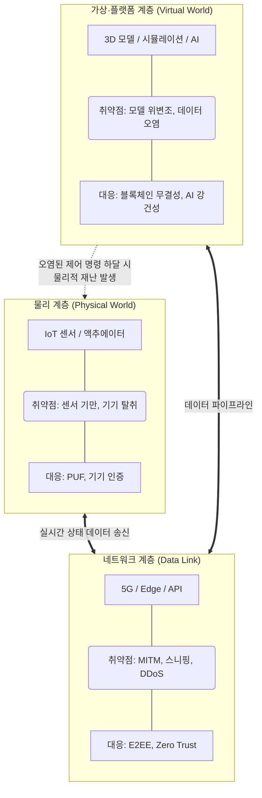

# 디지털 트윈(Digital Twin)의 보안 취약점 및 대응방안

---

## I. 초연결 사이버-물리 시스템 보호를 위한, 디지털 트윈 보안의 개요

* **정의**: 물리적 세계와 가상 세계 간의 실시간 양방향 데이터 동기화 과정에서 발생하는 [[기밀성]], [[무결성]], [[HA(High Availability)|가용성]] 침해 위협을 식별하고 이를 방어하기 위한 총체적 보안 체계
* **필요성 및 특징**:
* **공격 표면(Attack Surface) 확장**: IoT, 5G, 클라우드 등 다양한 이기종 기술 결합으로 인한 다계층 보안 위협 증가
* **물리적 피해 직결 ([[CPS]] 위협)**: 가상 세계의 해킹(제어권 탈취)이 현실 세계의 설비 파괴, 인명 피해 등 물리적 재난으로 전이
* **연쇄적 침해 방지**: 데이터 조작 시 잘못된 AI 시뮬레이션 결과를 초래하여 오작동을 유발하는 연쇄 실패(Cascading Failure) 방지 필요

---

## II. 디지털 트윈 보안 취약점의 개념도 및 핵심 대응 요소

### 가. 디지털 트윈 보안 취약점 및 대응 개념도

* 물리적 디바이스(IoT)부터 네트워크, 클라우드 가상 플랫폼까지 각 계층별로 고유한 취약점이 존재하며, 이를 방어하기 위한 다계층(Multi-layer) 심층 방어(Defense in Depth) 아키텍처가 필수적임

### 나. 디지털 트윈의 영역별 보안 취약점 및 대응 기술

| 영역 (구분) | 취약점 및 위협 (키워드) | 핵심 대응 기술 및 설명 |
| --- | --- | --- |
| **물리 (Device)** | 센서 기만 및 기기 복제 | **PUF (물리적 복제 방지 기술)**: 반도체 공정 편차를 이용한 고유 키 기반 기기 인증 체계 적용 |
| **물리 (Device)** | 펌웨어 위·변조 | **Secure Boot**: 기기 부팅 시 전자서명 기반으로 펌웨어의 무결성을 검증하여 악성코드 실행 원천 차단 |
| **네트워크 (Link)** | 비인가 접근 및 탈취 | **[[제로 트러스트 보안모델|Zero Trust]] Architecture (ZTA)**: '항상 검증(Never Trust, Always Verify)' 원칙 기반의 동적 접근 통제 |
| **네트워크 (Link)** | 데이터 스니핑 (MITM) | **E2EE (종단간 [[암호화]])**: 양자 내성 암호(PQC) 및 경량 암호화(LEA)를 통한 데이터 전송 구간 기밀성 보장 |
| **플랫폼 (Virtual)** | 3D 트윈 모델 위변조 | **[[01_IT Tech/블록체인]] (Blockchain)**: 트윈 데이터의 생성, 수정 이력(Provenance)을 분산 원장에 기록하여 무결성 확보 |
| **플랫폼 (Virtual)** | 초연결 API 취약점 | **API Security Gateway**: 비정상 API 호출 탐지, 트래픽 제한(Rate Limiting) 및 OAuth 2.0 기반 인가 처리 |
| **AI (지능형 분석)** | 데이터 오염 (Poisoning) | **AI 강건성(Robustness) 검증**: 시뮬레이션 학습 데이터에 대한 [[이상치]](Outlier) 탐지 및 [[적대적 공격]] 방어 |
| **데이터 (Data)** | 민감 정보 유출 | **[[동형 암호|동형 암호 (Homomorphic Encryption)]]**: 암호화된 상태 그대로 연산 및 시뮬레이션을 수행하여 프라이버시 보호 |

---

## III. 디지털 트윈 보안 최신 동향 및 발전 전망

### 가. 주요 보안 프레임워크 및 산업 적용 동향

* **국제 표준 보안 가이드라인 준수**: NIST IR 8320(하드웨어 기반 보안 트윈), ITU-T Y.3090([[디지털 트윈 네트워크]] 요구사항) 등 국제 표준 기반의 보안 아키텍처 설계 의무화 추세
* **연합 [[디지털 트윈]](Federated Digital Twin) 보안**: 스마트 시티 등 복수의 독립적 트윈 간 상호 연동 시, 프라이버시 침해를 방지하기 위해 **[[연합 학습]](Federated Learning)** 및 **데이터 클린룸(Data Clean Room)** 기술 적극 도입
* **보안 디지털 트윈(Security Digital Twin)으로의 역발상 활용**: 디지털 트윈 취약점을 방어하는 것을 넘어, 기업의 전체 IT 인프라를 트윈으로 복제하고 [[랜섬웨어]] 등 모의 해킹(BAS: Breach and Attack Simulation)을 수행하여 보안 취약점을 사전 식별하는 사이버 보안 테스트베드로 적극 활용 중임

---

### 🔗 연관 토픽

- **소속 도메인**: [[00_보안_MOC|🛡️ 보안]]
- **세부 분류**: `1. 정보보안 원칙 & 거버넌스 · 인증`
- **핵심 연관 토픽**:
  - [[암호화|암호화 (Encryption)]]
  - [[기밀성]]
  - [[제로 트러스트 보안모델|제로 트러스트 (Zero Trust) 보안모델]]
  - [[무결성]]
  - [[01_IT Tech/블록체인|블록체인 (Block Chain)]]
