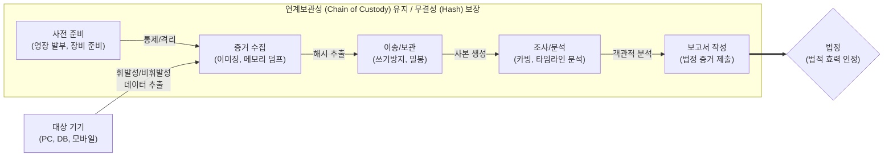

# 디지털 포렌식 (Digital Forensic)

---

## I. 디지털 증거의 법적 효력 확보, 디지털 포렌식의 개요

* **정의**: 범죄 수사 및 내부 감사 시 PC, 모바일, 클라우드 등 디지털 기기에 저장된 데이터를 적법한 절차에 따라 수집, 보관, 분석하여 법정 증거력을 확보하는 과학 수사 기법
* **필요성 및 특징**:
* **법적 증거력(Forensic Soundness) 확보**: 증거 훼손 방지([[무결성]]) 및 이력 추적(연계보관성)을 통한 증거 능력 인정
* **안티 포렌식([[안티 포렌식|Anti-Forensic]]) 대응**: 고도화되는 데이터 은닉, [[암호화]], 완전 삭제(Wiping) 기법에 대항하는 복원 기술 요구
* **분석 대상의 다변화**: 레거시 디스크 중심에서 활성 메모리(Live), 모바일(Mobile), 클라우드(Cloud), IoT 기기로 조사 영역 확장

---

## II. 디지털 포렌식의 수행 절차 및 핵심 기술 요소

### 가. 디지털 포렌식 수행 절차 및 동작 원리

* 원본 훼손을 막기 위해 해시(Hash) 연산과 쓰기 방지기(Write Blocker)를 적용하며, 수집부터 제출까지의 모든 취급 이력을 기록하는 연계보관성(CoC) 준수가 핵심임

### 나. 디지털 포렌식의 핵심 기술 및 구성 요소

| 분류 | 요소기술(키워드) | 세부 설명 |
| --- | --- | --- |
| **증거 수집** | [[디스크 이미징|디스크 이미징 (Disk Imaging)]] | 원본 저장매체의 물리적 섹터를 파일시스템과 무관하게 Bit-by-Bit 단위로 완벽하게 복제 |
| **증거 수집** | 쓰기 방지기 (Write Blocker) | 증거 수집 과정에서 원본 데이터의 의도치 않은 변경 및 훼손을 하드웨어/소프트웨어적으로 원천 차단 |
| **무결성 검증** | 해시 [[알고리즘]] (Hash) | 사본 획득 전후의 MD5, SHA-256 결괏값 비교를 통해 데이터의 위변조 여부 및 동일성 입증 |
| **법적 절차** | 연계보관성 (Chain of Custody) | 증거의 획득, 이송, 보관, 분석, 법정 제출까지 모든 담당자 및 인수인계 내역을 문서화하여 추적성 확보 |
| **증거 분석** | 파일 카빙 (File Carving) | 파일 시스템의 메타데이터가 손상되거나 삭제된 경우, 파일 고유의 시그니처(헤더/푸터)를 기반으로 데이터 복원 |
| **증거 분석** | 슬랙 공간 (Slack Space) 분석 | 클러스터 크기와 실제 파일 크기의 차이로 발생하는 잔여 공간(램 슬랙, 드라이브 슬랙)에 은닉된 데이터 추출 |
| **특수 분석** | 활성 포렌식 (Live Forensics) | 전원 차단 시 소멸되는 휘발성 데이터(RAM, 네트워크 [[세션]], [[프로세스]] 상태)를 시스템 구동 상태에서 덤프 및 분석 |
| **특수 분석** | 타임라인 (Timeline) 분석 | 파일의 [[MAC]] Time(수정, 접근, 생성 시간), 레지스트리, 시스템 로그를 교차 분석하여 사용자의 행위 흐름 재구성 |

---

## III. 안티 포렌식 대응 및 최신 발전 동향

### 가. 안티 포렌식(Anti-Forensic)과 안티-안티 포렌식 비교

| 비교 항목 | 안티 포렌식 (Anti-Forensic) | 안티-안티 포렌식 (Anti-Anti Forensic) |
| --- | --- | --- |
| **수행 목적** | 수사 방해, 디지털 증거 인멸 및 탐지 회피 | 훼손된 증거 복원, 은닉 데이터 탐지 및 해독 |
| **데이터 파괴** | 디스크 와이핑(Wiping), 디가우싱(Degaussing) | 파일 카빙, 볼륨 섀도 복사본(VSC) 분석 및 복원 |
| **데이터 은닉** | 스테가노그래피(Steganography), 슬랙 공간 은닉 | 스테그아날리시스(Steganalysis) 기반 통계적 이상 징후 분석 |
| **데이터 변조** | 암호화(Ransomware, EFS), 타임스탬프 조작 | [[GPU]] 병렬 처리 기반 크래킹, 타임라인 정합성 검증 |

### 나. 디지털 포렌식 최신 트렌드 및 향후 전망

* **[[클라우드 포렌식]](Cloud Forensics) 부상**: 물리적 매체 압수수색이 불가한 IaaS/SaaS 환경에 대응하여, [[CSP]](클라우드 사업자)가 제공하는 API 및 원격 볼륨 스냅샷 기반의 증거 수집 체계로 패러다임 전환
* **AI 기반 트리아지(Triage) 및 지능형 분석**: TB/PB급 대용량 데이터 압수 시 현장 선별 압수를 위해, 머신러닝 기반 정규표현식 검색 및 불법 영상물 자동 식별(Deepfake 탐지) 기술 도입 가속화
* **e-Discovery([[전자증거개시제도]]) 컴플라이언스 대응**: 글로벌 소송 환경에서 기업의 ESI(전자저장정보) 보존 및 제출이 의무화됨에 따라, 내부 감사 및 리스크 관리를 위한 기업용 상시 포렌식 준비도(Forensic Readiness) 확보가 필수적으로 요구됨

---

### 🔗 연관 토픽

- **소속 도메인**: [[00_보안_MOC|🛡️ 보안]]
- **세부 분류**: `1. 정보보안 원칙 & 거버넌스 · 인증`
- **핵심 연관 토픽**:
  - [[디스크 이미징|디스크 이미징 (Disk Imaging)]]
  - [[안티 포렌식|안티 포렌식(Anti-forensic)]]
  - [[클라우드 포렌식|클라우드 포렌식(Cloud Forensic)]]
  - [[전자증거개시제도|전자증거개시제도(e-Discovery)]]
  - [[암호화|암호화 (Encryption)]]
