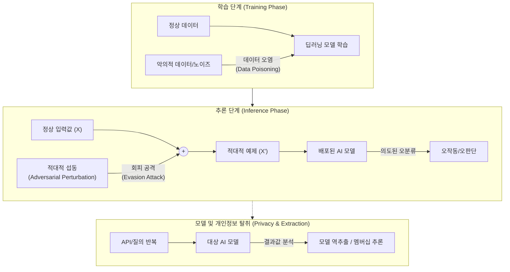

# 딥러닝 취약점

---

## I. AI 모델의 신뢰성 위협, 딥러닝 취약점의 개요

* **정의**: [[딥러닝]] 모델의 블랙박스 특성과 알고리즘적 한계를 악용하여, 학습 데이터를 오염시키거나 추론 과정에 개입하여 오작동 및 정보 유출을 유발하는 보안 위협
* **발생원인/특징**: 고차원 데이터 공간의 취약점(경계면 왜곡), 대규모 데이터 의존성(검증 한계), 블랙박스 구조(내부 연산 과정의 비가시성)

---

## II. 딥러닝 취약점 공격 메커니즘 개념도 및 핵심 위협 요소

### 가. 딥러닝 취약점 공격 메커니즘 개념도

* 학습 단계의 데이터 조작(Poisoning), 추론 단계의 미세 노이즈 주입(Evasion), 배포 모델에 대한 지속적 질의를 통한 정보 탈취(Inversion/Extraction)로 구분됨

### 나. 딥러닝 4대 주요 취약점 및 핵심 위협 요소

| 구분 | 요소기술(키워드) | 세부 설명 |
| --- | --- | --- |
| **데이터 [[무결성]] 위협** | **데이터 오염 (Data Poisoning)** | 학습 데이터셋에 조작된 데이터를 주입하여 모델의 정상적인 학습을 방해하고 정확도를 저하시키는 공격 |
| **데이터 무결성 위협** | **백도어 공격 (Backdoor Attack)** | 특정 트리거(Trigger) 패턴이 입력될 때만 모델이 오작동하도록 학습 단계에서 조작하는 공격 기법 |
| **[[HA(High Availability)|가용성]]/무결성 위협** | **회피 공격 (Evasion Attack)** | 추론 단계에서 사람 눈에 띄지 않는 적대적 섭동(Noise)을 추가하여 모델의 오분류를 유도 (예: FGSM) |
| **[[기밀성]](프라이버시) 위협** | **모델 역추출 (Model Inversion)** | 모델의 출력값 및 신뢰도 점수를 분석하여 학습에 사용된 민감한 원본 데이터를 역으로 복원하는 기법 |
| **기밀성(프라이버시) 위협** | **멤버십 추론 (Membership Inference)** | 특정 데이터(개인정보 등)가 해당 모델의 학습 데이터셋에 포함되었는지 여부를 통계적으로 추론하는 공격 |
| **기밀성/자산 위협** | **모델 추출 (Model Extraction)** | 모델에 대량의 질의를 수행하고 응답을 수집하여, 원본 모델과 유사한 기능을 하는 복제 모델을 생성 |
| **[[초거대 언어 모델|LLM]] 특화 위협** | **[[프롬프트 인젝션]] (Prompt Injection)** | 악의적 프롬프트를 입력하여 LLM의 기존 보안 필터를 우회하고 시스템 명령어 탈취 및 비정상 출력을 유도 |
| **LLM 특화 위협** | **탈옥 (Jailbreaking)** | AI 모델의 윤리적 가이드라인이나 안전장치를 무력화하도록 정교하게 설계된 프롬프트를 주입하는 기법 |

---

## III. 딥러닝 취약점 방어 기법 및 안전한 AI 동향

### 가. 딥러닝 취약점 대응 및 방어 기술

| 분류 | 요소기술(키워드) | 세부 설명 |
| --- | --- | --- |
| **학습 데이터 보호** | **데이터 정제 (Sanitization)** | 입력 데이터 내의 [[이상치]] 및 적대적 노이즈를 필터링하고 검증하는 기법 |
| **모델 강건성 확보** | **적대적 학습 (Adversarial Training)** | 학습 과정에서 적대적 예제를 생성하여 재학습시킴으로써 모델의 내성을 강화 |
| **프라이버시 보호** | **차등 프라이버시 (Differential Privacy)** | 학습 데이터에 수학적 노이즈를 추가하여 개별 데이터 식별을 원천 차단 |
| **연산 보안** | **[[동형 암호|동형 암호 (Homomorphic Encryption)]]** | 데이터가 암호화된 상태 그대로 모델 추론 연산을 수행하여 데이터 유출 방지 |

### 나. 안전한 AI를 위한 최신 동향 및 전망

* **[[AI TRiSM]] [[프레임워크]] 대두**: 신뢰(Trust), 리스크(Risk), 보안(Security) 관리를 포괄하는 가트너 AI TRiSM 기반의 거버넌스 체계 도입 확산
* **MITRE ATLAS 활용**: AI 시스템을 표적으로 하는 공격 전술 및 기술을 분석한 지식 기반 프레임워크를 통해 선제적 [[위협 헌팅]] 체계 구축
* **Explainable AI ([[XAI]]) 연계**: 딥러닝의 블랙박스 특성을 해소하기 위해 모델의 의사결정 과정을 시각화([[LIME]], SHAP)하여 오작동 원인 규명 및 모니터링 강화

---

### 🔗 연관 토픽

- **소속 도메인**: [[00_보안_MOC|🛡️ 보안]]
- **세부 분류**: `2. 현대 암호학 & 키 관리 · 전자서명`
- **핵심 연관 토픽**:
  - [[기밀성]]
  - [[동형 암호|동형 암호 (Homomorphic Encryption)]]
  - [[딥러닝]]
  - [[XAI]]
  - [[이상치]]
