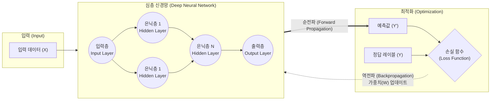

# 딥러닝 (Deep Learning)

---

## I. 데이터 특징의 자동 추출을 위한 기계학습, 딥러닝의 개요

* **정의**: 인간의 뇌 신경망을 모방한 인공신경망(ANN)을 다층(Deep)으로 구성하여, 대규모 데이터로부터 특징(Feature)을 스스로 추출하고 학습하는 기계학습 기술
* **등장배경**: 기존 머신러닝의 수동 특징 추출(Feature Engineering) 한계 극복, 빅데이터의 축적, [[GPU]] 기반 병렬 연산 능력의 비약적 향상
* **특징**: 특징 [[표현 학습]](Representation Learning), 비선형 함수(Activation) 활용, 빅데이터 및 대규모 컴퓨팅 자원 의존성(Scale Law)

---

## II. 딥러닝의 동작 원리 및 핵심 기술 요소

### 가. 딥러닝의 아키텍처 및 학습 동작 원리

* 입력 데이터가 다층 신경망을 거쳐 예측값을 산출(순전파)하고, 정답과의 오차(Loss)를 최소화하는 방향으로 가중치와 편향을 갱신([[역전파]])하여 모델을 최적화함

### 나. 딥러닝의 핵심 기술 요소

| 구분 | 핵심 기술 | 설명 |
| --- | --- | --- |
| **네트워크 구조** | **[[CNN]]** (합성곱 신경망) | 이미지, 영상의 공간적 특징(Spatial Feature) 추출에 특화 |
| **네트워크 구조** | **[[RNN (Recurrent Neural Network)|RNN]] / [[LSTM (Long Short-Term Memory)|LSTM]]** | 순차 데이터(시계열, 자연어 등)의 시간적 흐름(Temporal) 처리 |
| **네트워크 구조** | **Transformer** | 어텐션(Self-Attention) 메커니즘 기반 대규모 병렬 처리 구조 |
| **학습 [[알고리즘]]** | **역전파** (Backpropagation) | 출력 오차를 출력층에서 은닉층으로 거슬러 전파하며 가중치 갱신 |
| **최적화 기법** | **[[경사하강법]]** (SGD, AdamW) | 손실 함수의 기울기(Gradient)를 계산하여 오차를 최소화하는 방향 탐색 |
| **활성화 함수** | **ReLU, GELU** | 신경망에 비선형성을 부여하여 복잡한 패턴 학습 가능 (기울기 소실 방지) |
| **과적합 방지** | **[[Dropout]]** | 학습 시 신경망의 노드를 무작위로 비활성화하여 과적합 방지 |
| **과적합 방지** | **Batch Normalization** | 미니배치 단위로 입력 분포를 정규화하여 학습 속도 및 안정성 향상 |

---

## III. 머신러닝과 딥러닝 비교 및 최신 동향

### 가. 머신러닝과 딥러닝의 핵심 비교
|**비교 항목**|**전통적 머신러닝 (Traditional ML)**|**딥러닝 (Deep Learning)**|
|---|---|---|
|**특징 추출 (Feature Extraction)**|**전문가 개입 (Hand-crafted)**      - 인간이 직접 특징을 정의 및 추출|**자동화 (Representation Learning)**      - 신경망이 데이터로부터 스스로 특징 학습|
|**데이터 의존도**|소규모/중규모 데이터에서도 성능 발휘|대규모 데이터 필수 (Scale Law 적용)|
|**하드웨어 요구사항**|일반 [[CPU]] 환경에서도 구동 가능|고성능 병렬 처리 GPU/[[NPU]] 필수|
|**해석 가능성 ([[XAI]])**|화이트박스([[의사결정나무]] 등) 해석 용이|블랙박스 모델로 결과 도출 과정 해석 어려움|
### 나. 딥러닝의 발전 전망 및 최신 동향

* **대규모 언어 모델([[초거대 언어 모델|LLM]])**: Transformer 기반 수천억 개의 파라미터를 가진 초거대 AI(GPT-4, Claude 3 등)로 진화하며 [[범용 인공지능]]([[AGI]]) 기반 마련
* **멀티모달(Multi-modal) AI**: 텍스트를 넘어 이미지, 음성, 영상 등 다양한 형태의 데이터를 동시에 이해하고 생성하는 통합 모델 적용 확대
* **경량화 및 온디바이스(On-Device) AI**: NPU 탑재 모바일 기기에서의 딥러닝 추론을 위한 양자화(Quantization), 가지치기(Pruning), [[지식 증류]](Knowledge Distillation) 기술 고도화
* **설명 가능한 AI (XAI)**: 딥러닝의 블랙박스 문제를 해결하고 의료/금융 등 고신뢰 분야 적용을 위한 [[LIME]], SHAP 등 모델 해석 기술 도입 가속

---

### 🔗 연관 토픽

- **소속 도메인**: [[00_인공지능_MOC|🤖 인공지능]]
- **세부 분류**: `3. 딥러닝 핵심 아키텍처 & 신경망`
- **핵심 연관 토픽**:
  - [[초거대 언어 모델|초거대 언어 모델(Large Language Model)]]
  - [[LSTM (Long Short-Term Memory)]]
  - [[XAI]]
  - [[역전파|역전파(Backpropagation)]]
  - [[LIME]]
