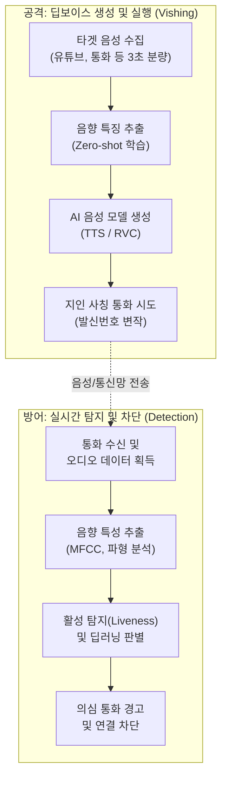

# 딥보이스 피싱 (Deep Voice Phishing)

---

## I. AI 악용 신종 금융 사기, 딥보이스 피싱의 개요

* **정의**: [[인공지능]] 기반의 음성 합성(Voice Cloning) 기술을 악용하여, 지인이나 신뢰할 수 있는 특정 인물의 목소리를 정교하게 복제해 금전을 편취하거나 민감 정보를 탈취하는 신종 보이스피싱 수단
* **필요성/등장배경/특징**:
* Zero-shot 음성 복제 기술의 진화(2~3초의 짧은 샘플로도 말투와 억양 복제 가능)
* 실시간 음성 변환(Real-time Voice Transformation) 기술을 통한 자연스러운 양방향 대화 악용
* 음성을 통한 인간의 본능적인 신뢰 체계를 악용하여 기존의 보안 인식 검증 무력화

---

## II. 딥보이스 피싱의 메커니즘 개념도 및 핵심 기술 요소

### 가. 딥보이스 피싱의 개념도 및 동작 원리

* 공격자는 소량의 오픈소스 음성 데이터를 기반으로 타겟의 목소리를 복제하며, 방어 시스템은 통화 수신 시 단말기 실시간 주파수 분석 및 활성 탐지(Liveness)를 통해 합성음 여부를 판별함

### 나. 딥보이스 피싱의 핵심 기술 및 방어/탐지 요소

| 구분 | 요소기술(키워드) | 세부 설명 |
| --- | --- | --- |
| **공격/생성** | **Zero-shot Voice Cloning** | 2~3초의 짧은 샘플 음성만으로도 타겟 화자의 억양, 발음 등 고유한 음향적 특성을 완벽하게 복제 |
| **공격/생성** | **생성형 AI 모델 ([[GAN (Generative Adversarial Network)|GAN]], TTS)** | 수집된 음성 데이터를 기반으로 고품질의 합성 음성을 생성하는 [[딥러닝]](Transformer 등) 아키텍처 |
| **공격/실행** | **실시간 음성 변환 (RVC)** | 공격자의 실제 목소리를 타겟의 목소리로 실시간 매핑(Masking)하여 이질감 없는 양방향 대화 수행 |
| **공격/실행** | **발신번호 변작 (Spoofing)** | 피해자의 신뢰를 빠르게 확보하기 위해 VoIP 망 등을 악용하여 가족, 수사기관 등의 발신자 정보 조작 |
| **방어/탐지** | **활성 탐지 (Liveness Detection)** | 인간 고유의 호흡 패턴, 미세한 피치 변화 및 배경 잡음 일관성을 기계학습으로 분석하여 인간 발화 여부 판별 |
| **방어/탐지** | **MFCC 기반 스펙트럼 분석** | 인간 청각 인지 특성을 반영하여(Mel-Frequency Cepstral Coefficients) 음향 주파수에서 기계적 합성 패턴 탐지 |
| **방어/탐지** | **오디오 워터마킹 (Watermark)** | AI 음성 생성 단계에서 비가청 주파수 대역에 추적 가능한 식별 코드 삽입을 의무화하여 출처 및 변조 검증 |
| **방어/인증** | **다중 모달 인증 (MFA 연계)** | 단순 음성 생체인식 외에 기기 정보, 지식 기반(OTP), 행동 바이오메트릭스를 결합한 교차(Zero-Trust) 인증 |

---

## III. 딥보이스 피싱 대응 전략 및 발전 동향

### 가. 딥보이스 피싱 기술적 방어 및 제도적 대응 동향

* **온디바이스(On-Device) AI 기반 실시간 탐지**: 통신사 중심으로 스마트폰 단말기([[EDGE|Edge]]) 환경에서 통화 맥락 및 음향적 비정상 패턴을 직접 분석하여, 외부 서버로의 통화 내용 유출(프라이버시 위협) 없이 피싱을 사전 차단하는 기술 상용화 확산
* **AI 생성물 식별 의무화 및 규제 강화**: EU 디지털서비스법([[DSA]]) 및 국내 공직선거법/정보통신망법 등에 기반하여, [[딥페이크]] 및 AI 생성 오디오에 대한 비가시적 워터마크 표시 의무화와 선제적 탐지 시스템 구축 의무 법제화 가속
* **연합학습(Federated Learning) 기반 공동 방어망 구축**: 통신사, 금융권, 수사기관 간 민감한 원본 음성 통화 데이터를 직접 공유하지 않고, 딥보이스 피싱 음성의 메타데이터 및 인공신경망 가중치(Weight)만 교환하여 전체 탐지 생태계의 방어력을 고도화하는 체계 도입 추진

---

### 🔗 연관 토픽

- **소속 도메인**: [[00_보안_MOC|🛡️ 보안]]
- **세부 분류**: `5. 사이버 공격 기법 & 침해사고 대응`
- **핵심 연관 토픽**:
  - [[딥페이크|딥페이크(Deepfake)]]
  - [[인공지능]]
  - [[GAN (Generative Adversarial Network)]]
  - [[DSA]]
  - [[딥러닝]]
