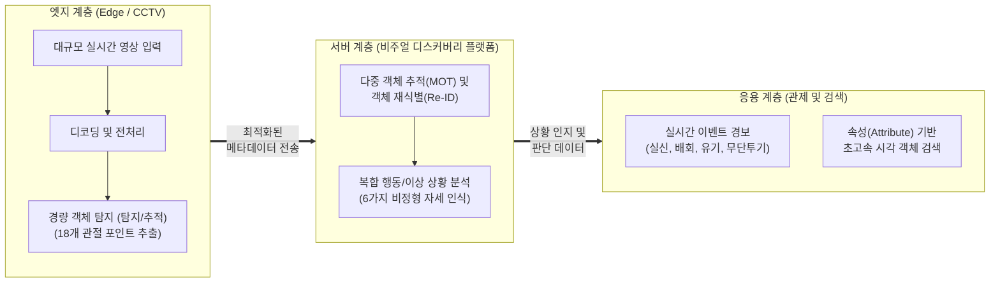

# 딥뷰 (DeepView)

---

## I. 대규모 영상 실시간 분석 시각지능 플랫폼, 딥뷰(DeepView)의 개요

* **정의**: 방대한 CCTV 등 대규모 영상 스트림에서 객체와 18개 관절 포인트를 실시간으로 추출하여, 비정형 자세(쓰러짐 등)와 행동 패턴을 스스로 이해하고 판단하는 [[딥러닝]] 기반 지능형 시각지능 플랫폼 (ETRI 주도 개발)
* **등장배경**: 수백만 대의 CCTV 인프라 확대로 인한 모니터링 인력의 인지적 한계 돌파, 도심 내 실신/낙상 등 안전사고에 대한 골든타임 확보 및 능동형 스마트시티 관제 수요 증가
* **특징**: 통합 추론 모델 기반 비정형 자세(웅크림, 누워있음 등) 복합 인식, 다중 카메라 간 객체 재식별(Re-ID) 기능, 메타데이터 속성(Attribute) 기반 초고속 횡단 검색 제공

---

## II. 딥뷰(DeepView)의 개념도 및 핵심 기술 요소

### 가. 딥뷰(DeepView)의 개념도 및 동작 원리

* 하단부 엣지(카메라단)에서 영상 전처리 및 경량 딥러닝 탐지를 수행하여 클라우드 서버의 연산 과부하 및 네트워크 대역폭 낭비를 방지함
* 상단부 분석 서버에서 다중 객체 광역 추적 및 사람의 관절 움직임 기반 복합 이상 행동을 분석하여 관제 센터에 실시간 경보를 제공함

### 나. 딥뷰(DeepView)의 핵심 기술 요소

| 분류 | 요소기술(키워드) | 세부 설명 |
| --- | --- | --- |
| **전처리/탐지** | **객체 탐지 (Object Detection)** | YOLO, SSD 계열의 알고리즘을 활용하여 실환경 영상 내 사람, 차량 등 관심 객체의 위치(Bounding Box) 실시간 식별 |
| **전처리/탐지** | **포즈 추정 (Pose Estimation)** | 사람의 형체를 18개 관절 포인트로 분할하여 서다, 걷다, 달리다, 앉다, 웅크리다, 누워있다 등 6가지 자세 종합 인식 |
| **추적/식별** | **다중 객체 추적 (MOT)** | 단일 카메라 영상의 연속된 프레임 간 동일 객체의 시공간 이동 궤적을 연결하여 행동 분석의 기초 데이터 확보 |
| **추적/식별** | **객체 재식별 (Re-ID)** | 이종(다중) CCTV 간 옷 색상, 체형, 소지품 등 외형 특징 벡터를 매칭하여 사각지대를 넘나드는 동일인 광역 단위 추적 |
| **상황 분석** | **비정형 행동 분석 모델** | 기존 2단계 구조(탐지 후 추정)를 탈피하고, 복합적 데이터를 동시에 연산하여 실신, 배회, 폭력 등의 시계열 패턴 분석 |
| **관제/검색** | **속성(Attribute) 기반 색인** | "빨간 옷을 입은 남성", "검은색 SUV" 등 객체 속성 메타데이터 추출 및 초고속 영상 검색 [[데이터베이스]](DB) 인덱싱 |
| **아키텍처** | **하이브리드 엣지 컴퓨팅** | [[NPU]] 탑재 카메라에서의 1차 경량 탐지 추론과 클라우드에서의 심층 추론을 결합한 지연시간 최소화 분산 아키텍처 |
| **아키텍처** | **고성능 비주얼 디스커버리** | 수천 대 단위 대규모 영상 채널을 동시 병렬 처리하고 실시간 상황 판단을 지원하는 딥뷰 핵심 플랫폼 [[프레임워크]] |

---

## III. 딥뷰(DeepView)와 기존 기술 비교 및 발전 동향

### 가. 딥뷰와 기존 지능형 영상 분석 기술 비교

| 비교 항목 | 기존 영상 분석 (규칙, 배경차분 기반) | 시각지능 딥뷰 (DeepView) |
| --- | --- | --- |
| **인식 방식 및 구조** | **2단계 분리 구조** (객체 탐지 선행 후 제어) | **통합 추론 모델** (관절 포인트+자세 동시 추출) |
| **주요 탐지 대상** | 정형화된 움직임 (서 있는 직립 보행자 위주) | **비정형 행동** (쓰러짐, 웅크림, 밀집, 유기 등) |
| **환경 강건성** | 조명 변화, 그림자, 객체 간 가림(Occlusion)에 취약 | 대규모 학습 데이터셋(9만 건 이상) 적용으로 **잡음에 강건함** |
| **연계 및 관제 모델** | 단일 카메라 내 단순 가상선(Line Crossing) 규칙 제어 | 다중 카메라 간 **객체 재식별(Re-ID)** 및 **의미 기반 고속 검색** |

### 나. 딥뷰의 최신 활용 동향 및 향후 전망

* **지자체 스마트시티 확산 적용**: 대전시 쓰러진 사람(실신, 주취자 등) 실시간 구호 관제 실증 및 세종/서울 지역 쓰레기 무단투기 자동 단속 시스템 적용 확대
* **예지형(PREVI) 시각지능으로의 진화**: 사후 인지나 실시간 탐지를 넘어, 사고가 발생하기 전 징후를 선제적으로 추론 및 파악하여 위험을 예방하는 [[인공지능]] 기술로 고도화 중
* **프라이버시 보호 연계**: 시각지능 적용에 따른 개인정보 침해 우려 해소를 위해 실시간 안면 [[비식별화]](동적 마스킹) 기술 및 원본 영상 유출이 없는 연합학습(Federated Learning) 엣지 분석 기술 결합 필수

---

### 🔗 연관 토픽

- **소속 도메인**: [[00_인공지능_MOC|🤖 인공지능]]
- **세부 분류**: `2. 머신러닝 기초 & 핵심 알고리즘`
- **핵심 연관 토픽**:
  - [[인공지능]]
  - [[딥러닝]]
  - [[비식별화]]
  - [[AI 거버넌스|AI 거버넌스 (AI Governance)]]
  - [[프레임워크]]
