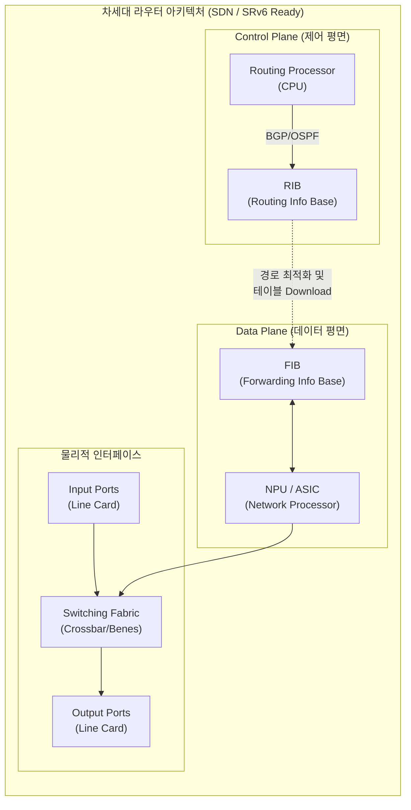

# 라우터 (Router)

---

## I. 최적 경로 탐색 및 데이터 포워딩의 핵심, 라우터의 개요

* **정의**: 서로 다른 이기종 네트워크 망을 연결하고, OSI 3계층([[네트워크 계층]]) IP 주소 기반으로 패킷의 최적 경로를 설정(Routing)하여 목적지로 전달(Forwarding)하는 핵심 통신 장비
* **등장배경**: 인터넷 규모 확장에 따른 트래픽 병목 현상 해소, 다중 경로 간 최적화된 경로 배정 필요, 최근 5G/클라우드 전환으로 인한 유연한 네트워크 제어 요구
* **특징**: 제어/데이터 평면 분리 아키텍처 도입(SDN), 개방형 H/W 구조 전환(Whitebox), 트래픽 엔지니어링(SRv6) 결합으로 진화 중

---

## II. 라우터의 아키텍처 및 핵심 기술 요소

### 가. 라우터의 내부 아키텍처 및 동작 원리

* Control Plane에서 라우팅 프로토콜을 구동하여 RIB(라우팅 테이블)를 생성하고, 이를 DP의 FIB로 다운로드함
* Data Plane은 FIB 캐시와 [[NPU]](하드웨어 칩)를 활용하여 스위칭 패브릭을 통해 패킷을 초고속으로 목적지 포트에 포워딩함

### 나. 라우터의 핵심 기술 및 구성 요소

| 구분 | 요소기술(키워드) | 세부 설명 |
| --- | --- | --- |
| **제어 평면 (Control)** | **라우팅 [[프로토콜]]** | OSPF, [[BGP]], IS-IS 등을 활용하여 네트워크 토폴로지 학습 및 최적 경로(Shortest Path) 탐색 수행 |
| **제어 평면 (Control)** | **RIB (Routing Info Base)** | 학습된 모든 목적지 네트워크와 경로, 메트릭 정보가 논리적으로 저장되는 라우팅 [[데이터베이스]] |
| **데이터 평면 (Data)** | **FIB (Forwarding Info Base)** | RIB에서 추출된 최적 경로 정보가 하드웨어(TCAM 등) 검색에 최적화된 형태로 변환된 초고속 포워딩 캐시 |
| **물리 계층 (Physical)** | **스위칭 패브릭 (Switch Fabric)** | 입력 포트로 들어온 패킷을 논리적 연산 후 목적지 출력 포트로 물리적으로 교환하는 내부 백플레인 구조 (Crossbar 등) |
| **차세대 기술 (Next-Gen)** | **SDN ([[SDN(Software Defined Network)|Software Defined Network]])** | 장비 내부의 제어 평면을 중앙의 SDN 컨트롤러로 분리하여 네트워크 전역에 대한 가시성 및 프로그래밍 제어 확보 |
| **차세대 기술 (Next-Gen)** | **SRv6 (Segment Routing [[IPv6]])** | IPv6 헤더에 SID(Segment ID)를 삽입하여, 복잡한 MPLS 오버헤드 없이 소스 기반 경로 제어 및 트래픽 엔지니어링 구현 |
| **차세대 기술 (Next-Gen)** | **Disaggregated Router (Whitebox)** | 특정 벤더에 종속되지 않고 범용 하드웨어(Baremetal)와 개방형 네트워크 [[OS(운영체제)|운영체제]](NOS, 예: SONiC)를 분리하여 유연성 극대화 |
| **차세대 기술 (Next-Gen)** | **P4 프로그래머블 데이터 플레인** | NPU 칩셋 수준에서 데이터 평면의 패킷 파싱 및 포워딩 규칙을 P4 언어를 이용해 소프트웨어적으로 직접 정의 |

---

## III. 전통적 라우터와 차세대 SRv6 기반 SDN 라우터 비교

| 비교 항목 | 전통적 IP/MPLS 라우터 | 차세대 SRv6 기반 SDN 라우터 |
| --- | --- | --- |
| **제어 아키텍처** | **분산형 제어** (각 장비 자체에서 프로토콜 연산 및 판단) | **중앙 집중형 제어** (SDN Controller를 통한 일괄 제어 및 정책 하달) |
| **트래픽 엔지니어링** | LDP, RSVP-TE 등 다중 프로토콜에 의존하여 구조 복잡 | **SRv6 SID**를 통한 소스 라우팅으로 프로토콜 스택 단순화 |
| **하드웨어 종속성** | **벤더 종속적** (Proprietary H/W 및 일체형 OS 구조) | **개방형 분리 구조** (Whitebox H/W + 개방형 NOS 결합) |
| **서비스 확장성** | 펌웨어 고정에 따른 새로운 프로토콜 및 서비스 도입 지연 | **P4 데이터 플레인 연동**을 통한 유연한 서비스 체이닝(SFC) 구현 |
| **주요 활용 분야** | 레거시 엔터프라이즈망, 전통적 인터넷 서비스 제공자([[ISP (Information Strategy Plan)|ISP]]) 망 | 5G/6G 모바일 백홀 코어망, [[클라우드 네이티브]] 데이터센터(DCI), 엣지망 |

* **최신 동향 및 전망**: 최근 통신사 및 글로벌 하이퍼스케일러 클라우드 기업들을 중심으로 망 구축 비용 절감과 운영 자동화를 위해 개방형 화이트박스 기반의 차세대 SRv6 라우터 도입이 급증하고 있으며, 인공지능을 결합한 [[인텐트 기반 네트워킹]]([[IBN(Intent-Based Networking)|IBN]])을 통해 라우팅 경로 최적화가 완전 자동화되는 방향으로 발전하고 있음.

---

### 🔗 연관 토픽

- **소속 도메인**: [[00_네트워크_MOC|🌐 네트워크]]
- **세부 분류**: `1. OSI 7계층 & 데이터링크 계층 (L1/L2)`
- **핵심 연관 토픽**:
  - [[네트워크 계층|네트워크 계층 (Network Layer)]]
  - [[BGP|BGP(Border Gateway Protocol)]]
  - [[IPv6]]
  - [[SDN(Software Defined Network)]]
  - [[인텐트 기반 네트워킹|인텐트 기반 네트워킹(Intent-Based Networking)]]
