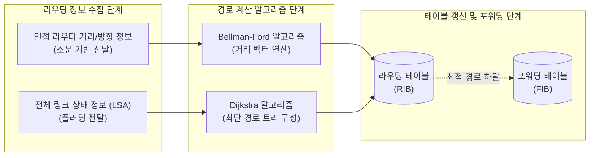

# 라우팅 알고리즘 (Routing Algorithm)

---

## I. 최적의 통신 경로 탐색을 위한, 라우팅 알고리즘의 개요

* **정의**: 패킷이 송신지에서 목적지까지 도달하기 위해 [[라우터]] 간 정보를 교환하여 최적의 경로(Best Path)를 결정하고 포워딩 테이블을 구성하는 일련의 수학적 논리 절차
* **필요성/등장배경/특징**:
* 복잡한 네트워크 토폴로지에서의 루핑(Looping) 방지 및 신속한 장애 복구(Convergence) 요구 증대
* **특징**: 동적 토폴로지 인지, 메트릭(Metric) 기반 최단 경로 계산, 분산 컴퓨팅 기반의 정보 교환 메커니즘

---

## II. 라우팅 알고리즘의 개념도 및 핵심 기술 요소

### 가. 라우팅 알고리즘의 개념도 및 동작 원리

* 라우터 간 수집된 정보를 바탕으로 거리 벡터(Bellman-Ford) 또는 링크 상태([[다익스트라 알고리즘|Dijkstra]]) 알고리즘을 수행하여 최적 경로를 산출하고 라우팅 테이블(RIB)을 구성함

### 나. 라우팅 알고리즘의 핵심 기술 요소

| 분류 | 요소기술(키워드) | 세부 설명 |
| --- | --- | --- |
| **[[알고리즘]] 종류** | **Distance Vector (거리 벡터)** | 인접 라우터와 전체 라우팅 테이블을 주기적으로 교환하여 최적 홉(Hop) 방향 결정 |
| **알고리즘 종류** | **Link State (링크 상태)** | 전체 네트워크 토폴로지(LSA)를 수집하여 자신을 루트로 하는 최단 경로 트리 구성 |
| **경로 계산 요소** | **Metric (메트릭)** | 최적 경로를 결정하는 비용 기준값 (Hop Count, Bandwidth, Delay, Load 등) |
| **안정성 기술** | **Convergence (수렴)** | 토폴로지 변경 시, 망 내 모든 라우터가 일관되고 정확한 라우팅 정보를 갖게 되는 과정 |
| **안정성 기술** | **Split Horizon (스플릿 호라이즌)** | 정보 루핑 방지를 위해, 라우팅 정보를 수신한 인터페이스로는 해당 정보를 재전송하지 않음 |
| **안정성 기술** | **Poison Reverse (포이즌 리버스)** | 끊어진 경로에 대해 무한대 메트릭(예: 16 Hop)을 할당하여 이웃에게 알려 루프를 즉각 차단 |
| **[[프로토콜]] 적용** | **IGP (내부 [[게이트웨이]])** | 단일 AS(자율 시스템) 내부망에서 사용 (RIP, EIGRP, OSPF, IS-IS) |
| **프로토콜 적용** | **EGP (외부 게이트웨이)** | 서로 다른 AS 간 라우팅 정보 교환 시 사용 ([[BGP]] - Path Vector 알고리즘 기반) |

---

## III. 거리 벡터와 링크 상태 알고리즘 비교 및 최신 동향

### 가. 거리 벡터 vs 링크 상태 알고리즘 비교

| 비교 항목 | [[거리 벡터 알고리즘]] (Distance Vector) | [[링크 상태 알고리즘]] (Link State) |
| --- | --- | --- |
| **정보 교환 범위** | **인접 라우터**에게만 정보 전달 (소문 기반) | **네트워크 내 모든 라우터**에게 전달 (Flooding) |
| **전달 정보 내용** | 자신의 **전체 라우팅 테이블**을 공유 | 변경된 **링크 상태 정보(LSA)**만을 공유 |
| **정보 갱신 방식** | **주기적** 갱신 (예: 30초 단위 브로드캐스트) | 토폴로지 **변화 발생 시 (Event-driven)** 즉각 갱신 |
| **사용 알고리즘** | **Bellman-Ford** 알고리즘 | **Dijkstra** 최단 경로 알고리즘 |
| **메모리/[[CPU]] 부하** | 낮음 (단순 연산 및 테이블 유지) | 높음 (전체 토폴로지 맵 유지 및 트리 재계산) |
| **적용 프로토콜** | RIP, IGRP, EIGRP(Advanced) | OSPF, IS-IS |

### 나. 최신 라우팅 알고리즘 발전 동향 및 전망

* **세그먼트 라우팅 (SRv6) 도입 확산**: 기존 복잡한 LDP 등 프로토콜 없이 [[IPv6]] 헤더에 패킷 처리 명령(SID)을 스태킹하여, 유연한 소스 라우팅(Source Routing) 및 네트워크 프로그래밍 구현
* **[[인텐트 기반 네트워킹]]([[IBN(Intent-Based Networking)|IBN]]) 및 AI 라우팅**: [[SDN(Software Defined Network)|SDN]] 컨트롤러와 인공지능을 결합하여, 글로벌 네트워크 트래픽 패턴을 사전 예측하고 [[SLA]] 요구사항에 따라 동적으로 최적 경로를 자동 스케줄링하는 하향식(Top-down) 지능형 라우팅 체계로 발전

---

### 🔗 연관 토픽

- **소속 도메인**: [[00_네트워크_MOC|🌐 네트워크]]
- **세부 분류**: `2. 네트워크 계층 & 라우팅 프로토콜 (L3)`
- **핵심 연관 토픽**:
  - [[SDN(Software Defined Network)]]
  - [[거리 벡터 알고리즘|거리 벡터 알고리즘 (Distance Vector Algorithm)]]
  - [[링크 상태 알고리즘|링크 상태 알고리즘 (Link State Algorithm)]]
  - [[Distance Vector Algorithm]]
  - [[라우터]]
