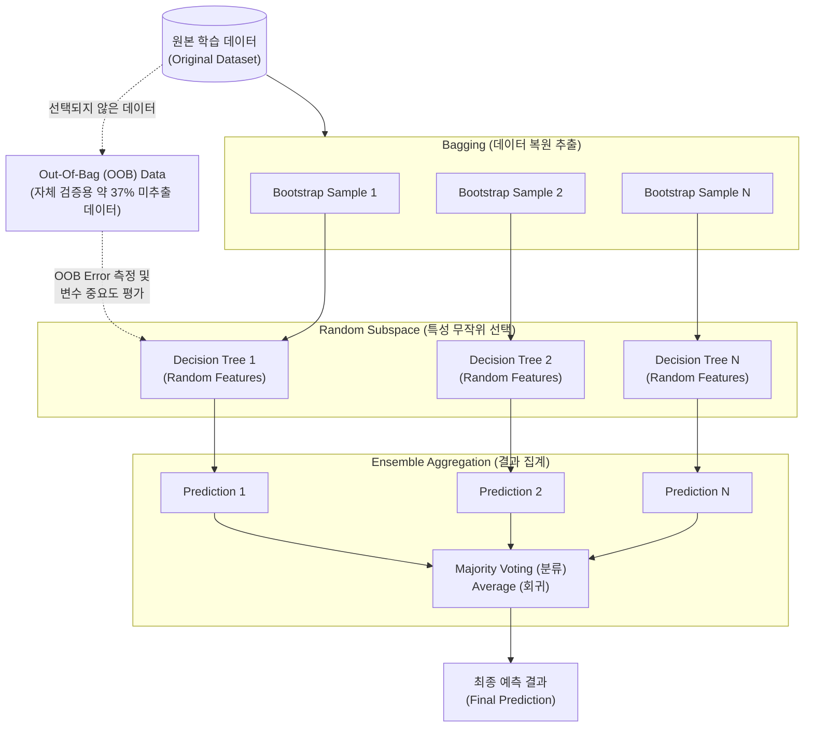

# 랜덤 포레스트 (Random Forest)

---

## I. 앙상블 학습의 대표적 모델, 랜덤 포레스트의 개요

* **정의**: 다수의 [[의사결정나무]](Decision Tree)를 학습시키고, 각 트리의 예측 결과를 결합(Ensemble)하여 단일 모델보다 높은 정확도와 안정성을 확보하는 기계학습 [[알고리즘]]
* **등장배경/특징**:
* 단일 의사결정나무의 치명적 단점인 과적합(Overfitting) 문제와 높은 분산(Variance) 한계 극복 필요
* 데이터 [[배깅]](Bagging)과 무작위 특성 선택(Random Subspace)을 결합하여 모델 간의 다양성(Diversity) 및 비상관성(Uncorrelation) 확보
* 교차검증 없이 OOB(Out-Of-Bag) 데이터를 통한 자체 성능 평가 및 변수 중요도(Feature Importance) 도출 가능

---

## II. 랜덤 포레스트의 개념도 및 핵심 기술 요소

### 가. 랜덤 포레스트의 아키텍처 및 동작 원리

* 학습 데이터에서 복원 추출(Bootstrapping)로 다수의 데이터셋을 생성하고, 노드 분할 시 특성(Feature)을 무작위로 선택하여 개별 트리를 독립적으로 학습한 후, 최종 다수결/평균으로 결과를 집계함

### 나. 랜덤 포레스트의 핵심 기술 요소

| 구분 | 요소기술(키워드) | 세부 설명 |
| --- | --- | --- |
| **데이터 샘플링** | **Bootstrapping** | 원본 데이터에서 중복을 허용하여 무작위로 데이터셋을 추출하는 기법 (복원 추출) |
| **다양성 확보** | **Random Subspace** | 트리 노드 분할 시 전체 변수 중 일부 서브셋만 무작위로 선택하여 트리 간 상관관계를 낮춤 |
| **결과 결합** | **Majority Voting** | 분류(Classification) 문제에서 개별 트리의 예측 [[클래스]] 중 가장 많은 표를 얻은 클래스를 최종 선택 |
| **자체 검증** | **OOB (Out-Of-Bag)** | 부트스트랩 샘플링 과정에서 누락된 약 37%의 데이터를 모델 성능 검증(OOB Error)에 활용 |
| **설명력 제공** | **Feature Importance** | Gini 불순도 감소량(MDI) 또는 순열(Permutation) 기반으로 모델 예측에 대한 변수의 기여도 산출 |
| **기본 학습기** | **Decision Tree (CART)** | 지니 계수나 분산 감소량을 기준으로 데이터를 재귀적으로 분할하여 계층적 규칙을 생성하는 기반 모델 |
| **최신 구조 확장** | **Deep Forest (gcForest)** | 랜덤 포레스트를 다층(Cascade) 구조로 직렬 연결하여, 역전파 없이 [[딥러닝]] 수준의 계층적 특징 추출 수행 |
| **연산 가속화** | **[[GPU]] Acceleration (FIL)** | RAPIDS cuML 내의 Forest Inference Library 등을 통해 수천 개의 트리 추론 연산을 GPU로 병렬 가속 |

---

## III. 딥러닝/기반 모델과의 비교 및 발전 동향

### 가. 의사결정나무, 랜덤 포레스트, 딥 포레스트 모델 비교

| 비교 항목 | Decision Tree | Random Forest | Deep Forest (gcForest) |
| --- | --- | --- | --- |
| **알고리즘 구조** | 단일 트리 (Single Model) | 병렬 다중 트리 (Bagging 기반) | 직렬-병렬 결합 (Cascade Layer) |
| **의사결정 경계** | 축에 평행한(Axis-parallel) 단순 경계 | 트리 결합을 통한 복잡한 비선형 경계 | 레이어별 특징 변환(Feature Transformation) |
| **주요 장점** | 높은 해석력(White Box) 및 직관성 | 과적합 방지, 정형(Tabular) 데이터 최적화 | [[역전파|역전파(Backpropagation)]] 불필요, 파라미터 튜닝 최소화 |
| **취약점/한계** | 작은 데이터 변화에도 구조가 변하는 불안정성 | 트리가 많아질수록 모델 해석력([[XAI]]) 저하 | 기존 신경망 대비 대용량 이미지/음성 데이터 적용 한계 |

### 나. 랜덤 포레스트의 한계점 극복 및 최신 발전 동향

* **설명 가능한 AI(XAI)와의 결합**: 앙상블 학습으로 인한 블랙박스(Black Box) 문제를 해결하기 위해, TreeSHAP 등의 게임 이론 기반 XAI 알고리즘과 결합하여 예측 결과에 대한 국소적/전역적 투명성 확보
* **의사결정 경계 한계 극복 (Oblique Random Forest)**: 기존 랜덤 포레스트가 축에 평행하게만 데이터를 분할하는 한계를 개선하기 위해, 노드 분할 시 주성분 분석([[PCA(Principal Component Analysis)|PCA]])이나 진화 알고리즘을 결합하여 사선(Oblique) 형태로 데이터를 정교하게 분류하는 기법 연구 활발

---

### 🔗 연관 토픽

- **소속 도메인**: [[00_인공지능_MOC|🤖 인공지능]]
- **세부 분류**: `2. 머신러닝 기초 & 핵심 알고리즘`
- **핵심 연관 토픽**:
  - [[의사결정나무]]
  - [[배깅]]
  - [[역전파|역전파(Backpropagation)]]
  - [[앙상블 학습|앙상블 학습(Ensemble Learning)]]
  - [[딥러닝]]
