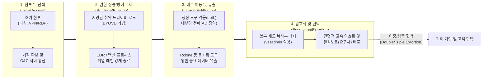

# 랜섬웨어 (Ransomware)

---

## I. 진화하는 기업 데이터 탈취 및 마비 위협, 랜섬웨어의 개요

* **정의**: 시스템에 무단 침투하여 주요 데이터를 암호화하거나 시스템 접근을 차단한 뒤, 데이터 복구 및 유출 금지를 빌미로 가상자산 등의 금전을 요구하는 악성 소프트웨어
* **등장배경/특징**:
* 범죄의 서비스화인 RaaS(서비스형 랜섬웨어) 기반 지하 생태계 확산
* 암호화를 넘어선 데이터 유출, 디도스([[DDOS|DDoS]]) 공격을 결합한 다중 협박(Multi-extortion) 모델 도입
* 최근 [[커널]] 권한 악용(BYOVD)을 통한 보안 솔루션 무력화 및 간헐적 [[암호화]](Intermittent Encryption) 등 탐지 회피 기법 고도화

---

## II. 랜섬웨어의 작동 방식(Kill Chain) 및 핵심 기술 요소

### 가. 랜섬웨어의 작동 단계(Kill Chain) 및 개념도

* 공격자는 시스템 침투 후 취약한 드라이버를 로드하여 보안 솔루션을 무력화(BYOVD)하고, 데이터를 사전 유출한 뒤 로컬 백업을 원천 차단하고 파일을 고속 암호화함

### 나. 랜섬웨어 동작 방식의 핵심 기술 및 구성 요소

| 구분 | 요소기술(키워드) | 세부 설명 |
| --- | --- | --- |
| **침투/거점확보** | **초기 접근 취약점 악용** | 이메일 스피어 피싱 첨부파일, RDP 브루트포스, 제로데이 취약점을 활용한 최초 네트워크 접근 권한 획득 |
| **방어 무력화** | **BYOVD (Bring Your Own Vulnerable Driver)** | 유효한 디지털 서명이 포함된 취약한 커널 드라이버를 강제로 로드하여 운영체제의 보안 솔루션([[EDR(Endpoint Detection and Response)|EDR]]) 무력화 |
| **도구 악용** | **LotL (Living off the Land)** | 외부 악성코드 대신 시스템에 기본 내장된 정상 유틸리티(PowerShell, WMI 등)를 악용하여 파일리스 형태로 공격 수행 |
| **데이터 유출** | **클라우드 동기화 툴 악용** | 파일 암호화 전 Rclone, MegaSync 등의 합법적 데이터 동기화 도구를 이용하여 시스템의 민감 데이터를 공격자 서버로 대량 유출 |
| **백업 차단** | **볼륨 섀도 복사본 삭제** | 윈도우 커맨드(vssadmin, bcdedit 등)를 자동 실행하여 운영체제의 복원 지점 및 로컬 백업 스냅샷을 영구 삭제 |
| **고속 암호화** | **간헐적 암호화 (Intermittent Encryption)** | 파일 전체를 암호화하지 않고 일정 바이트(N 바이트) 블록 단위로 건너뛰며 암호화하여 휴리스틱 탐지 우회 및 속도 극대화 |
| **협박 기법** | **다중 협박 (Multi-Extortion)** | 1차 암호화 협박, 2차 탈취 데이터 다크웹 공개, 3차 DDoS 공격, 4차 파트너사/고객 직접 연락 등 입체적 압박 모델 적용 |
| **공격 생태계** | **RaaS ([[RaaS(Ransomware as a Service)|Ransomware as a Service]])** | 전문 랜섬웨어 개발자가 플랫폼을 제공하고, 침투를 담당하는 유포자(Affiliate)와 범죄 수익을 분배하는 비즈니스 모델 |

---

## III. 랜섬웨어 최신 방어 동향 및 향후 전망

### 가. 랜섬웨어 킬체인 무력화를 위한 방어 아키텍처 동향

| 구분 | 대응 방안 (키워드) | 세부 설명 |
| --- | --- | --- |
| **예방/접근통제** | **제로 트러스트 (ZTA)** | "Never Trust, Always Verify" 원칙 하에 최소 권한 부여 및 마이크로 세그멘테이션을 통한 내부 이동(Lateral Movement) 원천 차단 |
| **백업/복구** | **불변 백업 (Immutable Backup)** | WORM(Write Once Read Many) 스토리지 적용 및 네트워크망과 물리적으로 분리된 에어갭(Air-Gap) 기반 3-2-1-1 백업 전략 도입 |
| **탐지/대응** | **[[XDR]] 및 행위 기반 분석** | 엔드포인트(EDR), 네트워크(NDR), 클라우드 전반의 위협 컨텍스트를 통합 분석하여 암호화 발생 전 비정상 데이터 유출 행위 선제 차단 |
| **OS 수준 보안** | **드라이버 신뢰 체계 강화** | 커널 레벨 취약점(BYOVD) 공격을 방어하기 위해 Windows Defender Application Control(WDAC) 기반의 취약 드라이버 차단 목록(Blocklist) 상시 업데이트 |

### 나. 향후 랜섬웨어 발전 전망 및 대응 방향

* 최근 생성형 AI(GenAI)를 악용한 정교한 다국어 피싱 이메일 생성 및 [[다형성]](Polymorphic) 악성코드의 자동화된 생성이 랜섬웨어 공격의 속도를 가속화하고 있음
* 기업은 단순 솔루션 도입을 넘어 지속적인 사이버 모의훈련(Red Teaming)과 AI 기반 보안 오케스트레이션([[SOAR (Security Orchestration, Automation and Response)|SOAR]])을 구축하여 위협 인지 시점부터 격리까지의 '골든타임'을 최소화하는 레질리언스(Resilience) 중심의 보안 체계로 전환해야 함

---

### 🔗 연관 토픽

- **소속 도메인**: [[00_보안_MOC|🛡️ 보안]]
- **세부 분류**: `2. 현대 암호학 & 키 관리 · 전자서명`
- **핵심 연관 토픽**:
  - [[RaaS(Ransomware as a Service)]]
  - [[EDR(Endpoint Detection and Response)]]
  - [[XDR|XDR(eXtended Detection Response)]]
  - [[DNS 싱크홀(Sinkhole)]]
  - [[시그니처 탐지기법|시그니처 탐지기법 (Signature-based Detection)]]
