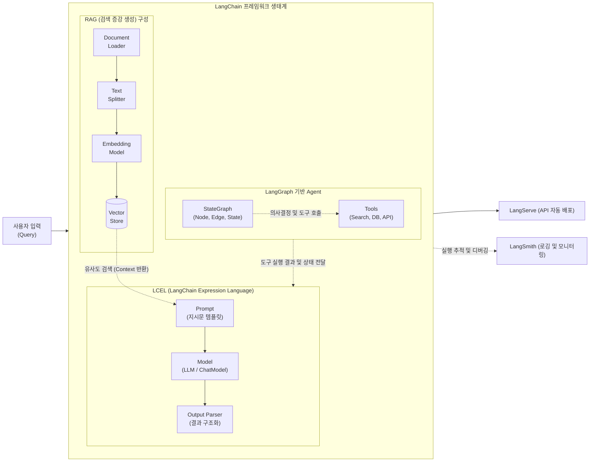

# 랭체인 (LangChain)

---

## I. LLM 애플리케이션 개발 프레임워크, 랭체인(LangChain)의 개요

* **정의**: 대규모 언어 모델([[초거대 언어 모델|LLM]])을 기반으로 프롬프트, 외부 데이터 검색(RAG), 도구(Tool) 호출 등의 구성 요소를 모듈화하여 복잡한 AI 애플리케이션을 쉽게 구축할 수 있도록 돕는 오픈소스 [[프레임워크]]
* **필요성/등장배경/특징**:
* LLM의 할각 현상(Hallucination) 및 최신 정보 부족 문제를 외부 데이터 연동(RAG)으로 해결 필요
* 복잡한 [[프롬프트 엔지니어링]] 및 워크플로우를 선언적 방식으로 단순화 (LCEL 적용)
* [[파운데이션 모델]] 독립성 확보 및 외부 도구를 통한 [[에이전틱 AI|에이전틱 AI(Agentic AI)]] 구현 생태계 제공

---

## II. 랭체인의 개념도 및 핵심 기술 요소

### 가. 랭체인의 생태계 개념도 및 동작 원리

* 사용자 입력이 들어오면 LCEL 기반의 파이프라인(|)을 거치며, RAG를 통해 외부 지식을 증강하고 Agent를 통해 자율적인 도구 호출 및 순환형 워크플로우를 처리함

### 나. 랭체인의 핵심 기술 요소

| 구분 | 요소기술(키워드) | 세부 설명 |
| --- | --- | --- |
| **코어 아키텍처** | **LCEL** (Expression Language) | 파이프( | ) 연산자를 통해 프롬프트, 모델, 파서를 직관적으로 체이닝하고 병렬/비동기 실행을 지원하는 선언적 언어 |
| **Model I/O** | **Prompt Template** | 사용자 입력과 컨텍스트(Context)를 결합하여 LLM이 최적의 답변을 생성하도록 지시문을 동적으로 구성 |
| **Model I/O** | **Output Parser** | LLM이 생성한 비정형 텍스트 응답을 [[JSON]], [[XML]], Pydantic 등의 정형화된 데이터 구조로 파싱 |
| **데이터 연결** | **Retrieval (RAG)** | Document Loader로 데이터를 수집하고, Text Splitter로 분할한 뒤, Embedding하여 Vector Store에 저장 및 검색 |
| **작업 자동화** | **Tools & Toolkit** | 웹 검색, [[데이터베이스]] 쿼리, 수학 연산 등 LLM 단독으로 수행할 수 없는 외부 작업을 실행하는 인터페이스 |
| **작업 자동화** | **[[LangGraph]]** | 노드(Node), 엣지([[EDGE|Edge]]), 상태(State) 기반으로 단방향 체인(Chain)의 한계를 극복한 다중 에이전트(Multi-Agent) 순환 워크플로우 제어 도구 |
| **운영 및 배포** | **LangServe** | 작성된 LangChain 코드나 에이전트를 FastAPI 기반의 고성능 REST API 엔드포인트로 즉시 배포 (스트리밍 지원) |
| **운영 및 배포** | **LangSmith** | LLM 애플리케이션의 토큰 사용량, 지연 시간 측정, 프롬프트 디버깅 및 성능 평가를 위한 통합 [[LLMOps]] 플랫폼 |

---

## III. 랭체인 아키텍처의 최신 발전 동향 및 전망

### 가. LangChain 아키텍처 구조의 변화 (v0.2 / v0.3 동향)

| 모듈 계층 | 패키지 분리 구조 | 핵심 역할 및 특징 |
| --- | --- | --- |
| **핵심 [[추상화]]** | **`langchain-core`** | LCEL, 기본 인터페이스 및 추상화 [[클래스]] 제공 (가장 가벼운 필수 코어) |
| **파트너 패키지** | **`langchain-{provider}`** | 특정 벤더(OpenAI, Anthropic 등) 전용 통합 패키지로 종속성 분리 |
| **써드파티 통합** | **`langchain-community`** | 그 외 다양한 오픈소스 및 써드파티 API(DB, 검색 엔진 등) 통합 관리 |

### 나. 랭체인 생태계의 향후 전망

* **Agentic AI로의 패러다임 전환**: 단순한 체인(Chain) 기반의 일방향 응답 생성(RAG)에서 벗어나, 복잡한 상태(State)를 추적하고 순환적 사고(Cyclic Reasoning)를 수행하는 **LangGraph** 중심의 자율형 멀티 에이전트 시스템으로 진화 중
* **[[End-to-End]] LLMOps 표준화**: 기업용 생성형 AI 서비스 도입이 본격화됨에 따라, 개발(LangChain), 평가 및 추적(LangSmith), 서비스 배포(LangServe)를 하나로 묶는 통합 생태계가 엔터프라이즈 AI 아키텍처의 사실상 표준(De Facto Standard)으로 자리매김함

---

### 🔗 연관 토픽

- **소속 도메인**: [[00_인공지능_MOC|🤖 인공지능]]
- **세부 분류**: `4. 거대언어모델 (LLM) & 생성형 AI`
- **핵심 연관 토픽**:
  - [[LLMOps]]
  - [[LangGraph]]
  - [[파운데이션 모델|파운데이션 모델(Foundation Model)]]
  - [[프롬프트 엔지니어링|프롬프트 엔지니어링(Prompt Engineering)]]
  - [[추상화|추상화 (Abstraction)]]
